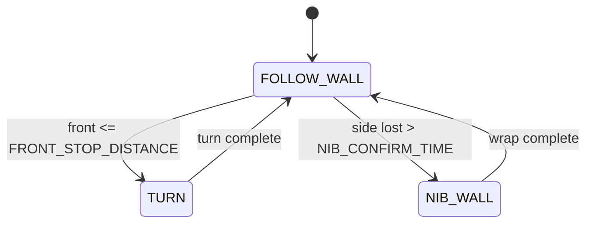

# Wall-Following Redesign — State Machine Plan

**Goal:** replace the tangled `while True` block (mixed sensor reads, PID, turns, nib wraps) with a
small, explicit **state machine**. Students learn one **state** at a time, set that state's
**parameters**, and then wire up the **triggers** that move between states.

**Outcomes**

- Cleaner main line — the loop just picks the current state and runs it.
- Less clutter — each behaviour lives in its own small function with its own parameters.
- Clear, named conditions for every change of state.

---

## 1. The three states

| State                          | What it does                                                                                                                                            | Student tutorial              |
| ------------------------------ | ------------------------------------------------------------------------------------------------------------------------------------------------------- | ----------------------------- |
| `FOLLOW_WALL` ("hand on wall") | Drive forward and hold the side wall at the target distance with the side PID. Slow down if a wall appears ahead.                                       | **Tutorial A — Hand on wall** |
| `TURN`                         | Rotate exactly 90° on the spot using the gyro turn PID, then stop.                                                                                      | **Tutorial B — Turn**         |
| `NIB_WALL`                     | The followed wall ended at an outside corner: drive forward to clear it, turn 90° toward the wall, drive forward again to come alongside the next wall. | **Tutorial C — Nib wall**     |

Each state owns **only** its own parameters — nothing leaks between them.

### State parameters (what the student tunes)

```
# --- FOLLOW_WALL ---
BASE_SPEED            = 200    # cruise speed
TARGET_WALL_DISTANCE = 200    # mm to hold from the side wall
side_Kp, side_Ki, side_Kd     # side PID gains
side_INTEGRAL_MAX             # anti-windup clamp
MAX_STEERING                  # steering clamp
FRONT_SLOW_DISTANCE  = 400    # start slowing when a wall is this close ahead
FRONT_Kp             = 1.0    # how hard to slow down

# --- TURN ---
TURN_ANGLE     = 90           # degrees per corner
turn_Kp, turn_Kd              # turn PID gains
turn_tolerance                # stop within this many degrees
TURN_MAX_SPEED, MIN_TURN_SPEED

# --- NIB_WALL ---
NIB_FORWARD_BEFORE            # seconds forward (NO PID) before the turn
NIB_FORWARD_AFTER             # seconds forward (NO PID) after the turn
```

---

## 2. The triggers (logic that changes state)

These thresholds are the **only** decision logic in the program — everything else is "run the
current state."

| From          | To            | Trigger condition                                                                                                                                              |
| ------------- | ------------- | -------------------------------------------------------------------------------------------------------------------------------------------------------------- |
| `FOLLOW_WALL` | `TURN`        | Front wall reached: `front != -1 and front <= FRONT_STOP_DISTANCE`. Turn **away** from the wall (opposite the hand-on-wall side).                              |
| `FOLLOW_WALL` | `NIB_WALL`    | Side wall lost: side reading stays `> TARGET_WALL_DISTANCE` (or `-1`) for longer than `NIB_CONFIRM_TIME` (e.g. 0.5 s).                                         |
| `TURN`        | `FOLLOW_WALL` | Turn finished (reached `TURN_ANGLE` within `turn_tolerance`).                                                                                                  |
| `NIB_WALL`    | `FOLLOW_WALL` | Wrap finished. The very next `FOLLOW_WALL` tick re-checks the triggers, so if the wall is _still_ gone it simply re-enters `NIB_WALL` (wraps the next corner). |



Two parameters describe the nib trigger (kept with the trigger logic, not inside a state):

```
NIB_CONFIRM_TIME = 0.5     # how long the wall must stay lost to count as a nib
FRONT_STOP_DISTANCE = 150  # how close a front wall is "reached"
```

---

## 3. The new main line

The entire control program becomes this:

```python
state = FOLLOW_WALL

while True:
    if state == FOLLOW_WALL:
        state = follow_wall()      # one tick of PID; returns next state
    elif state == TURN:
        state = turn()             # runs to completion; returns FOLLOW_WALL
    elif state == NIB_WALL:
        state = nib_wall()         # runs to completion; returns FOLLOW_WALL
```

That is the whole "main line." All the detail is inside three small functions.

---

## 4. State functions (sketch — kept deliberately small)

`FOLLOW_WALL` is **per-tick**: it does one 0.05 s step and decides the next state.
`TURN` and `NIB_WALL` **run to completion**, then hand control back to `FOLLOW_WALL`.

```python
def follow_wall():
    front = my_robot.read_distance()
    if front != -1 and front <= FRONT_STOP_DISTANCE:
        return TURN                       # trigger -> TURN

    side = my_robot.read_distance_2()
    if wall_lost_for(side, NIB_CONFIRM_TIME):
        return NIB_WALL                   # trigger -> NIB_WALL

    speed = front_limited_speed(front)    # slow down near a front wall
    steer = side_pid(side)                # hold the wall
    my_robot.drive(speed - sign*steer, speed + sign*steer)
    hold_state(0.05)
    return FOLLOW_WALL                     # stay in FOLLOW_WALL


def turn():
    direction = OPPOSITE of hand-on-wall
    gyro_turn_pid(TURN_ANGLE, direction)  # the Challenge-4 turn, unchanged
    my_robot.brake()
    return FOLLOW_WALL


def nib_wall():
    direction = hand-on-wall side
    my_robot.drive(BASE_SPEED, BASE_SPEED); hold_state(NIB_FORWARD_BEFORE)  # clear
    gyro_turn_pid(TURN_ANGLE, direction)                                    # turn
    my_robot.drive(BASE_SPEED, BASE_SPEED); hold_state(NIB_FORWARD_AFTER)   # clear
    my_robot.brake()
    return FOLLOW_WALL
```

`gyro_turn_pid(...)` is the existing Challenge-4 turn loop, lifted into **one** helper that both
`TURN` and `NIB_WALL` reuse. The nib "wall lost for X seconds" check is a tiny helper that counts
consecutive lost readings (`time = ticks * 0.05`).

---

## 5. How it maps onto the challenges (progressive)

Each challenge adds exactly one state, so the machine grows with the student.

| Challenge | States available                    | New tutorial           |
| --------- | ----------------------------------- | ---------------------- |
| C3        | `FOLLOW_WALL` only                  | (existing wall-follow) |
| C4        | `FOLLOW_WALL` + `TURN`              | Tutorial B — Turn      |
| C5        | `FOLLOW_WALL` + `TURN` + `NIB_WALL` | Tutorial C — Nib wall  |
| C6        | all three (dead ends + nibs)        | combine + tune         |
| C7        | all three (full maze)               | tune end to end        |

The starter files ship the state-machine skeleton with **parameters at `0.0`**; the student fills
them in per tutorial. The answer files carry the tuned values.

---

## 6. Files to change

| File(s)                                   | Change                                                                                                                                                            |
| ----------------------------------------- | ----------------------------------------------------------------------------------------------------------------------------------------------------------------- |
| `app/starter-code/challenge-{4,5,6,7}.py` | Rewrite to the state-machine skeleton; parameters at `0.0`.                                                                                                       |
| `app/answers/challenge-{4,5,6,7}.py`      | Same skeleton with tuned values.                                                                                                                                  |
| `app/js/challenges.js`                    | Update each challenge's hints/goals to talk in terms of _states, parameters, triggers_; add the new per-state tutorials.                                          |
| `docs/Challenge_{4,5,6,7}.md`             | Per-state tutorial text (one section per state).                                                                                                                  |
| `app/js/validator.js`                     | Confirm the helper calls used (`read_distance`, `read_distance_2`, `read_gyro_z_dps`, `drive`, `brake`) stay in `AIDRIVER_METHODS`. No new requirements expected. |

---

## 7. AIDriver library changes

**Goal: minimal.** The state machine lives entirely in the student's `main`-level code, so the
library should need **no changes** — it already exposes `drive`, `brake`, `read_distance`,
`read_distance_2`, `read_gyro_z_dps`, `wall_sign`, and `min_approach_speed`.

If, during build-out, a state needs something the library can't currently express cleanly, the only
candidate additions are:

- an optional `my_robot.turn_90(direction)` convenience (a turn already exists; reuse it), and/or
- nothing else.

Any such change must be made in all three implementations to stay in sync:
`project/lib/aidriver.py` (hardware), `app/js/aidriver-stub.js` (sim), and the embedded driver in
`app/js/python-runner.js` (trace). Changes will only be made if a goal genuinely requires them.

---

## 8. Validation

1. Compile all 8 challenge files (`python3 -m py_compile`).
2. Run the pure-Node physics harness (real `app/js/simulator.js`) for each maze and confirm the
   goal zone is reached with zero/low collisions.
3. Confirm `validator.js` passes the new student code.

> Note: C5/C7 maze **geometry** is a separate, already-identified blocker (see
> `docs/Nib_vs_End_Wall_Turn_Issue.md`). The state machine makes the _logic_ clean; mazes whose
> goal zones are unreachable by the hand-on-wall rule still need a geometry fix.

---

## 9. Build checklist

- [ ] Add a single `gyro_turn_pid(angle, direction)` helper (lift the C4 turn loop).
- [ ] Add a `wall_lost_for(side, seconds)` helper (debounced nib detector).
- [ ] Write `follow_wall()`, `turn()`, `nib_wall()` as above.
- [ ] Replace each challenge's loop with the 3-branch dispatcher.
- [ ] Set starter parameters to `0.0`; fill answer parameters with tuned values.
- [ ] Refresh `challenges.js` hints + add per-state tutorials in `docs/`.
- [ ] Compile, run the harness, run the validator.

```

```
