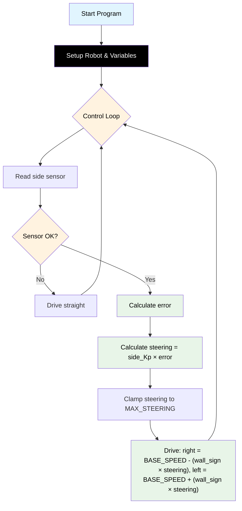

# Challenge 1: Wall Follow — P Control

In this challenge you will use the **side ultrasonic sensor** and a **Proportional (P) controller** to make the robot follow a straight wall from one end of a corridor to the other.

You will learn:

- How the side sensor measures distance to a wall.
- What "error" means in a control system.
- How to turn error into a steering correction using a single number called **side_Kp**.

---

## Success Criteria

My robot follows the wall through a straight corridor and reaches the **green exit zone** without hitting the wall.

---

## Before You Begin

1. Make sure you have completed the hardware setup in [Build Instructions](docs.html?doc=Assembly_Instructions).
2. Open the **Simulator** and select **Challenge 1** from the menu.
3. Note which side the wall is on in the simulator — set `AIDriver("left")` or `AIDriver("right")` to match.

---

## Flowchart Of The Algorithm



---

## Key Concepts

### What is the Side Sensor?

Your robot has **two** ultrasonic sensors:

| Sensor           | Function                  | Code                         |
| ---------------- | ------------------------- | ---------------------------- |
| **Front sensor** | Detects walls ahead       | `my_robot.read_distance()`   |
| **Side sensor**  | Detects walls to the side | `my_robot.read_distance_2()` |

Both return a distance in **millimetres**. If the wall is too close, too far, or there is an error, they return **-1**.

### What is Error?

Error is the difference between **where the robot is** and **where you want it to be**:

```
SIDE_DISTANCE = my_robot.read_distance_2()
error = SIDE_DISTANCE - TARGET_WALL_DISTANCE
```

- If the robot is **too far** from the wall → error is **positive** → steer closer.
- If the robot is **too close** to the wall → error is **negative** → steer away.
- If the robot is at the **perfect distance** → error is **zero** → drive straight.

### What is side_Kp?

**side_Kp** (Proportional gain) controls how strongly the error affects steering:

```
steering = side_Kp * error
```

- If **side_Kp** is too low, the robot reacts slowly and drifts away from the wall.
- If **side_Kp** is too high, the robot overreacts and zig-zags.

---

## The Code

The full algorithm is already written in the editor — you only fill in the four values at the top (they start at `0`). This is exactly what you'll see:

```python
# Challenge 1: Wall Follow — P Control
# Follow the side wall using a Proportional controller.
# Fill in the values below (they start at 0). Guide: docs.html?doc=Challenge_1

from aidriver import AIDriver, hold_state
import aidriver

aidriver.DEBUG_AIDRIVER = False  # set True to print sensor + motor values
my_robot = AIDriver("left")  # "left" or "right" — match the simulator scene

BASE_SPEED = 0            # forward speed (keep BASE_SPEED - MAX_STEERING > 120)
TARGET_WALL_DISTANCE = 0  # distance to hold from the wall (mm)
MAX_STEERING = 0          # max wheel-speed difference

side_Kp = 0.0             # proportional gain


while True:
    wall_distance = my_robot.read_distance_2()

    if wall_distance == -1:
        # Wall lost — drive straight and try again next loop.
        my_robot.drive(BASE_SPEED, BASE_SPEED)
        hold_state(0.05)
        continue

    error = wall_distance - TARGET_WALL_DISTANCE
    steering = side_Kp * error

    if steering > MAX_STEERING:
        steering = MAX_STEERING
    elif steering < -MAX_STEERING:
        steering = -MAX_STEERING

    right_speed = BASE_SPEED - (my_robot.wall_sign * steering)
    left_speed = BASE_SPEED + (my_robot.wall_sign * steering)

    my_robot.drive(int(right_speed), int(left_speed))
    hold_state(0.05)
```

## How It Works

- **Read the side sensor** — `read_distance_2()` returns the distance to the wall in mm, or `-1` if it can't see it (then the robot just drives straight).
- **Error** — `error = wall_distance - TARGET_WALL_DISTANCE`. Positive means too far from the wall, negative means too close.
- **Steering** — `steering = side_Kp * error`. A bigger `side_Kp` reacts harder to the same error.
- **Clamp** — keep `steering` within `±MAX_STEERING` so one wheel never stalls.
- **Differential drive** — `my_robot.wall_sign` flips the correction automatically, so the same code works whether the wall is on the left or the right.

> [!Important]
> `drive()` needs whole numbers, so the speeds are wrapped in `int()`.

---

## Tune Your Robot

Run your code in the simulator, watch the robot, and adjust:

| Symptom                            | Cause                             | Fix                                            |
| ---------------------------------- | --------------------------------- | ---------------------------------------------- |
| Robot barely corrects, drifts away | side_Kp too low                   | Increase side_Kp (try 0.40, 0.50)              |
| Robot oscillates side to side      | side_Kp too high                  | Decrease side_Kp (try 0.20, 0.15)              |
| One wheel stops during correction  | `BASE_SPEED - MAX_STEERING < 120` | Increase `BASE_SPEED` or reduce `MAX_STEERING` |
| Robot crashes into the wall        | TARGET_WALL_DISTANCE too small    | Increase TARGET_WALL_DISTANCE (try 200)        |

> [!Caution]
> When testing on the real robot: save your file, disconnect from your computer, place the robot on the floor with space to move, then power on.

---

<details>
<summary><strong>Example tuned values</strong> — open after you've tried your own</summary>

```python
BASE_SPEED = 200            # forward speed
TARGET_WALL_DISTANCE = 200  # mm to hold from the wall
MAX_STEERING = 60           # wheel-speed clamp

side_Kp = 0.25              # proportional gain
```

These are a starting point only — the full tuned answer is in `app/answers/challenge-1.py`.

</details>

---

## Debugging Tips — Test Small, Test Often

- Run your code after every change.
- Watch the **debug output** — it shows sensor distances and motor speeds each loop.
- If the robot doesn't move at all, check that `BASE_SPEED` is at least 120.
- If the robot drives away from the wall, check that `AIDriver("left")`/`AIDriver("right")` matches your physical setup — the `wall_sign` controls steering direction automatically.
- If something confusing happens, temporarily add:

  ```python
  print("error:", error, "steering:", steering)
  ```

  to see what numbers the controller is producing.

---

## What's Next

[Challenge 2](docs.html?doc=Challenge_2) starts the robot **off-centre and angled**, so P-only
control zig-zags. You'll add a **Derivative (D)** term to smooth it out.
