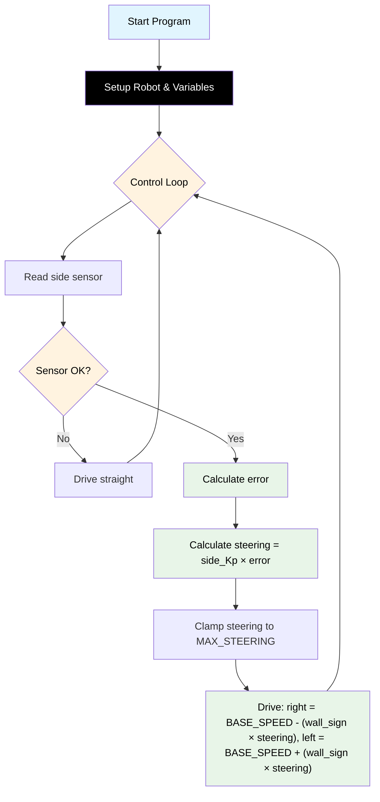

# Challenge 1: Wall Follow — P Control

In this challenge you will use the **side ultrasonic sensor** and a **Proportional (P) controller** to make the robot follow a straight wall from one end of a corridor to the other.

You will learn:

- How the side sensor measures distance to a wall.
- What "error" means in a control system.
- How to turn error into a steering correction using a single number called **side_Kp**.

---

## Success Criteria

My robot follows the wall through a straight corridor and reaches the **green exit zone** without hitting the wall.

---

## Before You Begin

1. Make sure you have completed the hardware setup in [Build Instructions](docs.html?doc=Assembly_Instructions).
2. Open the **Simulator** and select **Challenge 1** from the menu.
3. Note which side the wall is on in the simulator — set `AIDriver("left")` or `AIDriver("right")` to match.

---

## Flowchart Of The Algorithm



---

## Key Concepts

### What is the Side Sensor?

Your robot has **two** ultrasonic sensors:

| Sensor           | Function                  | Code                         |
| ---------------- | ------------------------- | ---------------------------- |
| **Front sensor** | Detects walls ahead       | `my_robot.read_distance()`   |
| **Side sensor**  | Detects walls to the side | `my_robot.read_distance_2()` |

Both return a distance in **millimetres**. If the wall is too close, too far, or there is an error, they return **-1**.

### What is Error?

Error is the difference between **where the robot is** and **where you want it to be**:

```
SIDE_DISTANCE = my_robot.read_distance_2()
error = SIDE_DISTANCE - TARGET_WALL_DISTANCE
```

- If the robot is **too far** from the wall → error is **positive** → steer closer.
- If the robot is **too close** to the wall → error is **negative** → steer away.
- If the robot is at the **perfect distance** → error is **zero** → drive straight.

### What is side_Kp?

**side_Kp** (Proportional gain) controls how strongly the error affects steering:

```
steering = side_Kp * error
```

- If **side_Kp** is too low, the robot reacts slowly and drifts away from the wall.
- If **side_Kp** is too high, the robot overreacts and zig-zags.

---

## Example Starting Values

```python
BASE_SPEED = 160
TARGET_WALL_DISTANCE = 150
MAX_STEERING = 40
side_Kp = 0.40
```

---

## Step 1 — Setup

Import the library and create the robot. Set up your configuration variables.

```python
from aidriver import AIDriver, hold_state
import aidriver

aidriver.DEBUG_AIDRIVER = False
my_robot = AIDriver("left")  # ← "left" or "right" — must match your physical setup!
```

> [!Tip]
> Setting `DEBUG_AIDRIVER = True` prints sensor readings and motor speeds to the console. This is very helpful while tuning.

---

## Step 2 — Add Configuration Variables

These are the numbers you will tune to get your robot working:

```python
BASE_SPEED = 160           # Forward speed (must be > 120!)
TARGET_WALL_DISTANCE = 150 # Distance to maintain from wall (mm)
side_Kp = 0.30             # Start here — raise in 0.05 steps until zig-zag starts
MAX_STEERING = 40          # Max wheel speed difference
```

> [!Note]
> Start with these values. You will adjust them in Step 5.

---

## Step 3 — Read the Side Sensor

Create a `while True:` loop and read the side sensor:

```python
while True:
    wall_distance = my_robot.read_distance_2()

    if wall_distance == -1:
        # Sensor error or wall out of range — just drive straight
        my_robot.drive(BASE_SPEED, BASE_SPEED)
        hold_state(0.05)
        continue
```

The `continue` keyword skips the rest of the loop and goes back to the top. This means: "if the sensor can't see the wall, just go straight and try again".

---

## Step 4 — Calculate Error and Steering

After the sensor check, calculate the error and apply P control:

```python
    # Calculate error (positive = too far from wall)
    error = wall_distance - TARGET_WALL_DISTANCE

    # P controller: steering correction
    steering = side_Kp * error

    # Clamp steering so it doesn't go too extreme
    if steering > MAX_STEERING:
        steering = MAX_STEERING
    elif steering < -MAX_STEERING:
        steering = -MAX_STEERING
```

Then apply differential steering — one wheel speeds up, the other slows down (see "How Differential Steering Corrects the Distance" above for why this works):

```python
    # Apply differential steering — wall_sign handles left/right automatically
    # Too far from wall → steering positive → curves toward wall
    # Too close to wall → steering negative → curves away from wall
    # At perfect distance → steering zero → drives straight
    right_speed = BASE_SPEED - (my_robot.wall_sign * steering)
    left_speed  = BASE_SPEED + (my_robot.wall_sign * steering)

    my_robot.drive(int(right_speed), int(left_speed))
    hold_state(0.05)
```

> [!Important]
> We use `int()` because `drive()` expects whole numbers (integers), but the maths may produce decimals.

---

## Step 5 — Tune Your Robot

Run your code in the simulator. Watch the robot carefully and adjust:

| Symptom                            | Cause                             | Fix                                            |
| ---------------------------------- | --------------------------------- | ---------------------------------------------- |
| Robot barely corrects, drifts away | side_Kp too low                   | Increase side_Kp (try 0.40, 0.50)              |
| Robot oscillates side to side      | side_Kp too high                  | Decrease side_Kp (try 0.20, 0.15)              |
| One wheel stops during correction  | `BASE_SPEED - MAX_STEERING < 120` | Increase `BASE_SPEED` or reduce `MAX_STEERING` |
| Robot crashes into the wall        | TARGET_WALL_DISTANCE too small    | Increase TARGET_WALL_DISTANCE (try 200)        |

> [!Caution]
> When testing on the real robot: save your file, disconnect from your computer, place the robot on the floor with space to move, then power on.

---

## Starter Scaffold

This is what you'll see in the editor when you open the challenge. Comments mark the `TODO` blocks you must complete.

```python
# Challenge 1: Wall Follow — P Control
# ====================================================================
# GOAL: Make the robot follow the side wall using only a Proportional
#       (P) controller. Reach the green exit zone without hitting the wall.
#
# WHAT YOU NEED TO WRITE:
#   1. Read the side sensor.
#   2. Calculate error = (sensor reading) - (target distance).
#   3. Calculate steering = side_Kp * error.
#   4. Clamp steering between -MAX_STEERING and +MAX_STEERING.
#   5. Apply differential drive using my_robot.wall_sign so it works
#      whether the wall is on the left or the right.
#
# READ THIS FIRST: docs/Challenge_1.md (open the Help dropdown).
# ====================================================================

from aidriver import AIDriver, hold_state
import aidriver

aidriver.DEBUG_AIDRIVER = False  # Set True to print sensor & motor values

# Set the wall side to match the simulator scene ("left" or "right")
my_robot = AIDriver("left")

# === BLOCK: CONFIG_BASE START ===
BASE_SPEED = 160            # Forward speed (must stay > 120, the motor dead zone)
TARGET_WALL_DISTANCE = 150  # Distance to maintain from wall (mm)
MAX_STEERING = 40           # Max wheel speed difference
# Rule: BASE_SPEED - MAX_STEERING must be >= 120
# === BLOCK: CONFIG_BASE END ===

# === BLOCK: SIDE_KP START ===
side_Kp = 0.0  # TODO: pick a starting value (try 0.30, then raise in 0.05 steps)
# === BLOCK: SIDE_KP END ===


# === MAIN LOOP ===
while True:
    # === BLOCK: SIDE_FOLLOW_P START ===
    # 1. Read the SIDE sensor (hint: my_robot.read_distance_2()).
    wall_distance = None  # TODO: replace None with the sensor read

    # 2. If the sensor failed (returned -1), drive straight and try again.
    #    Hint: my_robot.drive(BASE_SPEED, BASE_SPEED), then `continue`.
    # TODO: handle the wall_distance == -1 case

    # 3. Calculate the error (positive = too far from wall).
    error = 0  # TODO

    # 4. P controller: steering = side_Kp * error
    steering = 0  # TODO

    # 5. Clamp steering between -MAX_STEERING and +MAX_STEERING.
    # TODO: clamp `steering`

    # 6. Apply differential drive using my_robot.wall_sign.
    #    right_speed = BASE_SPEED - (my_robot.wall_sign * steering)
    #    left_speed  = BASE_SPEED + (my_robot.wall_sign * steering)
    #    Then call my_robot.drive(int(right_speed), int(left_speed)).
    # TODO: drive the robot
    # === BLOCK: SIDE_FOLLOW_P END ===

    hold_state(0.05)
```

<details>
<summary><strong>Reference Solution</strong> — click to expand <em>(only after you've genuinely tried)</em></summary>

```python
# Challenge 1: Wall Follow - P Control
# Follow the side wall using proportional steering only.

from aidriver import AIDriver, hold_state
import aidriver

aidriver.DEBUG_AIDRIVER = False  # Set True for full motor debug (slows loop)
my_robot = AIDriver("left")  # ← "left" or "right" — must match your physical setup!

# === BLOCK: CONFIG_BASE START ===
BASE_SPEED = 160  # Forward speed (must be > 120)
TARGET_WALL_DISTANCE = 150  # Distance to maintain from wall (mm)
MAX_STEERING = 40  # Max wheel speed difference
# Rule: BASE_SPEED - MAX_STEERING must be >= 120 (motor dead zone)
# === BLOCK: CONFIG_BASE END ===

# === BLOCK: SIDE_KP START ===
side_Kp = 0.40  # Proportional gain — raise in 0.05 steps until zig-zag starts
# === BLOCK: SIDE_KP END ===

# === MAIN LOOP ===
while True:
    # === BLOCK: SIDE_FOLLOW_P START ===
    wall_distance = my_robot.read_distance_2()

    if wall_distance == -1:
        # No valid reading - drive straight and try again
        my_robot.drive(BASE_SPEED, BASE_SPEED)
        hold_state(0.05)
        continue

    error = wall_distance - TARGET_WALL_DISTANCE
    steering = side_Kp * error

    if steering > MAX_STEERING:
        steering = MAX_STEERING
    elif steering < -MAX_STEERING:
        steering = -MAX_STEERING

    right_speed = BASE_SPEED - (my_robot.wall_sign * steering)
    left_speed = BASE_SPEED + (my_robot.wall_sign * steering)

    my_robot.drive(int(right_speed), int(left_speed))
    # === BLOCK: SIDE_FOLLOW_P END ===

    hold_state(0.05)
```

</details>

---

## Debugging Tips — Test Small, Test Often

- Run your code after every change.
- Watch the **debug output** — it shows sensor distances and motor speeds each loop.
- If the robot doesn't move at all, check that `BASE_SPEED` is at least 120.
- If the robot drives away from the wall, check that `AIDriver("left")`/`AIDriver("right")` matches your physical setup — the `wall_sign` controls steering direction automatically.
- If something confusing happens, temporarily add:

  ```python
  print("error:", error, "steering:", steering)
  ```

  to see what numbers the controller is producing.
