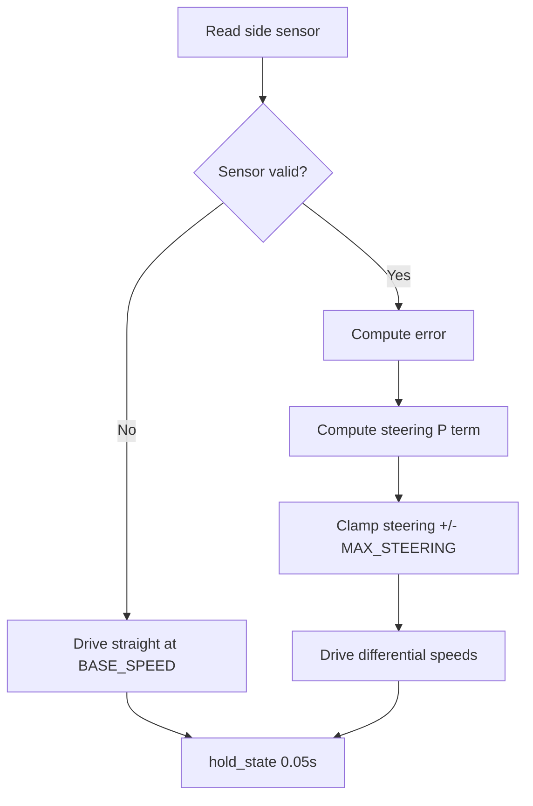

# Challenge 1: Wall Follow - P Control

## Purpose

Build a clean baseline wall follower using only the side sensor and a proportional controller. This challenge establishes the control-loop structure reused in later challenges.

## Success Criteria

The robot follows a straight wall through the corridor and reaches the green exit zone without hitting the wall.

## Before You Begin

1. Complete the robot hardware setup.
2. Open the simulator and select Challenge 1.
3. Set `AIDriver("left")` or `AIDriver("right")` to match the wall side.

## Maze Situation

- Maze feature: straight corridor with one side wall to follow.
- Trigger condition expected in code: no state trigger yet, only continuous side control.
- New behavior introduced: side-distance proportional steering.
- Why previous baseline fails: fixed-speed straight driving drifts and cannot hold wall distance.

## What Is New In This Challenge

New: proportional steering term.

Unchanged: basic loop timing and direct motor drive.

Delta equation:

```python
error = wall_distance - TARGET_WALL_DISTANCE
steering = side_Kp * error
```

## Carry Forward From Previous Challenge

| Group   | Variable               | Notes                            |
| ------- | ---------------------- | -------------------------------- |
| Reused  | `BASE_SPEED`           | Main forward speed.              |
| New     | `TARGET_WALL_DISTANCE` | Target side-wall distance in mm. |
| New     | `MAX_STEERING`         | Steering clamp.                  |
| New     | `side_Kp`              | Proportional gain.               |
| Removed | None                   | First challenge in the series.   |

## Algorithm Flow



## Starter Code Contract

Safe to edit:

1. `BASE_SPEED`
2. `TARGET_WALL_DISTANCE`
3. `MAX_STEERING`
4. `side_Kp`

Do not edit unless instructed:

1. Sensor validation branch for `-1`.
2. Steering clamp logic.
3. Core drive formula using `wall_sign`.
4. Loop timing (`hold_state(0.05)`).

Optional debug edits:

1. Add print lines in the loop to inspect `error` and `steering`.

## Tunables

| Name                   | Unit      | Purpose                 | Typical start value | Symptoms when too low | Symptoms when too high          |
| ---------------------- | --------- | ----------------------- | ------------------- | --------------------- | ------------------------------- |
| `BASE_SPEED`           | PWM       | Forward speed baseline  | 200                 | Robot may stall       | Harder to control corners later |
| `TARGET_WALL_DISTANCE` | mm        | Desired side clearance  | 200                 | Too close to wall     | Too far from wall               |
| `MAX_STEERING`         | PWM delta | Max wheel speed split   | 60                  | Weak correction       | One wheel can slow too much     |
| `side_Kp`              | gain      | Error to steering scale | 0.25                | Slow drift away       | Zig-zag oscillation             |

## Tuning Guide

1. Verify `BASE_SPEED` and `MAX_STEERING` so `BASE_SPEED - MAX_STEERING` stays above motor deadband.
2. Adjust `TARGET_WALL_DISTANCE` for safe clearance.
3. Adjust `side_Kp` until drift is controlled, then reduce slightly if oscillation starts.

## Debug Checklist

- [ ] Side sensor values are valid and not permanently `-1`.
- [ ] Steering stays inside `+/-MAX_STEERING`.
- [ ] Right and left speeds change in opposite directions when error changes sign.
- [ ] Robot reaches the green zone while maintaining wall distance.

## Common Failure Modes

| Symptom            | Root cause                     | Verification step              | Fix                              |
| ------------------ | ------------------------------ | ------------------------------ | -------------------------------- |
| Robot drifts away  | `side_Kp` too low              | Print `error`, `steering`      | Increase `side_Kp`               |
| Robot oscillates   | `side_Kp` too high             | Watch repeated over-correction | Decrease `side_Kp`               |
| Robot barely turns | `MAX_STEERING` too small       | Compare steering to clamp      | Increase `MAX_STEERING` slightly |
| Robot scrapes wall | `TARGET_WALL_DISTANCE` too low | Log measured side distance     | Increase target distance         |

## Exit Check

Pass when the Success Criteria are met in at least 3 consecutive simulator runs.

## What Is Next

Challenge 2 keeps the same wall-follow loop and adds derivative damping to reduce oscillation when starting off-center and angled.
