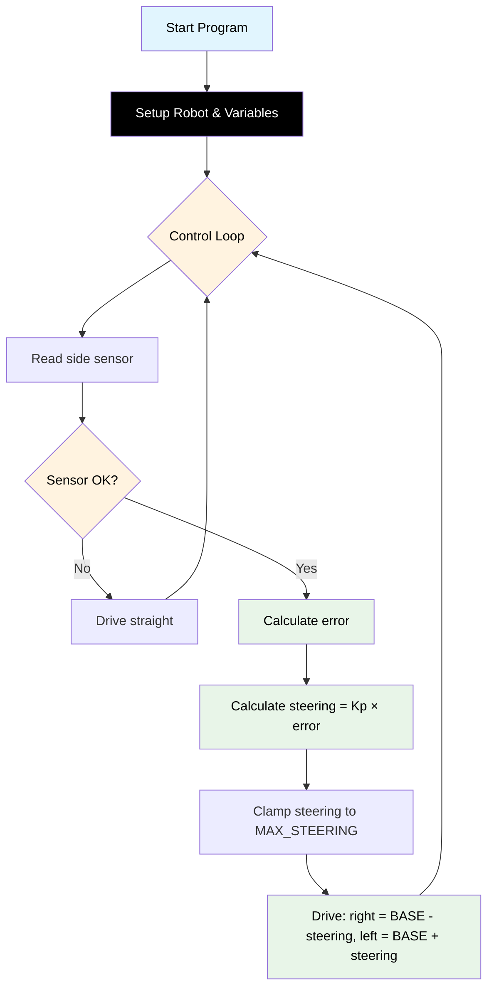

# Challenge 1: Wall Follow — P Control

In this challenge you will use the **side ultrasonic sensor** and a **Proportional (P) controller** to make the robot follow a straight wall from one end of a corridor to the other.

You will learn:

- How the side sensor measures distance to a wall.
- What "error" means in a control system.
- How to turn error into a steering correction using a single number called **Kp**.

---

## Success Criteria

My robot follows the wall through a straight corridor and reaches the **green exit zone** without hitting the wall.

---

## Before You Begin

1. Make sure you have completed the hardware setup in [Build Instructions](docs.html?doc=Assembly_Instructions).
2. Open the **Simulator** and select **Challenge 1** from the menu.
3. Note the corridor has a wall on the right side — your robot will follow it.

---

## Flowchart Of The Algorithm



---

## Key Concepts

### What is the Side Sensor?

Your robot has **two** ultrasonic sensors:

| Sensor           | Function                  | Code                         |
| ---------------- | ------------------------- | ---------------------------- |
| **Front sensor** | Detects walls ahead       | `my_robot.read_distance()`   |
| **Side sensor**  | Detects walls to the side | `my_robot.read_distance_2()` |

Both return a distance in **millimetres**. If the wall is too close, too far, or there is an error, they return **-1**.

### What is Error?

Error is the difference between **where the robot is** and **where you want it to be**:

```
error = wall_distance - TARGET_WALL_DISTANCE
```

- If the robot is **too far** from the wall → error is **positive** → steer closer.
- If the robot is **too close** to the wall → error is **negative** → steer away.
- If the robot is at the **perfect distance** → error is **zero** → drive straight.

### What is Kp?

**Kp** (Proportional gain) is a number you multiply by the error to get a steering correction:

```
steering = Kp × error
```

- **Bigger Kp** → stronger correction → faster response, but may overshoot.
- **Smaller Kp** → gentler correction → smoother, but may not correct fast enough.

### What is `drive()`?

The `drive()` method accepts **signed speeds** for the right and left wheels:

```python
my_robot.drive(right_speed, left_speed)
```

- Positive values = forward, negative values = backward.
- Values are automatically clamped to -255 to +255.
- The motor **dead zone** (speeds 1–119 don't spin the wheels) is handled automatically.

> [!Important]
> The robot's motors need at least speed **120** to actually turn. The `drive()` method handles this for you — if a speed is too low to move the wheel, it either stops it (0) or jumps to 120.

### The Dead Zone Rule

When setting your `BASE_SPEED` and `MAX_STEERING`, follow this rule:

```
BASE_SPEED - MAX_STEERING >= 120
```

If you break this rule, one wheel may stop unexpectedly during a correction. For example:

- `BASE_SPEED = 160`, `MAX_STEERING = 40` → minimum wheel speed = 120 ✅
- `BASE_SPEED = 150`, `MAX_STEERING = 40` → minimum wheel speed = 110 ❌

---

## Step 1 — Setup

Import the library and create the robot. Set up your configuration variables.

```python
from aidriver import AIDriver, hold_state
import aidriver

aidriver.DEBUG_AIDRIVER = True
my_robot = AIDriver()
```

> [!Tip]
> Setting `DEBUG_AIDRIVER = True` prints sensor readings and motor speeds to the console. This is very helpful while tuning.

---

## Step 2 — Add Configuration Variables

These are the numbers you will tune to get your robot working:

```python
BASE_SPEED = 160          # Forward speed (must be > 120!)
TARGET_WALL_DISTANCE = 150  # Distance to maintain from wall (mm)
Kp = 0.5                  # Proportional gain
MAX_STEERING = 40         # Max wheel speed difference
```

> [!Note]
> Start with these values. You will adjust them in Step 5.

---

## Step 3 — Read the Side Sensor

Create a `while True:` loop and read the side sensor:

```python
while True:
    wall_distance = my_robot.read_distance_2()

    if wall_distance == -1:
        # Sensor error or wall out of range — just drive straight
        my_robot.drive(BASE_SPEED, BASE_SPEED)
        hold_state(0.05)
        continue
```

The `continue` keyword skips the rest of the loop and goes back to the top. This means: "if the sensor can't see the wall, just go straight and try again".

---

## Step 4 — Calculate Error and Steering

After the sensor check, calculate the error and apply P control:

```python
    # Calculate error (positive = too far from wall)
    error = wall_distance - TARGET_WALL_DISTANCE

    # P controller: steering correction
    steering = Kp * error

    # Clamp steering so it doesn't go too extreme
    if steering > MAX_STEERING:
        steering = MAX_STEERING
    elif steering < -MAX_STEERING:
        steering = -MAX_STEERING
```

Then apply differential steering — one wheel speeds up, the other slows down:

```python
    # Apply differential steering (wall on RIGHT side)
    right_speed = BASE_SPEED - steering
    left_speed = BASE_SPEED + steering

    my_robot.drive(int(right_speed), int(left_speed))
    hold_state(0.05)
```

> [!Important]
> We use `int()` because `drive()` expects whole numbers (integers), but the maths may produce decimals.

---

## Step 5 — Tune Your Robot

Run your code in the simulator. Watch the robot carefully and adjust:

| Symptom                            | Cause                             | Fix                                            |
| ---------------------------------- | --------------------------------- | ---------------------------------------------- |
| Robot barely corrects, drifts away | Kp too low                        | Increase Kp (try 0.8, 1.0)                     |
| Robot oscillates side to side      | Kp too high                       | Decrease Kp (try 0.3, 0.2)                     |
| One wheel stops during correction  | `BASE_SPEED - MAX_STEERING < 120` | Increase `BASE_SPEED` or reduce `MAX_STEERING` |
| Robot crashes into the wall        | TARGET_WALL_DISTANCE too small    | Increase TARGET_WALL_DISTANCE (try 200)        |

> [!Caution]
> When testing on the real robot: save your file, disconnect from your computer, place the robot on the floor with space to move, then power on.

---

## Complete Code

```python
# Challenge 1: Wall Follow — P Control
from aidriver import AIDriver, hold_state
import aidriver

aidriver.DEBUG_AIDRIVER = True
my_robot = AIDriver()

BASE_SPEED = 160
TARGET_WALL_DISTANCE = 150
Kp = 0.5
MAX_STEERING = 40

while True:
    wall_distance = my_robot.read_distance_2()

    if wall_distance == -1:
        my_robot.drive(BASE_SPEED, BASE_SPEED)
        hold_state(0.05)
        continue

    error = wall_distance - TARGET_WALL_DISTANCE
    steering = Kp * error

    if steering > MAX_STEERING:
        steering = MAX_STEERING
    elif steering < -MAX_STEERING:
        steering = -MAX_STEERING

    right_speed = BASE_SPEED - steering
    left_speed = BASE_SPEED + steering

    my_robot.drive(int(right_speed), int(left_speed))
    hold_state(0.05)
```

---

## Debugging Tips — Test Small, Test Often

- Run your code after every change.
- Watch the **debug output** — it shows sensor distances and motor speeds each loop.
- If the robot doesn't move at all, check that `BASE_SPEED` is at least 120.
- If the robot drives away from the wall, you may have the steering signs reversed — try swapping `+ steering` and `- steering`.
- If something confusing happens, temporarily add:

  ```python
  print("error:", error, "steering:", steering)
  ```

  to see what numbers the controller is producing.
