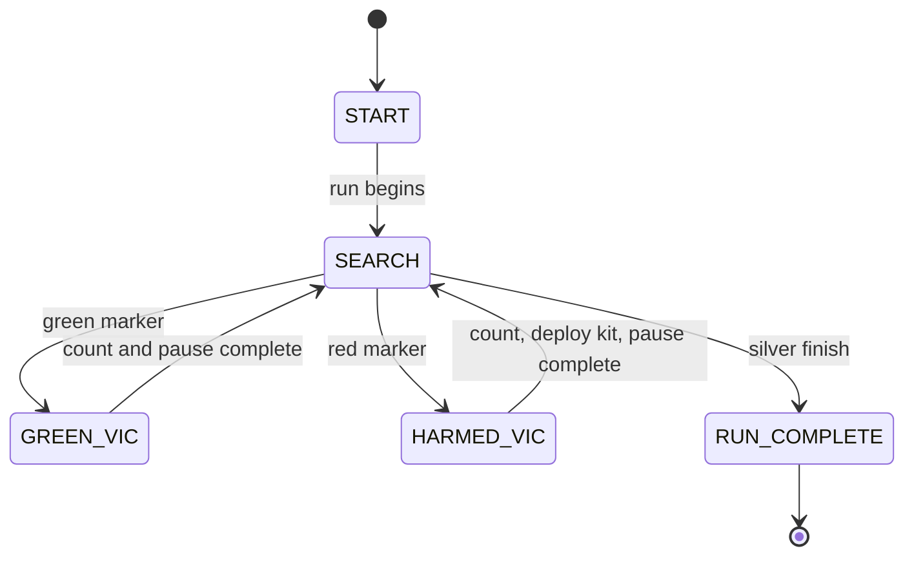

# Challenge 10: Competition Run - Victims, Score, OLED

## Purpose

Integrate navigation, victim detection, scoring, display reporting, and rescue-kit deployment into one complete competition run.

## Success Criteria

The robot identifies red and green victims, updates score and counts, deploys rescue kit on harmed victims, shows live OLED status, and completes the run at silver finish.

## Before You Begin

1. Complete Challenge 8 color classification.
2. Complete Challenge 9 recovery behavior.
3. Open simulator Challenge 10 and verify OLED panel visibility.

## Maze Situation

- Maze feature: victim markers and finish marker in one run.
- Trigger condition expected in code: marker classification transitions and run-complete condition.
- New behavior introduced: scoring and competition status state reporting.
- Why previous challenge fails: no victim accounting, no score model, no OLED run status.

## What Is New In This Challenge

New: competition scoring model and status output layer.

Unchanged: core movement and color classification flow.

## Carry Forward From Previous Challenge

| Group   | Variable                                | Notes                                       |
| ------- | --------------------------------------- | ------------------------------------------- |
| Reused  | Color thresholds and movement control   | Same sensing baseline.                      |
| New     | `unharmed`, `harmed`, score constants   | Competition accounting.                     |
| New     | OLED status strings and state labels    | Live operator/judge feedback.               |
| New     | Rescue-kit action call on harmed marker | Bonus-scoring behavior.                     |
| Removed | None                                    | Challenge flow is marker-driven end-to-end. |

## Algorithm Flow

### State Table

| State name     | Responsibilities                                            | Exit conditions                         |
| -------------- | ----------------------------------------------------------- | --------------------------------------- |
| `START`        | Initialize counters, status, and started flag               | Enter `SEARCH` when moving off start    |
| `SEARCH`       | Drive and classify markers                                  | Exit to victim states or `RUN_COMPLETE` |
| `GREEN_VIC`    | Count unharmed victim, update score/status, pause           | Return to `SEARCH`                      |
| `HARMED_VIC`   | Count harmed victim, deploy kit, update score/status, pause | Return to `SEARCH`                      |
| `RUN_COMPLETE` | Brake and display final report                              | End                                     |

### Trigger Table

| Trigger condition         | From state                  | To state       | Priority |
| ------------------------- | --------------------------- | -------------- | -------- |
| New green marker          | `SEARCH`                    | `GREEN_VIC`    | High     |
| New red marker            | `SEARCH`                    | `HARMED_VIC`   | High     |
| Silver finish after start | `SEARCH`                    | `RUN_COMPLETE` | Highest  |
| Pause complete            | `GREEN_VIC` or `HARMED_VIC` | `SEARCH`       | High     |

## Starter Code Contract

Safe to edit:

1. Scoring constants if competition rules change.
2. Pause duration.
3. OLED display text labels.

Do not edit unless instructed:

1. New-marker edge detection.
2. Score-update formulas.
3. Run-complete finish guard.

Optional debug edits:

1. Print state, color class, counts, and score each loop.

## Tunables

| Name                 | Unit         | Purpose                     | Typical start value | Symptoms when too low | Symptoms when too high    |
| -------------------- | ------------ | --------------------------- | ------------------- | --------------------- | ------------------------- |
| `color_min_clear`    | clear counts | Marker gate threshold       | 180                 | False markers         | Missed markers            |
| `color_red_ratio`    | fraction     | Red victim classification   | 0.55                | Red misses            | Red over-classification   |
| `color_green_ratio`  | fraction     | Green victim classification | 0.55                | Green misses          | Green over-classification |
| `color_silver_clear` | clear counts | Finish marker detection     | 500                 | Early finish          | Missed finish             |
| `VICTIM_PAUSE_TIME`  | s            | Pause on victim marker      | 1.0                 | Insufficient pause    | Slow run                  |

## Tuning Guide

1. Verify marker edge detection avoids double counts.
2. Verify finish is only valid after run start.
3. Verify score math with a known marker sequence.

## Debug Checklist

- [ ] Each victim marker increments once.
- [ ] Harmed marker triggers rescue-kit deploy call.
- [ ] OLED status matches current state and score.
- [ ] Final report appears at run completion.

## Common Failure Modes

| Symptom                        | Root cause                    | Verification step                     | Fix                                  |
| ------------------------------ | ----------------------------- | ------------------------------------- | ------------------------------------ |
| Same victim counted repeatedly | Missing edge detection        | Print current and previous marker     | Enforce new-marker condition         |
| Score mismatch                 | Incorrect scoring formula     | Hand-calculate expected score         | Correct constants/formula            |
| Finish at start tile           | Missing started guard         | Log started flag when finish triggers | Require started before finish        |
| OLED unreadable or stale       | No update on state transition | Log display update calls              | Update display on every state change |

## Exit Check

Pass when the Success Criteria are met in at least 3 consecutive simulator runs.

## What Is Next

This challenge completes the student sequence. Next step is hardware calibration and transfer of tuned values to real-robot `main.py`.
