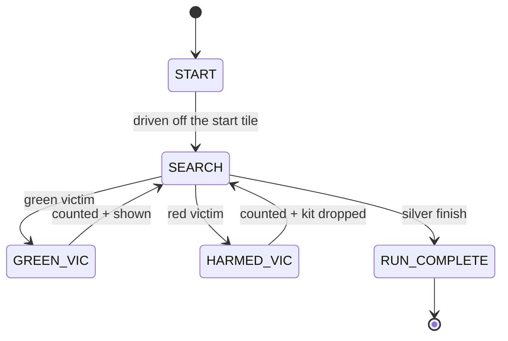

# Challenge 10: Competition Run — Victims, Score & the OLED

Challenge 10 is the **Rescue Maze capstone**. You bring together everything from the earlier
challenges — driving, the colour sensor, and now the **SSD1306 OLED status display** — into a single
competition run. As the robot drives up the corridor it must **identify each victim**, keep a
**running score**, drop a **rescue kit** on the harmed ones, and **report what it is doing on the
OLED** so a judge can read the screen at a glance.

This is exactly how the real robot communicates during a RoboCup Junior Rescue Maze round: the OLED
shows the current state and score, and the rescue-kit servo drops a kit on a harmed victim for the
bonus.

You will learn:

- How to drive the **OLED status display** with `display_status()` and `show_display()`.
- How to keep a **running score** and a **victim count** in your own variables.
- How to trigger the **rescue-kit** deployment on a harmed victim.

---

## Success Criteria

My robot drives up the corridor, counts every **green (unharmed)** and **red (harmed)** victim, shows
the live **state / score / victim count** on the OLED, drops a kit on each harmed victim, and reaches
the **silver finish** showing a `RUN COMPLETE` report.

---

## Before You Begin

1. Complete [Challenge 8](docs.html?doc=Challenge_8) — you already know how to read and classify
   colours.
2. Open the **Simulator** and select **Challenge 10**. The simulated OLED appears in the top-right
   corner of the arena and shows whatever your code displays.

---

## Concept 1 — The OLED status display

The robot has an SSD1306 OLED on the shared I²C bus (GP16/GP17, address `0x3C`). The AIDriver gives
you two output calls. They work the same in the simulator and on the real robot — and if no OLED is
plugged in, the calls simply do nothing, so your program never breaks.

```python
# High-level: show the competition state, score and victim count
my_robot.display_status("SEARCH", 30, 2)

# Low-level: show any four short lines (max 16 characters each)
my_robot.show_display("RUN COMPLETE", "Unharmed:2", "Harmed:1", "Score:55")
```

> **Tip:** each OLED line holds **16 characters**. Keep your state labels short, e.g. `"HARMED VIC"`.

---

## Concept 2 — Counting victims and scoring

The simulator marks victims as coloured floor tiles, just like Challenge 8:

- **Green** = an **unharmed** victim → **10 points**
- **Red** = a **harmed** victim → **25 points**, plus **10** for dropping a rescue kit

Keep your own counters and compute the score yourself so you can show it on the OLED:

```python
POINTS_UNHARMED = 10
POINTS_HARMED = 25
POINTS_KIT = 10

unharmed = 0
harmed = 0


def score():
    return (unharmed * POINTS_UNHARMED) + (harmed * POINTS_HARMED) + (harmed * POINTS_KIT)
```

Only count a victim the **first** frame you roll onto it — track the previous colour so a single tile
is not counted on every loop:

```python
new_marker = color != "none" and color != previous_color
```

---

## Concept 3 — Dropping a rescue kit

On a **harmed (red)** victim, call the kit-deploy method for the bonus. The servo hardware is fitted
on the real robot; in the simulator the call is a safe no-op, so the same code runs in both places.

```python
if new_marker and color == "red":
    harmed = harmed + 1
    my_robot.brake()
    my_robot.deploy_rescue_kit()
    my_robot.display_status("HARMED VIC", score(), unharmed + harmed)
    hold_state(VICTIM_PAUSE_TIME)
```

---

## Concept 4 — The competition state machine



Push a fresh `display_status(...)` every time the state changes so the OLED always reflects what the
robot is doing.

---

## What you tune in this challenge

| Parameter            | What it does                                                  |
| -------------------- | ------------------------------------------------------------- |
| `color_min_clear`    | Clear value above which a tile counts as a marker (not floor) |
| `color_red_ratio`    | Red fraction needed to classify a victim as harmed            |
| `color_green_ratio`  | Green fraction needed to classify a victim as unharmed        |
| `color_silver_clear` | Brightness above which a balanced tile counts as silver       |
| `VICTIM_PAUSE_TIME`  | Seconds to stop on a victim (rules: at least 1 second)        |

---

## Tuning guide

| Observation                          | Fix                                                            |
| ------------------------------------ | -------------------------------------------------------------- |
| Same victim counted many times       | Check `new_marker` — you must compare against `previous_color` |
| Victims missed entirely              | Lower `color_min_clear` / re-tune the ratios from Challenge 8  |
| Finish triggers immediately at start | Only finish on silver **after** `started` is `True`            |
| OLED text is cut off                 | Shorten the line — the panel shows 16 characters per line      |
| Score looks wrong                    | Remember a harmed victim is worth 25 **plus** 10 for the kit   |

---

## Try it

1. Open **Challenge 10** and run the starter code — it drives up the corridor but ignores the
   victims and leaves the OLED on `START`.
2. Fill in the green / red / silver branches so the OLED shows the live state, score and victim
   count, and a kit is dropped on each harmed victim.
3. The completed answer is in `app/answers/challenge-10.py`.

---

## Hardware notes

The OLED is an **SSD1306** (128×64) on the shared bit-banged I²C bus (GP16/GP17, address `0x3C`),
alongside the LSM6DS3 gyro and TCS34725 colour sensor. The `deploy_rescue_kit()` call drives a hobby
servo to release a kit. Both are **optional**: if the panel or servo is not wired, the AIDriver
constructor sets `has_display` / `has_kit` to `False` and every display / kit call becomes a silent
no-op — so this exact program runs whether or not the extra hardware is attached.
