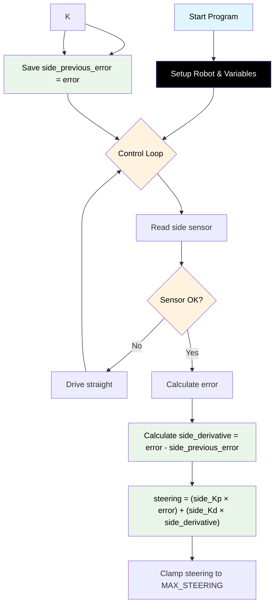

# Challenge 2: Wall Follow — PD Control

In this challenge you will add the **Derivative (D)** term to your P controller from Challenge 1. The robot now starts **off-centre and at a slight angle**, so a P-only controller will oscillate badly. The D term dampens these oscillations.

You will learn:

- Why P control alone causes oscillations.
- What the **Derivative** term does and why it helps.
- How to track `side_previous_error` to calculate the rate of change.

---

## Success Criteria

My robot follows the wall **smoothly** through the straight corridor and reaches the **green exit zone** — with noticeably fewer oscillations than P-only.

---

## Before You Begin

1. Complete [Challenge 1](docs.html?doc=Challenge_1) — you will build on that code.
2. Open the **Simulator** and select **Challenge 2**.
3. Notice the robot starts **off-centre** (closer to the wall) and **slightly angled**. This is deliberate!

---

## Flowchart Of The Algorithm



---

## Key Concepts

### Why Does P Control Oscillate?

With P-only control, the robot sees a large error and makes a strong correction. But by the time it reaches the target distance, it's moving fast and **overshoots** to the other side. Then it sees a large error in the opposite direction and overcorrects again. This back-and-forth is called **oscillation**.

Think of it like a car on an icy road — you turn the wheel hard, slide past where you wanted, turn hard the other way, and keep fishtailing.

### What is the Derivative Term?

The **Derivative** measures how fast the error is **changing**:

```
side_derivative = error - side_previous_error
```

- If the error is **getting smaller quickly** (robot approaching the wall fast) → side_derivative is **negative** → it opposes the P correction and slows you down.
- If the error is **getting bigger** (robot drifting away) → side_derivative is **positive** → it adds to the P correction and speeds up the response.

The derivative acts like a **brake on the steering** — it resists rapid changes and prevents overshoot.

### What is side_Kd?

**side_Kd** (Derivative gain) controls how strongly the derivative term affects steering:

```
steering = (side_Kp * error) + (side_Kd * side_derivative)
```

---

## Example Starting Values

```python
BASE_SPEED = 160
TARGET_WALL_DISTANCE = 150
MAX_STEERING = 40
side_Kp = 0.40
side_Kd = 0.15
side_previous_error = 0
```

> [!Note]
> `side_previous_error` starts at 0 because on the first loop iteration, there is no previous reading.

---

## Step 1 — Start from Your Challenge 1 Code

Copy your working Challenge 1 code. You will add two things:

1. A new variable `side_Kd` in the configuration section.
2. A `side_previous_error` variable before the loop.
3. The derivative calculation inside the loop.

---

## Step 2 — Add the New Variables

Add `side_Kd` to your configuration and `side_previous_error` before the loop:

```python
BASE_SPEED = 160
TARGET_WALL_DISTANCE = 150
side_Kp = 0.40
side_Kd = 0.15            # Derivative gain — dampens oscillations
MAX_STEERING = 40

side_previous_error = 0
```

> [!Note]
> `side_previous_error` starts at 0 because on the first loop iteration, there is no previous reading.

---

## Step 3 — Calculate the Derivative

Inside your loop, after calculating the error, add the derivative calculation:

```python
    error = wall_distance - TARGET_WALL_DISTANCE

    # Derivative: how fast is the error changing?
    side_derivative = error - side_previous_error

    # PD output
    steering = (side_Kp * error) + (side_Kd * side_derivative)
```

---

## Step 4 — Save the Previous Error

At the **end** of each loop iteration (after setting motor speeds), save the current error for next time:

```python
    my_robot.drive(int(right_speed), int(left_speed))

    side_previous_error = error
    hold_state(0.05)
```

> [!Important]
> If you forget this line, `side_previous_error` will always be 0 and the D term won't work at all.

---

## Step 5 — Compare P vs PD

Try running the same maze with two versions of your code:

1. **P only**: Set `Kd = 0` and watch the oscillations.
2. **PD**: Set `Kd = 0.3` and watch the robot smooth out.

The difference should be obvious, especially at the start where the robot begins off-centre.

---

## Tuning Guide

| Symptom                         | Cause           | Fix                        |
| ------------------------------- | --------------- | -------------------------- |
| Still oscillating (like P-only) | Kd too low      | Increase Kd (try 0.5, 0.8) |
| Robot responds very slowly      | Kd too high     | Decrease Kd (try 0.1, 0.2) |
| Robot overshoots then settles   | Kd slightly low | Small increase to Kd       |
| Robot barely moves toward wall  | Kp too low      | Increase Kp first          |

> [!Tip]
> The ideal approach is: get P working first, then gradually increase Kd until the oscillations disappear without making the robot sluggish.

---

## Complete Code

```python
# Challenge 2: Wall Follow — PD Control
from aidriver import AIDriver, hold_state
import aidriver

aidriver.DEBUG_AIDRIVER = False
my_robot = AIDriver("left")  # ← "left" or "right" — must match your physical setup!

BASE_SPEED = 160
TARGET_WALL_DISTANCE = 150
side_Kp = 0.40             # Use the Kp you found in Challenge 1
side_Kd = 0.15             # Derivative gain — dampens oscillations
MAX_STEERING = 40

side_previous_error = 0

while True:
    wall_distance = my_robot.read_distance_2()

    if wall_distance == -1:
        my_robot.drive(BASE_SPEED, BASE_SPEED)
        hold_state(0.05)
        continue

    error = wall_distance - TARGET_WALL_DISTANCE

    side_derivative = error - side_previous_error

    steering = (side_Kp * error) + (side_Kd * side_derivative)

    if steering > MAX_STEERING:
        steering = MAX_STEERING
    elif steering < -MAX_STEERING:
        steering = -MAX_STEERING

    right_speed = BASE_SPEED - (my_robot.wall_sign * steering)
    left_speed  = BASE_SPEED + (my_robot.wall_sign * steering)

    my_robot.drive(int(right_speed), int(left_speed))

    side_previous_error = error
    hold_state(0.05)
```

---

## Debugging Tips

- Add `print("D:", derivative, "steer:", steering)` inside the loop to see how the derivative affects steering.
- If both numbers look the same as Challenge 1, check that you are updating `side_previous_error` at the end of each loop.
- The D term should be largest in the first few loops (when the initial error is large and changing fast) and settle near zero once the robot is at the right distance.
