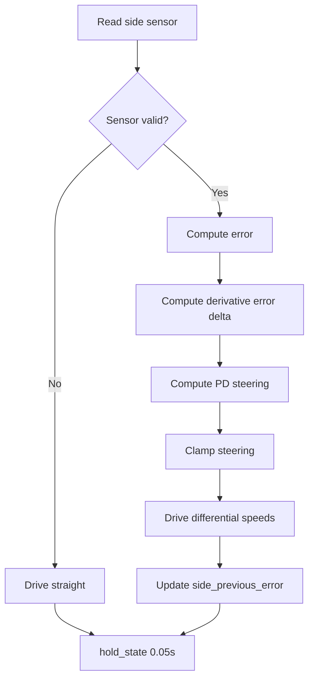

# Challenge 2: Wall Follow - PD Control

## Purpose

Extend Challenge 1 by adding derivative damping so the robot settles faster and oscillates less from a poor start pose.

## Success Criteria

The robot follows the wall smoothly from an off-center, angled start and reaches the green exit zone with fewer oscillations than P-only.

## Before You Begin

1. Complete Challenge 1 with stable `side_Kp`.
2. Open simulator Challenge 2.
3. Carry forward working values for speed, target distance, and steering clamp.

## Maze Situation

- Maze feature: straight corridor but robot starts misaligned.
- Trigger condition expected in code: none, continuous side control.
- New behavior introduced: derivative term based on error change.
- Why previous challenge fails: P-only control overshoots and oscillates.

## What Is New In This Challenge

New: derivative term and previous-error history.

Unchanged: sensor fail branch, steering clamp, drive mapping.

Delta equations:

```python
side_derivative = error - side_previous_error
steering = (side_Kp * error) + (side_Kd * side_derivative)
```

## Carry Forward From Previous Challenge

| Group   | Variable                                                        | Notes                   |
| ------- | --------------------------------------------------------------- | ----------------------- |
| Reused  | `BASE_SPEED`, `TARGET_WALL_DISTANCE`, `MAX_STEERING`, `side_Kp` | Kept from Challenge 1.  |
| New     | `side_Kd`                                                       | Derivative gain.        |
| New     | `side_previous_error`                                           | Error history per loop. |
| Removed | None                                                            | P term remains active.  |

## Algorithm Flow



## Starter Code Contract

Safe to edit:

1. `BASE_SPEED`
2. `TARGET_WALL_DISTANCE`
3. `MAX_STEERING`
4. `side_Kp`
5. `side_Kd`

Do not edit unless instructed:

1. `side_previous_error = error` update at end of loop.
2. Steering clamp.
3. Sensor fail branch.

Optional debug edits:

1. Print `error`, `side_derivative`, and `steering`.

## Tunables

| Name           | Unit      | Purpose                 | Typical start value | Symptoms when too low | Symptoms when too high  |
| -------------- | --------- | ----------------------- | ------------------- | --------------------- | ----------------------- |
| `side_Kd`      | gain      | Damping on error change | 0.30                | Oscillation remains   | Sluggish response       |
| `side_Kp`      | gain      | Main correction         | 0.25                | Weak correction       | Zig-zag                 |
| `MAX_STEERING` | PWM delta | Steering cap            | 60                  | Under-correction      | Harsh wheel split       |
| `BASE_SPEED`   | PWM       | Forward speed           | 200                 | Slow progress         | More overshoot pressure |

## Tuning Guide

1. Verify your Challenge 1 `side_Kp` baseline.
2. Adjust `side_Kd` gradually until oscillation reduces.
3. Adjust `side_Kd` slightly downward if response becomes too slow.

## Debug Checklist

- [ ] `side_previous_error` updates every loop.
- [ ] Derivative term spikes early, then shrinks near steady state.
- [ ] Steering remains clamped.
- [ ] Robot settles with less side-to-side swing than Challenge 1.

## Common Failure Modes

| Symptom                    | Root cause             | Verification step           | Fix                                               |
| -------------------------- | ---------------------- | --------------------------- | ------------------------------------------------- |
| No change from Challenge 1 | Missing history update | Print `side_previous_error` | Ensure update after drive call                    |
| Strong oscillation remains | `side_Kd` too low      | Observe repeated overshoot  | Increase `side_Kd`                                |
| Robot becomes lazy         | `side_Kd` too high     | Slow return to target       | Reduce `side_Kd`                                  |
| Sudden spikes in steering  | Noisy sensor values    | Log side distance sequence  | Lower gains slightly and confirm sensor stability |

## Exit Check

Pass when the Success Criteria are met in at least 3 consecutive simulator runs.

## What Is Next

Challenge 3 adds integral control to remove persistent corner drift and introduces anti-windup handling.
