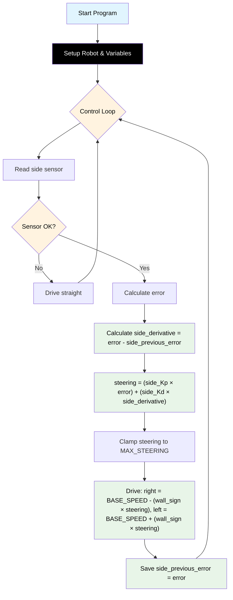

# Challenge 2: Wall Follow — PD Control

In this challenge you will add the **Derivative (D)** term to your P controller from Challenge 1. The robot now starts **off-centre and at a slight angle**, so a P-only controller will oscillate badly. The D term dampens these oscillations.

You will learn:

- Why P control alone causes oscillations.
- What the **Derivative** term does and why it helps.
- How to track `side_previous_error` to calculate the rate of change.

---

## Success Criteria

My robot follows the wall **smoothly** through the straight corridor and reaches the **green exit zone** — with noticeably fewer oscillations than P-only.

---

## Before You Begin

1. Complete [Challenge 1](docs.html?doc=Challenge_1) — you will build on that code.
2. Open the **Simulator** and select **Challenge 2**.
3. Notice the robot starts **off-centre** (closer to the wall) and **slightly angled**. This is deliberate!

---

## Flowchart Of The Algorithm



---

## Key Concepts

### Why Does P Control Oscillate?

With P-only control, the robot sees a large error and makes a strong correction. But by the time it reaches the target distance, it's moving fast and **overshoots** to the other side. Then it sees a large error in the opposite direction and overcorrects again. This back-and-forth is called **oscillation**.

Think of it like a car on an icy road — you turn the wheel hard, slide past where you wanted, turn hard the other way, and keep fishtailing.

### What is the Derivative Term?

The **Derivative** measures how fast the error is **changing**:

```
side_derivative = error - side_previous_error
```

- If the error is **getting smaller quickly** (robot approaching the wall fast) → side_derivative is **negative** → it opposes the P correction and slows you down.
- If the error is **getting bigger** (robot drifting away) → side_derivative is **positive** → it adds to the P correction and speeds up the response.

The derivative acts like a **brake on the steering** — it resists rapid changes and prevents overshoot.

### What is side_Kd?

**side_Kd** (Derivative gain) controls how strongly the derivative term affects steering:

```
steering = (side_Kp * error) + (side_Kd * side_derivative)
```

---

## The Code

The full PD algorithm is already in the editor — carry forward your four Challenge 1 values, then tune `side_Kd`:

```python
# Challenge 2: Wall Follow — PD Control
# Add a Derivative term to Challenge 1 to stop the zig-zag.
# Carry forward your C1 values, then tune side_Kd. Guide: docs.html?doc=Challenge_2

from aidriver import AIDriver, hold_state
import aidriver

aidriver.DEBUG_AIDRIVER = False
my_robot = AIDriver("left")

BASE_SPEED = 0  # carry forward from C1
TARGET_WALL_DISTANCE = 0  # carry forward from C1
MAX_STEERING = 0  # carry forward from C1

side_Kp = 0.0  # carry forward from C1
side_Kd = 0.0  # derivative gain — dampens oscillation

side_previous_error = 0


while True:
    wall_distance = my_robot.read_distance_2()

    if wall_distance == -1:
        my_robot.drive(BASE_SPEED, BASE_SPEED)
        hold_state(0.05)
        continue

    error = wall_distance - TARGET_WALL_DISTANCE
    side_derivative = error - side_previous_error

    steering = (side_Kp * error) + (side_Kd * side_derivative)

    if steering > MAX_STEERING:
        steering = MAX_STEERING
    elif steering < -MAX_STEERING:
        steering = -MAX_STEERING

    right_speed = BASE_SPEED - (my_robot.wall_sign * steering)
    left_speed = BASE_SPEED + (my_robot.wall_sign * steering)

    my_robot.drive(int(right_speed), int(left_speed))

    side_previous_error = error  # save for next loop (must be last)
    hold_state(0.05)
```

## How It Works

Everything from Challenge 1 is the same. Three things are new:

- **`side_previous_error = 0`** — remembers the last error so you can measure change. It starts at 0 because there's no previous reading on the first loop.
- **`side_derivative = error - side_previous_error`** — how fast the error is changing. It acts like a brake that resists sudden swings.
- **PD steering** — `steering = (side_Kp * error) + (side_Kd * side_derivative)`. The `side_Kd` term cancels overshoot before it happens.
- **Save at the end** — `side_previous_error = error` must be the last line before `hold_state`. Forgetting it is the most common bug (the D term stays 0).

---

## Tune Your Robot

| Symptom                         | Cause           | Fix                          |
| ------------------------------- | --------------- | ---------------------------- |
| Still oscillating (like P-only) | Kd too low      | Increase Kd (try 0.20, 0.30) |
| Robot responds very slowly      | Kd too high     | Decrease Kd (try 0.10, 0.05) |
| Robot overshoots then settles   | Kd slightly low | Small increase to Kd         |
| Robot barely moves toward wall  | Kp too low      | Increase Kp first            |

> [!Tip]
> The ideal approach is: get P working first, then gradually increase Kd until the oscillations disappear without making the robot sluggish.

---

<details>
<summary><strong>Example tuned values</strong> — open after you've tried your own</summary>

```python
BASE_SPEED = 200
TARGET_WALL_DISTANCE = 200
MAX_STEERING = 60
side_Kp = 0.25
side_Kd = 0.30
```

Full worked solution: `app/answers/challenge-2.py`.

</details>

---

## Debugging Tips

- Add `print("D:", derivative, "steer:", steering)` inside the loop to see how the derivative affects steering.
- If both numbers look the same as Challenge 1, check that you are updating `side_previous_error` at the end of each loop.
- The D term should be largest in the first few loops (when the initial error is large and changing fast) and settle near zero once the robot is at the right distance.
