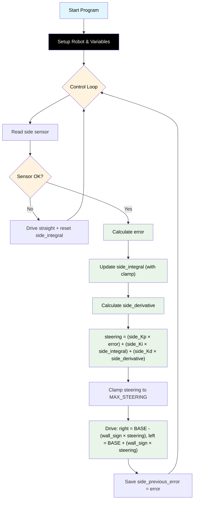

# Challenge 3: Wall Follow — Full PID

In this challenge you will add the **Integral (I)** term to your PD controller from Challenge 2. The robot must follow a straight wall **and** navigate around an L-shaped corner. The I term corrects the steady-state drift that appears on the corner.

You will learn:

- Why PD control alone drifts around corners.
- What the **Integral** term does and why it helps.
- How to prevent **integral windup** using a clamp.

---

## Success Criteria

My robot follows the wall smoothly through the corridor, navigates around the **L corner**, and reaches the **green exit zone**.

---

## Before You Begin

1. Complete [Challenge 2](docs.html?doc=Challenge_2) — you need working PD gains (`side_Kp` and `side_Kd`).
2. Open the **Simulator** and select **Challenge 3**.
3. Run your Challenge 2 code here — the robot will follow the straight part but drift on the corner.

---

## Flowchart Of The Algorithm



---

## Key Concepts

### Why Does PD Control Drift on Corners?

When the robot turns around a corner, it briefly runs at a constant small error (the corner geometry keeps it slightly away from the wall). The P and D terms together produce only a small correction. Because the error is **small but persistent**, the robot never fully closes the gap — it drifts.

### What is the Integral Term?

The **Integral** accumulates all past errors over time:

```
side_integral = side_integral + error
```

- If the robot has been slightly too far from the wall for many loops → `side_integral` grows large → the I term adds a correction that eventually pushes the robot back.
- This is why the I term is useful for **slow, steady drift** — it catches errors the P term misses.

### What is Integral Windup?

If the robot loses the wall sensor (e.g. going around a wide corner), the integral can grow **very large** before the robot recovers. When the wall reappears, the huge integral produces a massive overshoot.

**Fix:** Clamp the integral between `-side_INTEGRAL_MAX` and `+side_INTEGRAL_MAX`, and reset it to 0 when the wall is lost.

### What is side_Ki?

**side_Ki** (Integral gain) controls how strongly the accumulated error affects steering:

```
steering = (side_Kp * error) + (side_Ki * side_integral) + (side_Kd * side_derivative)
```

Keep `side_Ki` very small — even 0.003 is enough. Too high causes a slow, rolling oscillation.

---

## Example Starting Values

```python
BASE_SPEED = 160
TARGET_WALL_DISTANCE = 150
MAX_STEERING = 40
side_Kp = 0.40       # Carry over from Challenge 1
side_Kd = 0.15       # Carry over from Challenge 2
side_Ki = 0.003      # Start very small
side_INTEGRAL_MAX = 1200
side_previous_error = 0
side_integral = 0
```

---

## Step 1 — Start from Your Challenge 2 Code

Copy your working PD code. You will add three things:

1. `side_Ki` and `side_INTEGRAL_MAX` in the configuration section.
2. `side_integral = 0` before the loop.
3. Integral update and clamp inside the loop.

---

## Step 2 — Add the New Variables

```python
side_Ki = 0.003            # Start very small — raise in 0.002 steps
side_INTEGRAL_MAX = 1200   # Anti-windup clamp

side_previous_error = 0
side_integral = 0
```

> [!Note]
> `side_INTEGRAL_MAX = 1200` means the integral can accumulate at most 1200 mm of total error before it stops growing. This prevents runaway corrections.

---

## Step 3 — Update the Integral Each Loop

Inside your loop, after calculating the error, add:

```python
    error = wall_distance - TARGET_WALL_DISTANCE

    # Integral: accumulated error — reset when wall lost (see sensor check above)
    side_integral = side_integral + error
    if side_integral > side_INTEGRAL_MAX:
        side_integral = side_INTEGRAL_MAX
    elif side_integral < -side_INTEGRAL_MAX:
        side_integral = -side_INTEGRAL_MAX
```

---

## Step 4 — Add the Full PID Formula

Replace your PD steering formula with:

```python
    side_derivative = error - side_previous_error

    steering = (side_Kp * error) + (side_Ki * side_integral) + (side_Kd * side_derivative)
```

---

## Step 5 — Reset the Integral When Wall Is Lost

In the sensor-error branch (where `wall_distance == -1`), add a reset:

```python
    if wall_distance == -1:
        my_robot.drive(BASE_SPEED, BASE_SPEED)
        side_integral = 0   # ← prevent windup when wall is out of range
        hold_state(0.05)
        continue
```

---

## Step 6 — Compare PD vs PID

Try running the L-corner maze with two versions:

1. **PD only**: Set `side_Ki = 0` — the robot will drift on the corner.
2. **PID**: Set `side_Ki = 0.003` — the robot should track back to the target distance.

---

## Tuning Guide

| Symptom                              | Cause                  | Fix                                         |
| ------------------------------------ | ---------------------- | ------------------------------------------- |
| Robot drifts on corner (like PD)     | side_Ki too low        | Increase side_Ki (try 0.005, 0.008)         |
| Slow rolling oscillation builds up   | side_Ki too high       | Decrease side_Ki (try 0.001, 0.002)         |
| Large overshoot after losing wall    | Integral not resetting | Check `side_integral = 0` in sensor-error branch |
| Robot overreacts after a long drift  | INTEGRAL_MAX too large | Decrease side_INTEGRAL_MAX (try 600, 800)   |

> [!Tip]
> Tune in this order: get `side_Kp` working first → add `side_Kd` to kill oscillations → add a tiny `side_Ki` to fix corner drift. Do not increase `side_Ki` aggressively.

---

## Starter Scaffold

This is what you'll see in the editor when you open the challenge. Comments mark the `TODO` blocks you must complete.

```python
# Challenge 3: Wall Follow — Full PID
# ====================================================================
# GOAL: Add an Integral (I) term to your PD controller so the robot
#       no longer drifts away from the wall around the L-shaped corner.
#
# WHAT'S ALREADY DONE FOR YOU:
#   - Challenge 1 (P) and Challenge 2 (PD) — both blocks are pre-filled.
#
# WHAT YOU NEED TO ADD:
#   1. A new gain  side_Ki  (start very small — try 0.003).
#   2. A clamp constant  side_INTEGRAL_MAX  to prevent integral windup.
#   3. A variable  side_integral  initialised to 0 BEFORE the loop.
#   4. Inside the loop: accumulate  side_integral = side_integral + error
#      THEN clamp it between  -side_INTEGRAL_MAX  and  +side_INTEGRAL_MAX.
#   5. New steering formula:
#         steering = (side_Kp * error)
#                  + (side_Ki * side_integral)
#                  + (side_Kd * side_derivative)
#   6. RESET side_integral to 0 in the lost-wall branch
#      (otherwise it keeps growing and overshoots when the wall reappears).
#
# READ THIS FIRST: docs/Challenge_3.md
# ====================================================================

from aidriver import AIDriver, hold_state
import aidriver

aidriver.DEBUG_AIDRIVER = False
my_robot = AIDriver("left")

# === BLOCK: CONFIG_BASE START ===
BASE_SPEED = 160
TARGET_WALL_DISTANCE = 150
MAX_STEERING = 40
# === BLOCK: CONFIG_BASE END ===

# === BLOCK: SIDE_KP START ===
side_Kp = 0.40
# === BLOCK: SIDE_KP END ===

# === BLOCK: SIDE_KD START ===
side_Kd = 0.15
# === BLOCK: SIDE_KD END ===

# === BLOCK: SIDE_KI START ===
side_Ki = 0.0              # TODO: try 0.003, then raise in 0.002 steps
side_INTEGRAL_MAX = 1200   # Anti-windup clamp (do NOT change unless tuning)
# === BLOCK: SIDE_KI END ===

side_previous_error = 0
# TODO: add a `side_integral` variable initialised to 0 here


# === MAIN LOOP ===
while True:
    # === BLOCK: SIDE_FOLLOW_PID START ===
    wall_distance = my_robot.read_distance_2()

    if wall_distance == -1:
        my_robot.drive(BASE_SPEED, BASE_SPEED)
        # TODO: reset side_integral here so windup can't build up while the
        #       wall is out of range
        hold_state(0.05)
        continue

    error = wall_distance - TARGET_WALL_DISTANCE

    # TODO: update side_integral = side_integral + error
    # TODO: clamp side_integral between -side_INTEGRAL_MAX and +side_INTEGRAL_MAX

    side_derivative = error - side_previous_error

    # TODO: replace this PD formula with the full PID formula
    steering = (side_Kp * error) + (side_Kd * side_derivative)

    if steering > MAX_STEERING:
        steering = MAX_STEERING
    elif steering < -MAX_STEERING:
        steering = -MAX_STEERING

    right_speed = BASE_SPEED - (my_robot.wall_sign * steering)
    left_speed = BASE_SPEED + (my_robot.wall_sign * steering)

    my_robot.drive(int(right_speed), int(left_speed))

    side_previous_error = error
    # === BLOCK: SIDE_FOLLOW_PID END ===

    hold_state(0.05)
```

<details>
<summary><strong>Reference Solution</strong> — click to expand <em>(only after you've genuinely tried)</em></summary>

```python
# Challenge 3: Wall Follow - Full PID
# Add the integral term to fix drift around the L corner.
# This file defines the FROZEN side-follow block reused in C4, C5, C6.

from aidriver import AIDriver, hold_state
import aidriver

aidriver.DEBUG_AIDRIVER = False
my_robot = AIDriver("left")  # ← "left" or "right" — must match your physical setup!

# === BLOCK: CONFIG_BASE START ===
BASE_SPEED = 160  # Forward speed (must be > 120)
TARGET_WALL_DISTANCE = 150  # Distance to maintain from wall (mm)
MAX_STEERING = 40  # Max wheel speed difference
# Rule: BASE_SPEED - MAX_STEERING must be >= 120 (motor dead zone)
# === BLOCK: CONFIG_BASE END ===

# === BLOCK: SIDE_KP START ===
side_Kp = 0.40  # Proportional gain — raise in 0.05 steps until zig-zag starts
# === BLOCK: SIDE_KP END ===

# === BLOCK: SIDE_KD START ===
side_Kd = 0.15  # Derivative gain — dampens oscillations
# === BLOCK: SIDE_KD END ===

# === BLOCK: SIDE_KI START ===
side_Ki = 0.003  # Integral gain — start very small, raise in 0.002 steps
side_INTEGRAL_MAX = 1200  # Anti-windup clamp
# === BLOCK: SIDE_KI END ===

side_previous_error = 0
side_integral = 0

# === MAIN LOOP ===
while True:
    # === BLOCK: SIDE_FOLLOW_PID START ===
    wall_distance = my_robot.read_distance_2()

    if wall_distance == -1:
        my_robot.drive(BASE_SPEED, BASE_SPEED)
        side_integral = 0  # Reset when wall lost — prevents windup
        hold_state(0.05)
        continue

    error = wall_distance - TARGET_WALL_DISTANCE

    # Integral: accumulated error (clamped against windup)
    side_integral = side_integral + error
    if side_integral > side_INTEGRAL_MAX:
        side_integral = side_INTEGRAL_MAX
    elif side_integral < -side_INTEGRAL_MAX:
        side_integral = -side_INTEGRAL_MAX

    # Derivative
    side_derivative = error - side_previous_error

    # Full PID
    steering = (
        (side_Kp * error) + (side_Ki * side_integral) + (side_Kd * side_derivative)
    )

    if steering > MAX_STEERING:
        steering = MAX_STEERING
    elif steering < -MAX_STEERING:
        steering = -MAX_STEERING

    right_speed = BASE_SPEED - (my_robot.wall_sign * steering)
    left_speed = BASE_SPEED + (my_robot.wall_sign * steering)

    my_robot.drive(int(right_speed), int(left_speed))

    side_previous_error = error
    # === BLOCK: SIDE_FOLLOW_PID END ===

    hold_state(0.05)
```

</details>

---
## Debugging Tips

- Add `print("I:", int(side_integral), "D:", int(side_derivative), "steer:", int(steering))` to watch all three terms.
- The integral column should stay near zero on straight sections and slowly grow on the corner.
- If the integral grows even on a straight section, your `side_Kp` may be too low and the robot is already slightly off-target.
- If something confusing happens, temporarily set `side_Ki = 0` to confirm the PD part is still working correctly, then re-add Ki.
