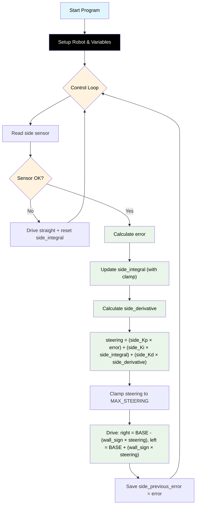

# Challenge 3: Wall Follow — Full PID

In this challenge you will add the **Integral (I)** term to your PD controller from Challenge 2. The robot must follow a straight wall **and** navigate around an L-shaped corner. The I term corrects the steady-state drift that appears on the corner.

You will learn:

- Why PD control alone drifts around corners.
- What the **Integral** term does and why it helps.
- How to prevent **integral windup** using a clamp.

---

## Success Criteria

My robot follows the wall smoothly through the corridor, navigates around the **L corner**, and reaches the **green exit zone**.

---

## Before You Begin

1. Complete [Challenge 2](docs.html?doc=Challenge_2) — you need working PD gains (`side_Kp` and `side_Kd`).
2. Open the **Simulator** and select **Challenge 3**.
3. Run your Challenge 2 code here — the robot will follow the straight part but drift on the corner.

---

## Flowchart Of The Algorithm



---

## Key Concepts

### Why Does PD Control Drift on Corners?

When the robot turns around a corner, it briefly runs at a constant small error (the corner geometry keeps it slightly away from the wall). The P and D terms together produce only a small correction. Because the error is **small but persistent**, the robot never fully closes the gap — it drifts.

### What is the Integral Term?

The **Integral** accumulates all past errors over time:

```
side_integral = side_integral + error
```

- If the robot has been slightly too far from the wall for many loops → `side_integral` grows large → the I term adds a correction that eventually pushes the robot back.
- This is why the I term is useful for **slow, steady drift** — it catches errors the P term misses.

### What is Integral Windup?

If the robot loses the wall sensor (e.g. going around a wide corner), the integral can grow **very large** before the robot recovers. When the wall reappears, the huge integral produces a massive overshoot.

**Fix:** Clamp the integral between `-side_INTEGRAL_MAX` and `+side_INTEGRAL_MAX`, and reset it to 0 when the wall is lost.

### What is side_Ki?

**side_Ki** (Integral gain) controls how strongly the accumulated error affects steering:

```
steering = (side_Kp * error) + (side_Ki * side_integral) + (side_Kd * side_derivative)
```

Keep `side_Ki` very small — even 0.003 is enough. Too high causes a slow, rolling oscillation.

---

## The Code

The full PID algorithm is already in the editor — carry forward your Challenge 1 and 2 values, then tune `side_Ki` and `side_INTEGRAL_MAX`:

```python
# Challenge 3: Wall Follow — Full PID
# Add an Integral term so the robot holds the wall around the L corner.
# Carry forward C1/C2 values, then tune side_Ki. Guide: docs.html?doc=Challenge_3

from aidriver import AIDriver, hold_state
import aidriver

aidriver.DEBUG_AIDRIVER = False
my_robot = AIDriver("left")

BASE_SPEED = 0  # carry forward
TARGET_WALL_DISTANCE = 0  # carry forward
MAX_STEERING = 0  # carry forward

side_Kp = 0.0  # carry forward
side_Kd = 0.0  # carry forward
side_Ki = 0.0  # integral gain — start very small
side_INTEGRAL_MAX = 0  # anti-windup clamp

side_previous_error = 0
side_integral = 0


while True:
    wall_distance = my_robot.read_distance_2()

    if wall_distance == -1:
        my_robot.drive(BASE_SPEED, BASE_SPEED)
        side_integral = 0  # reset so windup can't build while wall is gone
        hold_state(0.05)
        continue

    error = wall_distance - TARGET_WALL_DISTANCE

    side_integral = side_integral + error
    if side_integral > side_INTEGRAL_MAX:
        side_integral = side_INTEGRAL_MAX
    elif side_integral < -side_INTEGRAL_MAX:
        side_integral = -side_INTEGRAL_MAX

    side_derivative = error - side_previous_error

    steering = (
        (side_Kp * error) + (side_Ki * side_integral) + (side_Kd * side_derivative)
    )

    if steering > MAX_STEERING:
        steering = MAX_STEERING
    elif steering < -MAX_STEERING:
        steering = -MAX_STEERING

    right_speed = BASE_SPEED - (my_robot.wall_sign * steering)
    left_speed = BASE_SPEED + (my_robot.wall_sign * steering)

    my_robot.drive(int(right_speed), int(left_speed))

    side_previous_error = error
    hold_state(0.05)
```

## How It Works

Everything from Challenge 2 (P and D) is the same. The Integral term is new:

- **`side_integral = 0`** — a running total of all past error, set before the loop.
- **Accumulate** — `side_integral = side_integral + error` each loop, so small persistent errors (like corner drift) build up until they get corrected.
- **Clamp** — keep `side_integral` within `±side_INTEGRAL_MAX` so it can't grow out of control (integral windup).
- **Reset on lost wall** — `side_integral = 0` in the `wall_distance == -1` branch stops windup while the wall is out of range.
- **Full PID steering** — `(side_Kp * error) + (side_Ki * side_integral) + (side_Kd * side_derivative)`. Keep `side_Ki` very small.

---

## Tune Your Robot

| Symptom                             | Cause                  | Fix                                              |
| ----------------------------------- | ---------------------- | ------------------------------------------------ |
| Robot drifts on corner (like PD)    | side_Ki too low        | Increase side_Ki (try 0.005, 0.008)              |
| Slow rolling oscillation builds up  | side_Ki too high       | Decrease side_Ki (try 0.001, 0.002)              |
| Large overshoot after losing wall   | Integral not resetting | Check `side_integral = 0` in sensor-error branch |
| Robot overreacts after a long drift | INTEGRAL_MAX too large | Decrease side_INTEGRAL_MAX (try 600, 800)        |

> [!Tip]
> Tune in this order: get `side_Kp` working first → add `side_Kd` to kill oscillations → add a tiny `side_Ki` to fix corner drift. Do not increase `side_Ki` aggressively.

---

<details>
<summary><strong>Example tuned values</strong> — open after you've tried your own</summary>

```python
BASE_SPEED = 200
TARGET_WALL_DISTANCE = 200
MAX_STEERING = 60
side_Kp = 0.25
side_Kd = 0.40
side_Ki = 0.001
side_INTEGRAL_MAX = 50
```

Full worked solution: `app/answers/challenge-3.py`. This tuned side-follow block is the one reused in Challenges 4–7.

</details>

---

## Debugging Tips

- Add `print("I:", int(side_integral), "D:", int(side_derivative), "steer:", int(steering))` to watch all three terms.
- The integral column should stay near zero on straight sections and slowly grow on the corner.
- If the integral grows even on a straight section, your `side_Kp` may be too low and the robot is already slightly off-target.
- If something confusing happens, temporarily set `side_Ki = 0` to confirm the PD part is still working correctly, then re-add Ki.
