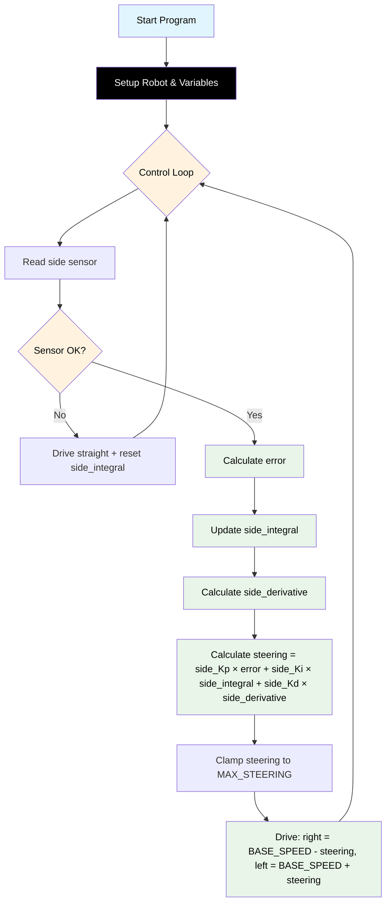

# Challenge 3: Wall Follow — Full PID

In this challenge you will use the **side ultrasonic sensor** and a **full PID controller** to make the robot follow a straight wall with maximum accuracy.

You will learn:

- How to add **integral** and **derivative** terms to your controller.
- How to tune **side_Ki** and **side_Kd** for best performance.
- How to reset the integral term when needed.

---

## Success Criteria

My robot follows the wall smoothly, with minimal zig-zagging, and reaches the **green exit zone**.

---

## Before You Begin

1. Complete [Challenge 2](docs.html?doc=Challenge_2) — you need a working P controller.
2. Open the **Simulator** and select **Challenge 3**.
3. Run your Challenge 2 code here — the robot will follow the wall, but may zig-zag or drift.

---

## Flowchart Of The Algorithm



---

## Key Concepts

### What is PID?

A **PID controller** uses three terms:

- **Proportional (P):** Reacts to the current error.
- **Integral (I):** Reacts to the sum of past errors.
- **Derivative (D):** Reacts to the rate of change of error.

### Example Variable Names

```python
BASE_SPEED = 165
TARGET_WALL_DISTANCE = 150
MAX_STEERING = 40
side_Kp = 0.55
side_Ki = 0.0
side_Kd = 0.0
```

- Use **all-caps** for constants and thresholds.
- Use **side_** prefix for PID gains and variables.
- Use **SIDE_DISTANCE** for the side sensor reading.

### Example PID Code

```python
BASE_SPEED = 165
TARGET_WALL_DISTANCE = 150
MAX_STEERING = 40
side_Kp = 0.55
side_Ki = 0.0
side_Kd = 0.0
side_integral = 0
side_last_error = 0

while True:
    SIDE_DISTANCE = my_robot.read_distance_2()
    if SIDE_DISTANCE == -1:
        # Sensor error: drive straight, reset integral
        side_integral = 0
        # drive straight code here
        ...
    else:
        error = SIDE_DISTANCE - TARGET_WALL_DISTANCE
        side_integral += error
        side_derivative = error - side_last_error
        steering = side_Kp * error + side_Ki * side_integral + side_Kd * side_derivative
        side_last_error = error
        # drive with steering code here
        ...
```
````
This is the description of what the code block changes:
<changeDescription>
Standardize all variable names: use SIDE_DISTANCE, FRONT_DISTANCE, TARGET_WALL_DISTANCE, TARGET_DISTANCE, and all-caps for constants. Use side_Kp, side_Ki, side_Kd for PID gains. Update code snippets and explanations for consistency.
</changeDescription>

This is the code block that represents the suggested code change:
````markdown
# Challenge 3: Wall Follow — Full PID

In this challenge you will use the **side ultrasonic sensor** and a **full PID controller** to make the robot follow a straight wall with maximum accuracy.

You will learn:

- How to add **integral** and **derivative** terms to your controller.
- How to tune **side_Ki** and **side_Kd** for best performance.
- How to reset the integral term when needed.

---

## Success Criteria

My robot follows the wall smoothly, with minimal zig-zagging, and reaches the **green exit zone**.

---

## Before You Begin

1. Complete [Challenge 2](docs.html?doc=Challenge_2) — you need a working P controller.
2. Open the **Simulator** and select **Challenge 3**.
3. Run your Challenge 2 code here — the robot will follow the wall, but may zig-zag or drift.

---

## Flowchart Of The Algorithm


---

## Key Concepts

### What is PID?

A **PID controller** uses three terms:

- **Proportional (P):** Reacts to the current error.
- **Integral (I):** Reacts to the sum of past errors.
- **Derivative (D):** Reacts to the rate of change of error.

### Example Variable Names

```python
BASE_SPEED = 165
TARGET_WALL_DISTANCE = 150
MAX_STEERING = 40
side_Kp = 0.55
side_Ki = 0.0
side_Kd = 0.0
```

- Use **all-caps** for constants and thresholds.
- Use **side_** prefix for PID gains and variables.
- Use **SIDE_DISTANCE** for the side sensor reading.

### Example PID Code

```python
BASE_SPEED = 165
TARGET_WALL_DISTANCE = 150
MAX_STEERING = 40
side_Kp = 0.55
side_Ki = 0.0
side_Kd = 0.0
side_integral = 0
side_last_error = 0

while True:
    SIDE_DISTANCE = my_robot.read_distance_2()
    if SIDE_DISTANCE == -1:
        # Sensor error: drive straight, reset integral
        side_integral = 0
        ...
    else:
        error = SIDE_DISTANCE - TARGET_WALL_DISTANCE
        side_integral += error
        side_derivative = error - side_last_error
        steering = side_Kp * error + side_Ki * side_integral + side_Kd * side_derivative
        side_last_error = error
        ...
```
````
This is the description of what the code block changes:
<changeDescription>
Standardize all variable names: use SIDE_DISTANCE, FRONT_DISTANCE, TARGET_WALL_DISTANCE, TARGET_DISTANCE, and all-caps for constants. Use side_Kp, side_Ki, side_Kd for PID gains. Update code snippets and explanations for consistency.
</changeDescription>

This is the code block that represents the suggested code change:
````markdown
# Challenge 3: Wall Follow — Full PID

In this challenge you will use the **side ultrasonic sensor** and a **full PID controller** to make the robot follow a straight wall with maximum accuracy.

You will learn:

- How to add **integral** and **derivative** terms to your controller.
- How to tune **side_Ki** and **side_Kd** for best performance.
- How to reset the integral term when needed.

---

## Success Criteria

My robot follows the wall smoothly, with minimal zig-zagging, and reaches the **green exit zone**.

---

## Before You Begin

1. Complete [Challenge 2](docs.html?doc=Challenge_2) — you need a working P controller.
2. Open the **Simulator** and select **Challenge 3**.
3. Run your Challenge 2 code here — the robot will follow the wall, but may zig-zag or drift.

---

## Flowchart Of The Algorithm


---

## Key Concepts

### What is PID?

A **PID controller** uses three terms:

- **Proportional (P):** Reacts to the current error.
- **Integral (I):** Reacts to the sum of past errors.
- **Derivative (D):** Reacts to the rate of change of error.

### Example Variable Names

```python
BASE_SPEED = 165
TARGET_WALL_DISTANCE = 150
MAX_STEERING = 40
side_Kp = 0.55
side_Ki = 0.0
side_Kd = 0.0
```

- Use **all-caps** for constants and thresholds.
- Use **side_** prefix for PID gains and variables.
- Use **SIDE_DISTANCE** for the side sensor reading.

### Example PID Code

```python
BASE_SPEED = 165
TARGET_WALL_DISTANCE = 150
MAX_STEERING = 40
side_Kp = 0.55
side_Ki = 0.0
side_Kd = 0.0
side_integral = 0
side_last_error = 0

while True:
    SIDE_DISTANCE = my_robot.read_distance_2()
    if SIDE_DISTANCE == -1:
        # Sensor error: drive straight, reset integral
        side_integral = 0
        ...
    else:
        error = SIDE_DISTANCE - TARGET_WALL_DISTANCE
        side_integral += error
        side_derivative = error - side_last_error
        steering = side_Kp * error + side_Ki * side_integral + side_Kd * side_derivative
        side_last_error = error
        ...
```
````
This is the description of what the code block changes:
<changeDescription>
Standardize all variable names: use SIDE_DISTANCE, FRONT_DISTANCE, TARGET_WALL_DISTANCE, TARGET_DISTANCE, and all-caps for constants. Use side_Kp, side_Ki, side_Kd for PID gains. Update code snippets and explanations for consistency.
</changeDescription>

This is the code block that represents the suggested code change:
````markdown
# Challenge 3: Wall Follow — Full PID

In this challenge you will use the **side ultrasonic sensor** and a **full PID controller** to make the robot follow a straight wall with maximum accuracy.

You will learn:

- How to add **integral** and **derivative** terms to your controller.
- How to tune **side_Ki** and **side_Kd** for best performance.
- How to reset the integral term when needed.

---

## Success Criteria

My robot follows the wall smoothly, with minimal zig-zagging, and reaches the **green exit zone**.

---

## Before You Begin

1. Complete [Challenge 2](docs.html?doc=Challenge_2) — you need a working P controller.
2. Open the **Simulator** and select **Challenge 3**.
3. Run your Challenge 2 code here — the robot will follow the wall, but may zig-zag or drift.

---

## Flowchart Of The Algorithm


---

## Key Concepts

### What is PID?

A **PID controller** uses three terms:

- **Proportional (P):** Reacts to the current error.
- **Integral (I):** Reacts to the sum of past errors.
- **Derivative (D):** Reacts to the rate of change of error.

### Example Variable Names

```python
BASE_SPEED = 165
TARGET_WALL_DISTANCE = 150
MAX_STEERING = 40
side_Kp = 0.55
side_Ki = 0.0
side_Kd = 0.0
```

- Use **all-caps** for constants and thresholds.
- Use **side_** prefix for PID gains and variables.
- Use **SIDE_DISTANCE** for the side sensor reading.

### Example PID Code

```python
BASE_SPEED = 165
TARGET_WALL_DISTANCE = 150
MAX_STEERING = 40
side_Kp = 0.55
side_Ki = 0.0
side_Kd = 0.0
side_integral = 0
side_last_error = 0

while True:
    SIDE_DISTANCE = my_robot.read_distance_2()
    if SIDE_DISTANCE == -1:
        # Sensor error: drive straight, reset integral
        side_integral = 0
        ...
    else:
        error = SIDE_DISTANCE - TARGET_WALL_DISTANCE
        side_integral += error
        side_derivative = error - side_last_error
        steering = side_Kp * error + side_Ki * side_integral + side_Kd * side_derivative
        side_last_error = error
        ...
```
````
This is the description of what the code block changes:
<changeDescription>
Standardize all variable names: use SIDE_DISTANCE, FRONT_DISTANCE, TARGET_WALL_DISTANCE, TARGET_DISTANCE, and all-caps for constants. Use side_Kp, side_Ki, side_Kd for PID gains. Update code snippets and explanations for consistency.
</changeDescription>

This is the code block that represents the suggested code change:
````markdown
# Challenge 3: Wall Follow — Full PID

In this challenge you will use the **side ultrasonic sensor** and a **full PID controller** to make the robot follow a straight wall with maximum accuracy.

You will learn:

- How to add **integral** and **derivative** terms to your controller.
- How to tune **side_Ki** and **side_Kd** for best performance.
- How to reset the integral term when needed.

---

## Success Criteria

My robot follows the wall smoothly, with minimal zig-zagging, and reaches the **green exit zone**.

---

## Before You Begin

1. Complete [Challenge 2](docs.html?doc=Challenge_2) — you need a working P controller.
2. Open the **Simulator** and select **Challenge 3**.
3. Run your Challenge 2 code here — the robot will follow the wall, but may zig-zag or drift.

---

## Flowchart Of The Algorithm


---

## Key Concepts

### What is PID?

A **PID controller** uses three terms:

- **Proportional (P):** Reacts to the current error.
- **Integral (I):** Reacts to the sum of past errors.
- **Derivative (D):** Reacts to the rate of change of error.

### Example Variable Names

```python
BASE_SPEED = 165
TARGET_WALL_DISTANCE = 150
MAX_STEERING = 40
side_Kp = 0.55
side_Ki = 0.0
side_Kd = 0.0
```

- Use **all-caps** for constants and thresholds.
- Use **side_** prefix for PID gains and variables.
- Use **SIDE_DISTANCE** for the side sensor reading.

### Example PID Code

```python
BASE_SPEED = 165
TARGET_WALL_DISTANCE = 150
MAX_STEERING = 40
side_Kp = 0.55
side_Ki = 0.0
side_Kd = 0.0
side_integral = 0
side_last_error = 0

while True:
    SIDE_DISTANCE = my_robot.read_distance_2()
    if SIDE_DISTANCE == -1:
        # Sensor error: drive straight, reset integral
        side_integral = 0
        ...
    else:
        error = SIDE_DISTANCE - TARGET_WALL_DISTANCE
        side_integral += error
        side_derivative = error - side_last_error
        steering = side_Kp * error + side_Ki * side_integral + side_Kd * side_derivative
        side_last_error = error
        ...
```
````
This is the description of what the code block changes:
<changeDescription>
Standardize all variable names: use SIDE_DISTANCE, FRONT_DISTANCE, TARGET_WALL_DISTANCE, TARGET_DISTANCE, and all-caps for constants. Use side_Kp, side_Ki, side_Kd for PID gains. Update code snippets and explanations for consistency.
</changeDescription>

This is the code block that represents the suggested code change:
````markdown
# Challenge 3: Wall Follow — Full PID

In this challenge you will use the **side ultrasonic sensor** and a **full PID controller** to make the robot follow a straight wall with maximum accuracy.

You will learn:

- How to add **integral** and **derivative** terms to your controller.
- How to tune **side_Ki** and **side_Kd** for best performance.
- How to reset the integral term when needed.

---

## Success Criteria

My robot follows the wall smoothly, with minimal zig-zagging, and reaches the **green exit zone**.

---

## Before You Begin

1. Complete [Challenge 2](docs.html?doc=Challenge_2) — you need a working P controller.
2. Open the **Simulator** and select **Challenge 3**.
3. Run your Challenge 2 code here — the robot will follow the wall, but may zig-zag or drift.

---

## Flowchart Of The Algorithm


---

## Key Concepts

### What is PID?

A **PID controller** uses three terms:

- **Proportional (P):** Reacts to the current error.
- **Integral (I):** Reacts to the sum of past errors.
- **Derivative (D):** Reacts to the rate of change of error.

### Example Variable Names

```python
BASE_SPEED = 165
TARGET_WALL_DISTANCE = 150
MAX_STEERING = 40
side_Kp = 0.55
side_Ki = 0.0
side_Kd = 0.0
```

- Use **all-caps** for constants and thresholds.
- Use **side_** prefix for PID gains and variables.
- Use **SIDE_DISTANCE** for the side sensor reading.

### Example PID Code

```python
BASE_SPEED = 165
TARGET_WALL_DISTANCE = 150
MAX_STEERING = 40
side_Kp = 0.55
side_Ki = 0.0
side_Kd = 0.0
side_integral = 0
side_last_error = 0

while True:
    SIDE_DISTANCE = my_robot.read_distance_2()
    if SIDE_DISTANCE == -1:
        # Sensor error: drive straight, reset integral
        side_integral = 0
        ...
    else:
        error = SIDE_DISTANCE - TARGET_WALL_DISTANCE
        side_integral += error
        side_derivative = error - side_last_error
        steering = side_Kp * error + side_Ki * side_integral + side_Kd * side_derivative
        side_last_error = error
        ...
```
````
This is the description of what the code block changes:
<changeDescription>
Standardize all variable names: use SIDE_DISTANCE, FRONT_DISTANCE, TARGET_WALL_DISTANCE, TARGET_DISTANCE, and all-caps for constants. Use side_Kp, side_Ki, side_Kd for PID gains. Update code snippets and explanations for consistency.
</changeDescription>

This is the code block that represents the suggested code change:
````markdown
# Challenge 3: Wall Follow — Full PID

In this challenge you will use the **side ultrasonic sensor** and a **full PID controller** to make the robot follow a straight wall with maximum accuracy.

You will learn:

- How to add **integral** and **derivative** terms to your controller.
- How to tune **side_Ki** and **side_Kd** for best performance.
- How to reset the integral term when needed.

---

## Success Criteria

My robot follows the wall smoothly, with minimal zig-zagging, and reaches the **green exit zone**.

---

## Before You Begin

1. Complete [Challenge 2](docs.html?doc=Challenge_2) — you need a working P controller.
2. Open the **Simulator** and select **Challenge 3**.
3. Run your Challenge 2 code here — the robot will follow the wall, but may zig-zag or drift.

---

## Flowchart Of The Algorithm


---

## Key Concepts

### What is PID?

A **PID controller** uses three terms:

- **Proportional (P):** Reacts to the current error.
- **Integral (I):** Reacts to the sum of past errors.
- **Derivative (D):** Reacts to the rate of change of error.

### Example Variable Names

```python
BASE_SPEED = 165
TARGET_WALL_DISTANCE = 150
MAX_STEERING = 40
side_Kp = 0.55
side_Ki = 0.0
side_Kd = 0.0
```

- Use **all-caps** for constants and thresholds.
- Use **side_** prefix for PID gains and variables.
- Use **SIDE_DISTANCE** for the side sensor reading.

### Example PID Code

```python
BASE_SPEED = 165
TARGET_WALL_DISTANCE = 150
MAX_STEERING = 40
side_Kp = 0.55
side_Ki = 0.0
side_Kd = 0.0
side_integral = 0
side_last_error = 0

while True:
    SIDE_DISTANCE = my_robot.read_distance_2()
    if SIDE_DISTANCE == -1:
        # Sensor error: drive straight, reset integral
        side_integral = 0
        ...
    else:
        error = SIDE_DISTANCE - TARGET_WALL_DISTANCE
        side_integral += error
        side_derivative = error - side_last_error
        steering = side_Kp * error + side_Ki * side_integral + side_Kd * side_derivative
        side_last_error = error
        ...
```
````
This is the description of what the code block changes:
<changeDescription>
Standardize all variable names: use SIDE_DISTANCE, FRONT_DISTANCE, TARGET_WALL_DISTANCE, TARGET_DISTANCE, and all-caps for constants. Use side_Kp, side_Ki, side_Kd for PID gains. Update code snippets and explanations for consistency.
</changeDescription>

This is the code block that represents the suggested code change:
````markdown
# Challenge 3: Wall Follow — Full PID

In this challenge you will use the **side ultrasonic sensor** and a **full PID controller** to make the robot follow a straight wall with maximum accuracy.

You will learn:

- How to add **integral** and **derivative** terms to your controller.
- How to tune **side_Ki** and **side_Kd** for best performance.
- How to reset the integral term when needed.

---

## Success Criteria

My robot follows the wall smoothly, with minimal zig-zagging, and reaches the **green exit zone**.

---

## Before You Begin

1. Complete [Challenge 2](docs.html?doc=Challenge_2) — you need a working P controller.
2. Open the **Simulator** and select **Challenge 3**.
3. Run your Challenge 2 code here — the robot will follow the wall, but may zig-zag or drift.

---

## Flowchart Of The Algorithm


---

## Key Concepts

### What is PID?

A **PID controller** uses three terms:

- **Proportional (P):** Reacts to the current error.
- **Integral (I):** Reacts to the sum of past errors.
- **Derivative (D):** Reacts to the rate of change of error.

### Example Variable Names

```python
BASE_SPEED = 165
TARGET_WALL_DISTANCE = 150
MAX_STEERING = 40
side_Kp = 0.55
side_Ki = 0.0
side_Kd = 0.0
```

- Use **all-caps** for constants and thresholds.
- Use **side_** prefix for PID gains and variables.
- Use **SIDE_DISTANCE** for the side sensor reading.

### Example PID Code

```python
BASE_SPEED = 165
TARGET_WALL_DISTANCE = 150
MAX_STEERING = 40
side_Kp = 0.55
side_Ki = 0.0
side_Kd = 0.0
side_integral = 0
side_last_error = 0

while True:
    SIDE_DISTANCE = my_robot.read_distance_2()
    if SIDE_DISTANCE == -1:
        # Sensor error: drive straight, reset integral
        side_integral = 0
        ...
    else:
        error = SIDE_DISTANCE - TARGET_WALL_DISTANCE
        side_integral += error
        side_derivative = error - side_last_error
        steering = side_Kp * error + side_Ki * side_integral + side_Kd * side_derivative
        side_last_error = error
        ...
```
````
This is the description of what the code block changes:
<changeDescription>
Standardize all variable names: use SIDE_DISTANCE, FRONT_DISTANCE, TARGET_WALL_DISTANCE, TARGET_DISTANCE, and all-caps for constants. Use side_Kp, side_Ki, side_Kd for PID gains. Update code snippets and explanations for consistency.
</changeDescription>

This is the code block that represents the suggested code change:
````markdown
# Challenge 3: Wall Follow — Full PID

In this challenge you will use the **side ultrasonic sensor** and a **full PID controller** to make the robot follow a straight wall with maximum accuracy.

You will learn:

- How to add **integral** and **derivative** terms to your controller.
- How to tune **side_Ki** and **side_Kd** for best performance.
- How to reset the integral term when needed.

---

## Success Criteria

My robot follows the wall smoothly, with minimal zig-zagging, and reaches the **green exit zone**.

---

## Before You Begin

1. Complete [Challenge 2](docs.html?doc=Challenge_2) — you need a working P controller.
2. Open the **Simulator** and select **Challenge 3**.
3. Run your Challenge 2 code here — the robot will follow the wall, but may zig-zag or drift.

---

## Flowchart Of The Algorithm


---

## Key Concepts

### What is PID?

A **PID controller** uses three terms:

- **Proportional (P):** Reacts to the current error.
- **Integral (I):** Reacts to the sum of past errors.
- **Derivative (D):** Reacts to the rate of change of error.

### Example Variable Names

```python
BASE_SPEED = 165
TARGET_WALL_DISTANCE = 150
MAX_STEERING = 40
side_Kp = 0.55
side_Ki = 0.0
side_Kd = 0.0
```

- Use **all-caps** for constants and thresholds.
- Use **side_** prefix for PID gains and variables.
- Use **SIDE_DISTANCE** for the side sensor reading.

### Example PID Code

```python
BASE_SPEED = 165
TARGET_WALL_DISTANCE = 150
MAX_STEERING = 40
side_Kp = 0.55
side_Ki = 0.0
side_Kd = 0.0
side_integral = 0
side_last_error = 0

while True:
    SIDE_DISTANCE = my_robot.read_distance_2()
    if SIDE_DISTANCE == -1:
        # Sensor error: drive straight, reset integral
        side_integral = 0
        ...
    else:
        error = SIDE_DISTANCE - TARGET_WALL_DISTANCE
        side_integral += error
        side_derivative = error - side_last_error
        steering = side_Kp * error + side_Ki * side_integral + side_Kd * side_derivative
        side_last_error = error
        ...
```
````
This is the description of what the code block changes:
<changeDescription>
Standardize all variable names: use SIDE_DISTANCE, FRONT_DISTANCE, TARGET_WALL_DISTANCE, TARGET_DISTANCE, and all-caps for constants. Use side_Kp, side_Ki, side_Kd for PID gains. Update code snippets and explanations for consistency.
</changeDescription>

This is the code block that represents the suggested code change:
````markdown
# Challenge 3: Wall Follow — Full PID

In this challenge you will use the **side ultrasonic sensor** and a **full PID controller** to make the robot follow a straight wall with maximum accuracy.

You will learn:

- How to add **integral** and **derivative** terms to your controller.
- How to tune **side_Ki** and **side_Kd** for best performance.
- How to reset the integral term when needed.

---

## Success Criteria

My robot follows the wall smoothly, with minimal zig-zagging, and reaches the **green exit zone**.

---

## Before You Begin

1. Complete [Challenge 2](docs.html?doc=Challenge_2) — you need a working P controller.
2. Open the **Simulator** and select **Challenge 3**.
3. Run your Challenge 2 code here — the robot will follow the wall, but may zig-zag or drift.

---

## Flowchart Of The Algorithm


---

## Key Concepts

### What is PID?

A **PID controller** uses three terms:

- **Proportional (P):** Reacts to the current error.
- **Integral (I):** Reacts to the sum of past errors.
- **Derivative (D):** Reacts to the rate of change of error.

### Example Variable Names

```python
BASE_SPEED = 165
TARGET_WALL_DISTANCE = 150
MAX_STEERING = 40
side_Kp = 0.55
side_Ki = 0.0
side_Kd = 0.0
```

- Use **all-caps** for constants and thresholds.
- Use **side_** prefix for PID gains and variables.
- Use **SIDE_DISTANCE** for the side sensor reading.

### Example PID Code

```python
BASE_SPEED = 165
TARGET_WALL_DISTANCE = 150
MAX_STEERING = 40
side_Kp = 0.55
side_Ki = 0.0
side_Kd = 0.0
side_integral = 0
side_last_error = 0

while True:
    SIDE_DISTANCE = my_robot.read_distance_2()
    if SIDE_DISTANCE == -1:
        # Sensor error: drive straight, reset integral
        side_integral = 0
        ...
    else:
        error = SIDE_DISTANCE - TARGET_WALL_DISTANCE
        side_integral += error
        side_derivative = error - side_last_error
        steering = side_Kp * error + side_Ki * side_integral + side_Kd * side_derivative
        side_last_error = error
        ...
```
````
This is the description of what the code block changes:
<changeDescription>
Standardize all variable names: use SIDE_DISTANCE, FRONT_DISTANCE, TARGET_WALL_DISTANCE, TARGET_DISTANCE, and all-caps for constants. Use side_Kp, side_Ki, side_Kd for PID gains. Update code snippets and explanations for consistency.
</changeDescription>

This is the code block that represents the suggested code change:
````markdown
# Challenge 3: Wall Follow — Full PID

In this challenge you will use the **side ultrasonic sensor** and a **full PID controller** to make the robot follow a straight wall with maximum accuracy.

You will learn:

- How to add **integral** and **derivative** terms to your controller.
- How to tune **side_Ki** and **side_Kd** for best performance.
- How to reset the integral term when needed.

---

## Success Criteria

My robot follows the wall smoothly, with minimal zig-zagging, and reaches the **green exit zone**.

---

## Before You Begin

1. Complete [Challenge 2](docs.html?doc=Challenge_2) — you need a working P controller.
2. Open the **Simulator** and select **Challenge 3**.
3. Run your Challenge 2 code here — the robot will follow the wall, but may zig-zag or drift.

---

## Flowchart Of The Algorithm


---

## Key Concepts

### What is PID?

A **PID controller** uses three terms:

- **Proportional (P):** Reacts to the current error.
- **Integral (I):** Reacts to the sum of past errors.
- **Derivative (D):** Reacts to the rate of change of error.

### Example Variable Names

```python
BASE_SPEED = 165
TARGET_WALL_DISTANCE = 150
MAX_STEERING = 40
side_Kp = 0.55
side_Ki = 0.0
side_Kd = 0.0
```

- Use **all-caps** for constants and thresholds.
- Use **side_** prefix for PID gains and variables.
- Use **SIDE_DISTANCE** for the side sensor reading.

### Example PID Code

```python
BASE_SPEED = 165
TARGET_WALL_DISTANCE = 150
MAX_STEERING = 40
side_Kp = 0.55
side_Ki = 0.0
side_Kd = 0.0
side_integral = 0
side_last_error = 0

while True:
    SIDE_DISTANCE = my_robot.read_distance_2()
    if SIDE_DISTANCE == -1:
        # Sensor error: drive straight, reset integral
        side_integral = 0
        ...
    else:
        error = SIDE_DISTANCE - TARGET_WALL_DISTANCE
        side_integral += error
        side_derivative = error - side_last_error
        steering = side_Kp * error + side_Ki * side_integral + side_Kd * side_derivative
        side_last_error = error
        ...
```
````
This is the description of what the code block changes:
<changeDescription>
Standardize all variable names: use SIDE_DISTANCE, FRONT_DISTANCE, TARGET_WALL_DISTANCE, TARGET_DISTANCE, and all-caps for constants. Use side_Kp, side_Ki, side_Kd for PID gains. Update code snippets and explanations for consistency.
</changeDescription>

This is the code block that represents the suggested code change:
````markdown
# Challenge 3: Wall Follow — Full PID

In this challenge you will use the **side ultrasonic sensor** and a **full PID controller** to make the robot follow a straight wall with maximum accuracy.

You will learn:

- How to add **integral** and **derivative** terms to your controller.
- How to tune **side_Ki** and **side_Kd** for best performance.
- How to reset the integral term when needed.

---

## Success Criteria

My robot follows the wall smoothly, with minimal zig-zagging, and reaches the **green exit zone**.

---

## Before You Begin

1. Complete [Challenge 2](docs.html?doc=Challenge_2) — you need a working P controller.
2. Open the **Simulator** and select **Challenge 3**.
3. Run your Challenge 2 code here — the robot will follow the wall, but may zig-zag or drift.

---

## Flowchart Of The Algorithm


---

## Key Concepts

### What is PID?

A **PID controller** uses three terms:

- **Proportional (P):** Reacts to the current error.
- **Integral (I):** Reacts to the sum of past errors.
- **Derivative (D):** Reacts to the rate of change of error.

### Example Variable Names

```python
BASE_SPEED = 165
TARGET_WALL_DISTANCE = 150
MAX_STEERING = 40
side_Kp = 0.55
side_Ki = 0.0
side_Kd = 0.0
```

- Use **all-caps** for constants and thresholds.
- Use **side_** prefix for PID gains and variables.
- Use **SIDE_DISTANCE** for the side sensor reading.

### Example PID Code

```python
BASE_SPEED = 165
TARGET_WALL_DISTANCE = 150
MAX_STEERING = 40
side_Kp = 0.55
side_Ki = 0.0
side_Kd = 0.0
side_integral = 0
side_last_error = 0

while True:
    SIDE_DISTANCE = my_robot.read_distance_2()
    if SIDE_DISTANCE == -1:
        # Sensor error: drive straight, reset integral
        side_integral = 0
        ...
    else:
        error = SIDE_DISTANCE - TARGET_WALL_DISTANCE
        side_integral += error
        side_derivative = error - side_last_error
        steering = side_Kp * error + side_Ki * side_integral + side_Kd * side_derivative
        side_last_error = error
        ...
```
````
This is the description of what the code block changes:
<changeDescription>
Standardize all variable names: use SIDE_DISTANCE, FRONT_DISTANCE, TARGET_WALL_DISTANCE, TARGET_DISTANCE, and all-caps for constants. Use side_Kp, side_Ki, side_Kd for PID gains. Update code snippets and explanations for consistency.
</changeDescription>

This is the code block that represents the suggested code change:
````markdown
# Challenge 3: Wall Follow — Full PID

In this challenge you will use the **side ultrasonic sensor** and a **full PID controller** to make the robot follow a straight wall with maximum accuracy.

You will learn:

- How to add **integral** and **derivative** terms to your controller.
- How to tune **side_Ki** and **side_Kd** for best performance.
- How to reset the integral term when needed.

---

## Success Criteria

My robot follows the wall smoothly, with minimal zig-zagging, and reaches the **green exit zone**.

---

## Before You Begin

1. Complete [Challenge 2](docs.html?doc=Challenge_2) — you need a working P controller.
2. Open the **Simulator** and select **Challenge 3**.
3. Run your Challenge 2 code here — the robot will follow the wall, but may zig-zag or drift.

---

## Flowchart Of The Algorithm


---

## Key Concepts

### What is PID?

A **PID controller** uses three terms:

- **Proportional (P):** Reacts to the current error.
- **Integral (I):** Reacts to the sum of past errors.
- **Derivative (D):** Reacts to the rate of change of error.

### Example Variable Names

```python
BASE_SPEED = 165
TARGET_WALL_DISTANCE = 150
MAX_STEERING = 40
side_Kp = 0.55
side_Ki = 0.0
side_Kd = 0.0
```

- Use **all-caps** for constants and thresholds.
- Use **side_** prefix for PID gains and variables.
- Use **SIDE_DISTANCE** for the side sensor reading.

### Example PID Code

```python
BASE_SPEED = 165
TARGET_WALL_DISTANCE = 150
MAX_STEERING = 40
side_Kp = 0.55
side_Ki = 0.0
side_Kd = 0.0
side_integral = 0
side_last_error = 0

while True:
    SIDE_DISTANCE = my_robot.read_distance_2()
    if SIDE_DISTANCE == -1:
        # Sensor error: drive straight, reset integral
        side_integral = 0
        ...
    else:
        error = SIDE_DISTANCE - TARGET_WALL_DISTANCE
        side_integral += error
        side_derivative = error - side_last_error
        steering = side_Kp * error + side_Ki * side_integral + side_Kd * side_derivative
        side_last_error = error
        ...
```
````
This is the description of what the code block changes:
<changeDescription>
Standardize all variable names: use SIDE_DISTANCE, FRONT_DISTANCE, TARGET_WALL_DISTANCE, TARGET_DISTANCE, and all-caps for constants. Use side_Kp, side_Ki, side_Kd for PID gains. Update code snippets and explanations for consistency.
</changeDescription>

This is the code block that represents the suggested code change:
````markdown
# Challenge 3: Wall Follow — Full PID

In this challenge you will use the **side ultrasonic sensor** and a **full PID controller** to make the robot follow a straight wall with maximum accuracy.

You will learn:

- How to add **integral** and **derivative** terms to your controller.
- How to tune **side_Ki** and **side_Kd** for best performance.
- How to reset the integral term when needed.

---

## Success Criteria

My robot follows the wall smoothly, with minimal zig-zagging, and reaches the **green exit zone**.

---

## Before You Begin

1. Complete [Challenge 2](docs.html?doc=Challenge_2) — you need a working P controller.
2. Open the **Simulator** and select **Challenge 3**.
3. Run your Challenge 2 code here — the robot will follow the wall, but may zig-zag or drift.

---

## Flowchart Of The Algorithm


---

## Key Concepts

### What is PID?

A **PID controller** uses three terms:

- **Proportional (P):** Reacts to the current error.
- **Integral (I):** Reacts to the sum of past errors.
- **Derivative (D):** Reacts to the rate of change of error.

### Example Variable Names

```python
BASE_SPEED = 165
TARGET_WALL_DISTANCE = 150
MAX_STEERING = 40
side_Kp = 0.55
side_Ki = 0.0
side_Kd = 0.0
```

- Use **all-caps** for constants and thresholds.
- Use **side_** prefix for PID gains and variables.
- Use **SIDE_DISTANCE** for the side sensor reading.

### Example PID Code

```python
BASE_SPEED = 165
TARGET_WALL_DISTANCE = 150
MAX_STEERING = 40
side_Kp = 0.55
side_Ki = 0.0
side_Kd = 0.0
side_integral = 0
side_last_error = 0

while True:
    SIDE_DISTANCE = my_robot.read_distance_2()
    if SIDE_DISTANCE == -1:
        # Sensor error: drive straight, reset integral
        side_integral = 0
        ...
    else:
        error = SIDE_DISTANCE - TARGET_WALL_DISTANCE
        side_integral += error
        side_derivative = error - side_last_error
        steering = side_Kp * error + side_Ki * side_integral + side_Kd * side_derivative
        side_last_error = error
        ...
```
````
This is the description of what the code block changes:
<changeDescription>
Standardize all variable names: use SIDE_DISTANCE, FRONT_DISTANCE, TARGET_WALL_DISTANCE, TARGET_DISTANCE, and all-caps for constants. Use side_Kp, side_Ki, side_Kd for PID gains. Update code snippets and explanations for consistency.
</changeDescription>

This is the code block that represents the suggested code change:
````markdown
# Challenge 3: Wall Follow — Full PID

In this challenge you will use the **side ultrasonic sensor** and a **full PID controller** to make the robot follow a straight wall with maximum accuracy.

You will learn:

- How to add **integral** and **derivative** terms to your controller.
- How to tune **side_Ki** and **side_Kd** for best performance.
- How to reset the integral term when needed.

---

## Success Criteria

My robot follows the wall smoothly, with minimal zig-zagging, and reaches the **green exit zone**.

---

## Before You Begin

1. Complete [Challenge 2](docs.html?doc=Challenge_2) — you need a working P controller.
2. Open the **Simulator** and select **Challenge 3**.
3. Run your Challenge 2 code here — the robot will follow the wall, but may zig-zag or drift.

---

## Flowchart Of The Algorithm


---

## Key Concepts

### What is PID?

A **PID controller** uses three terms:

- **Proportional (P):** Reacts to the current error.
- **Integral (I):** Reacts to the sum of past errors.
- **Derivative (D):** Reacts to the rate of change of error.

### Example Variable Names

```python
BASE_SPEED = 165
TARGET_WALL_DISTANCE = 150
MAX_STEERING = 40
side_Kp = 0.55
side_Ki = 0.0
side_Kd = 0.0
```

- Use **all-caps** for constants and thresholds.
- Use **side_** prefix for PID gains and variables.
- Use **SIDE_DISTANCE** for the side sensor reading.

### Example PID Code

```python
BASE_SPEED = 165
TARGET_WALL_DISTANCE = 150
MAX_STEERING = 40
side_Kp = 0.55
side_Ki = 0.0
side_Kd = 0.0
side_integral = 0
side_last_error = 0

while True:
    SIDE_DISTANCE = my_robot.read_distance_2()
    if SIDE_DISTANCE == -1:
        # Sensor error: drive straight, reset integral
        side_integral = 0
        ...
    else:
        error = SIDE_DISTANCE - TARGET_WALL_DISTANCE
        side_integral += error
        side_derivative = error - side_last_error
        steering = side_Kp * error + side_Ki * side_integral + side_Kd * side_derivative
        side_last_error = error
        ...
```
````
This is the description of what the code block changes:
<changeDescription>
Standardize all variable names: use SIDE_DISTANCE, FRONT_DISTANCE, TARGET_WALL_DISTANCE, TARGET_DISTANCE, and all-caps for constants. Use side_Kp, side_Ki, side_Kd for PID gains. Update code snippets and explanations for consistency.
</changeDescription>

This is the code block that represents the suggested code change:
````markdown
# Challenge 3: Wall Follow — Full PID

In this challenge you will use the **side ultrasonic sensor** and a **full PID controller** to make the robot follow a straight wall with maximum accuracy.

You will learn:

- How to add **integral** and **derivative** terms to your controller.
- How to tune **side_Ki** and **side_Kd** for best performance.
- How to reset the integral term when needed.

---

## Success Criteria

My robot follows the wall smoothly, with minimal zig-zagging, and reaches the **green exit zone**.

---

## Before You Begin

1. Complete [Challenge 2](docs.html?doc=Challenge_2) — you need a working P controller.
2. Open the **Simulator** and select **Challenge 3**.
3. Run your Challenge 2 code here — the robot will follow the wall, but may zig-zag or drift.

---

## Flowchart Of The Algorithm


---

## Key Concepts

### What is PID?

A **PID controller** uses three terms:

- **Proportional (P):** Reacts to the current error.
- **Integral (I):** Reacts to the sum of past errors.
- **Derivative (D):** Reacts to the rate of change of error.

### Example Variable Names

```python
BASE_SPEED = 165
TARGET_WALL_DISTANCE = 150
MAX_STEERING = 40
side_Kp = 0.55
side_Ki = 0.0
side_Kd = 0.0
```

- Use **all-caps** for constants and thresholds.
- Use **side_** prefix for PID gains and variables.
- Use **SIDE_DISTANCE** for the side sensor reading.

### Example PID Code

```python
BASE_SPEED = 165
TARGET_WALL_DISTANCE = 150
MAX_STEERING = 40
side_Kp = 0.55
side_Ki = 0.0
side_Kd = 0.0
side_integral = 0
side_last_error = 0

while True:
    SIDE_DISTANCE = my_robot.read_distance_2()
    if SIDE_DISTANCE == -1:
        # Sensor error: drive straight, reset integral
        side_integral = 0
        ...
    else:
        error = SIDE_DISTANCE - TARGET_WALL_DISTANCE
        side_integral += error
        side_derivative = error - side_last_error
        steering = side_Kp * error + side_Ki * side_integral + side_Kd * side_derivative
        side_last_error = error
        ...
```
````
This is the description of what the code block changes:
<changeDescription>
Standardize all variable names: use SIDE_DISTANCE, FRONT_DISTANCE, TARGET_WALL_DISTANCE, TARGET_DISTANCE, and all-caps for constants. Use side_Kp, side_Ki, side_Kd for PID gains. Update code snippets and explanations for consistency.
</changeDescription>

This is the code block that represents the suggested code change:
````markdown
# Challenge 3: Wall Follow — Full PID

In this challenge you will use the **side ultrasonic sensor** and a **full PID controller** to make the robot follow a straight wall with maximum accuracy.

You will learn:

- How to add **integral** and **derivative** terms to your controller.
- How to tune **side_Ki** and **side_Kd** for best performance.
- How to reset the integral term when needed.

---

## Success Criteria

My robot follows the wall smoothly, with minimal zig-zagging, and reaches the **green exit zone**.

---

## Before You Begin

1. Complete [Challenge 2](docs.html?doc=Challenge_2) — you need a working P controller.
2. Open the **Simulator** and select **Challenge 3**.
3. Run your Challenge 2 code here — the robot will follow the wall, but may zig-zag or drift.

---

## Flowchart Of The Algorithm


---

## Key Concepts

### What is PID?

A **PID controller** uses three terms:

- **Proportional (P):** Reacts to the current error.
- **Integral (I):** Reacts to the sum of past errors.
- **Derivative (D):** Reacts to the rate of change of error.

### Example Variable Names

```python
BASE_SPEED = 165
TARGET_WALL_DISTANCE = 150
MAX_STEERING = 40
side_Kp = 0.55
side_Ki = 0.0
side_Kd = 0.0
```

- Use **all-caps** for constants and thresholds.
- Use **side_** prefix for PID gains and variables.
- Use **SIDE_DISTANCE** for the side sensor reading.

### Example PID Code

```python
BASE_SPEED = 165
TARGET_WALL_DISTANCE = 150
MAX_STEERING = 40
side_Kp = 0.55
side_Ki = 0.0
side_Kd = 0.0
side_integral = 0
side_last_error = 0

while True:
    SIDE_DISTANCE = my_robot.read_distance_2()
    if SIDE_DISTANCE == -1:
        # Sensor error: drive straight, reset integral
        side_integral = 0
        ...
    else:
        error = SIDE_DISTANCE - TARGET_WALL_DISTANCE
        side_integral += error
        side_derivative = error - side_last_error
        steering = side_Kp * error + side_Ki * side_integral + side_Kd * side_derivative
        side_last_error = error
        ...
```
````
This is the description of what the code block changes:
<changeDescription>
Standardize all variable names: use SIDE_DISTANCE, FRONT_DISTANCE, TARGET_WALL_DISTANCE, TARGET_DISTANCE, and all-caps for constants. Use side_Kp, side_Ki, side_Kd for PID gains. Update code snippets and explanations for consistency.
</changeDescription>

This is the code block that represents the suggested code change:
````markdown
# Challenge 3: Wall Follow — Full PID

In this challenge you will use the **side ultrasonic sensor** and a **full PID controller** to make the robot follow a straight wall with maximum accuracy.

You will learn:

- How to add **integral** and **derivative** terms to your controller.
- How to tune **side_Ki** and **side_Kd** for best performance.
- How to reset the integral term when needed.

---

## Success Criteria

My robot follows the wall smoothly, with minimal zig-zagging, and reaches the **green exit zone**.

---

## Before You Begin

1. Complete [Challenge 2](docs.html?doc=Challenge_2) — you need a working P controller.
2. Open the **Simulator** and select **Challenge 3**.
3. Run your Challenge 2 code here — the robot will follow the wall, but may zig-zag or drift.

---

## Flowchart Of The Algorithm


---

## Key Concepts

### What is PID?

A **PID controller** uses three terms:

- **Proportional (P):** Reacts to the current error.
- **Integral (I):** Reacts to the sum of past errors.
- **Derivative (D):** Reacts to the rate of change of error.

### Example Variable Names

```python
BASE_SPEED = 165
TARGET_WALL_DISTANCE = 150
MAX_STEERING = 40
side_Kp = 0.55
side_Ki = 0.0
side_Kd = 0.0
```

- Use **all-caps** for constants and thresholds.
- Use **side_** prefix for PID gains and variables.
- Use **SIDE_DISTANCE** for the side sensor reading.

### Example PID Code

```python
BASE_SPEED = 165
TARGET_WALL_DISTANCE = 150
MAX_STEERING = 40
side_Kp = 0.55
side_Ki = 0.0
side_Kd = 0.0
side_integral = 0
side_last_error = 0

while True:
    SIDE_DISTANCE = my_robot.read_distance_2()
    if SIDE_DISTANCE == -1:
        # Sensor error: drive straight, reset integral
        side_integral = 0
        ...
    else:
        error = SIDE_DISTANCE - TARGET_WALL_DISTANCE
        side_integral += error
        side_derivative = error - side_last_error
        steering = side_Kp * error + side_Ki * side_integral + side_Kd * side_derivative
        side_last_error = error
        ...
```
````
This is the description of what the code block changes:
<changeDescription>
Standardize all variable names: use SIDE_DISTANCE, FRONT_DISTANCE, TARGET_WALL_DISTANCE, TARGET_DISTANCE, and all-caps for constants. Use side_Kp, side_Ki, side_Kd for PID gains. Update code snippets and explanations for consistency.
</changeDescription>

This is the code block that represents the suggested code change:
````markdown
# Challenge 3: Wall Follow — Full PID

In this challenge you will use the **side ultrasonic sensor** and a **full PID controller** to make the robot follow a straight wall with maximum accuracy.

You will learn:

- How to add **integral** and **derivative** terms to your controller.
- How to tune **side_Ki** and **side_Kd** for best performance.
- How to reset the integral term when needed.

---

## Success Criteria

My robot follows the wall smoothly, with minimal zig-zagging, and reaches the **green exit zone**.

---

## Before You Begin

1. Complete [Challenge 2](docs.html?doc=Challenge_2) — you need a working P controller.
2. Open the **Simulator** and select **Challenge 3**.
3. Run your Challenge 2 code here — the robot will follow the wall, but may zig-zag or drift.

---

## Flowchart Of The Algorithm


---

## Key Concepts

### What is PID?

A **PID controller** uses three terms:

- **Proportional (P):** Reacts to the current error.
- **Integral (I):** Reacts to the sum of past errors.
- **Derivative (D):** Reacts to the rate of change of error.

### Example Variable Names

```python
BASE_SPEED = 165
TARGET_WALL_DISTANCE = 150
MAX_STEERING = 40
side_Kp = 0.55
side_Ki = 0.0
side_Kd = 0.0
```

- Use **all-caps** for constants and thresholds.
- Use **side_** prefix for PID gains and variables.
- Use **SIDE_DISTANCE** for the side sensor reading.

### Example PID Code

```python
BASE_SPEED = 165
TARGET_WALL_DISTANCE = 150
MAX_STEERING = 40
side_Kp = 0.55
side_Ki = 0.0
side_Kd = 0.0
side_integral = 0
side_last_error = 0

while True:
    SIDE_DISTANCE = my_robot.read_distance_2()
    if SIDE_DISTANCE == -1:
        # Sensor error: drive straight, reset integral
        side_integral = 0
        ...
    else:
        error = SIDE_DISTANCE - TARGET_WALL_DISTANCE
        side_integral += error
        side_derivative = error - side_last_error
        steering = side_Kp * error + side_Ki * side_integral + side_Kd * side_derivative
        side_last_error = error
        ...
```
````
This is the description of what the code block changes:
<changeDescription>
Standardize all variable names: use SIDE_DISTANCE, FRONT_DISTANCE, TARGET_WALL_DISTANCE, TARGET_DISTANCE, and all-caps for constants. Use side_Kp, side_Ki, side_Kd for PID gains. Update code snippets and explanations for consistency.
</changeDescription>

This is the code block that represents the suggested code change:
````markdown
# Challenge 3: Wall Follow — Full PID

In this challenge you will use the **side ultrasonic sensor** and a **full PID controller** to make the robot follow a straight wall with maximum accuracy.

You will learn:

- How to add **integral** and **derivative** terms to your controller.
- How to tune **side_Ki** and **side_Kd** for best performance.
- How to reset the integral term when needed.

---

## Success Criteria

My robot follows the wall smoothly, with minimal zig-zagging, and reaches the **green exit zone**.

---

## Before You Begin

1. Complete [Challenge 2](docs.html?doc=Challenge_2) — you need a working P controller.
2. Open the **Simulator** and select **Challenge 3**.
3. Run your Challenge 2 code here — the robot will follow the wall, but may zig-zag or drift.

---

## Flowchart Of The Algorithm


---

## Key Concepts

### What is PID?

A **PID controller** uses three terms:

- **Proportional (P):** Reacts to the current error.
- **Integral (I):** Reacts to the sum of past errors.
- **Derivative (D):** Reacts to the rate of change of error.

### Example Variable Names

```python
BASE_SPEED = 165
TARGET_WALL_DISTANCE = 150
MAX_STEERING = 40
side_Kp = 0.55
side_Ki = 0.0
side_Kd = 0.0
```

- Use **all-caps** for constants and thresholds.
- Use **side_** prefix for PID gains and variables.
- Use **SIDE_DISTANCE** for the side sensor reading.

### Example PID Code

```python
BASE_SPEED = 165
TARGET_WALL_DISTANCE = 150
MAX_STEERING = 40
side_Kp = 0.55
side_Ki = 0.0
side_Kd = 0.0
side_integral = 0
side_last_error = 0

while True:
    SIDE_DISTANCE = my_robot.read_distance_2()
    if SIDE_DISTANCE == -1:
        # Sensor error: drive straight, reset integral
        side_integral = 0
        ...
    else:
        error = SIDE_DISTANCE - TARGET_WALL_DISTANCE
        side_integral += error
        side_derivative = error - side_last_error
        steering = side_Kp * error + side_Ki * side_integral + side_Kd * side_derivative
        side_last_error = error
        ...
```
````
This is the description of what the code block changes:
<changeDescription>
Standardize all variable names: use SIDE_DISTANCE, FRONT_DISTANCE, TARGET_WALL_DISTANCE, TARGET_DISTANCE, and all-caps for constants. Use side_Kp, side_Ki, side_Kd for PID gains. Update code snippets and explanations for consistency.
</changeDescription>

This is the code block that represents the suggested code change:
````markdown
# Challenge 3: Wall Follow — Full PID

In this challenge you will use the **side ultrasonic sensor** and a **full PID controller** to make the robot follow a straight wall with maximum accuracy.

You will learn:

- How to add **integral** and **derivative** terms to your controller.
- How to tune **side_Ki** and **side_Kd** for best performance.
- How to reset the integral term when needed.

---

## Success Criteria

My robot follows the wall smoothly, with minimal zig-zagging, and reaches the **green exit zone**.

---

## Before You Begin

1. Complete [Challenge 2](docs.html?doc=Challenge_2) — you need a working P controller.
2. Open the **Simulator** and select **Challenge 3**.
3. Run your Challenge 2 code here — the robot will follow the wall, but may zig-zag or drift.

---

## Flowchart Of The Algorithm

```mermaid
flowchart TD
    A[Start Program] --> B[Setup Robot & Variables]
    B --> C{Control Loop}
    C --> D[Read side sensor]
    D --> E{Sensor OK?}
    E -- No --> F[Drive straight + reset side_integral]
    F --> C
    E -- Yes --> G[Calculate error]
    G --> H[Update side_integral]
    H --> I[Calculate side_derivative]
    I --> J[Calculate steering = side_Kp × error + side_Ki × side_integral + side_Kd × side_derivative]
    J --> K[Clamp steering to MAX_STEERING]
    K --> L["Drive: right = BASE_SPEED - steering, left = BASE_SPEED + steering"]
    L --> C

    style A fill:#e1f5fe,color:#000000
    style B fill:#000000,color:#ffffff
    style C fill:#fff3e0,color:#000000
    style E fill:#fff3e0,color:#000000
    style G fill:#e8f5e8,color:#000000
    style H fill:#e8f5e8,color:#000000
    style I fill:#e8f5e8,color:#000000
    style J fill:#e8f5e8,color:#000000
    style L fill:#e8f5e8,color:#000000
```

---

## Key Concepts

### What is PID?

A **PID controller** uses three terms:

- **Proportional (P):** Reacts to the current error.
- **Integral (I):** Reacts to the sum of past errors.
- **Derivative (D):** Reacts to the rate of change of error.

### Example Variable Names

```python
BASE_SPEED = 165
TARGET_WALL_DISTANCE = 150
MAX_STEERING = 40
side_Kp = 0.55
side_Ki = 0.0
side_Kd = 0.0
```

- Use **all-caps** for constants and thresholds.
- Use **side_** prefix for PID gains and variables.
- Use **SIDE_DISTANCE** for the side sensor reading.

### Example PID Code

```python
BASE_SPEED = 165
TARGET_WALL_DISTANCE = 150
MAX_STEERING = 40
side_Kp = 0.55
side_Ki = 0.0
side_Kd = 0.0
side_integral = 0
side_last_error = 0

while True:
    SIDE_DISTANCE = my_robot.read_distance_2()
    if SIDE_DISTANCE == -1:
        # Sensor error: drive straight, reset integral
        side_integral = 0
        ...
    else:
        error = SIDE_DISTANCE - TARGET_WALL_DISTANCE
        side_integral += error
        side_derivative = error - side_last_error
        steering = side_Kp * error + side_Ki * side_integral + side_Kd * side_derivative
        side_last_error = error
        ...
```
````
This is the description of what the code block changes:
<changeDescription>
Standardize all variable names: use SIDE_DISTANCE, FRONT_DISTANCE, TARGET_WALL_DISTANCE, TARGET_DISTANCE, and all-caps for constants. Use side_Kp, side_Ki, side_Kd for PID gains. Update code snippets and explanations for consistency.
</changeDescription>

This is the code block that represents the suggested code change:
````markdown
# Challenge 3: Wall Follow — Full PID

In this challenge you will use the **side ultrasonic sensor** and a **full PID controller** to make the robot follow a straight wall with maximum accuracy.

You will learn:

- How to add **integral** and **derivative** terms to your controller.
- How to tune **side_Ki** and **side_Kd** for best performance.
- How to reset the integral term when needed.

---

## Success Criteria

My robot follows the wall smoothly, with minimal zig-zagging, and reaches the **green exit zone**.

---

## Before You Begin

1. Complete [Challenge 2](docs.html?doc=Challenge_2) — you need a working P controller.
2. Open the **Simulator** and select **Challenge 3**.
3. Run your Challenge 2 code here — the robot will follow the wall, but may zig-zag or drift.

---

## Flowchart Of The Algorithm

```mermaid
flowchart TD
    A[Start Program] --> B[Setup Robot & Variables]
    B --> C{Control Loop}
    C --> D[Read side sensor]
    D --> E{Sensor OK?}
    E -- No --> F[Drive straight + reset side_integral]
    F --> C
    E -- Yes --> G[Calculate error]
    G --> H[Update side_integral]
    H --> I[Calculate side_derivative]
    I --> J[Calculate steering = side_Kp × error + side_Ki × side_integral + side_Kd × side_derivative]
    J --> K[Clamp steering to MAX_STEERING]
    K --> L["Drive: right = BASE_SPEED - steering, left = BASE_SPEED + steering"]
    L --> C

    style A fill:#e1f5fe,color:#000000
    style B fill:#000000,color:#ffffff
    style C fill:#fff3e0,color:#000000
    style E fill:#fff3e0,color:#000000
    style G fill:#e8f5e8,color:#000000
    style H fill:#e8f5e8,color:#000000
    style I fill:#e8f5e8,color:#000000
    style J fill:#e8f5e8,color:#000000
    style L fill:#e8f5e8,color:#000000
```

---

## Key Concepts

### What is PID?

A **PID controller** uses three terms:

- **Proportional (P):** Reacts to the current error.
- **Integral (I):** Reacts to the sum of past errors.
- **Derivative (D):** Reacts to the rate of change of error.

### Example Variable Names

```python
BASE_SPEED = 165
TARGET_WALL_DISTANCE = 150
MAX_STEERING = 40
side_Kp = 0.55
side_Ki = 0.0
side_Kd = 0.0
```

- Use **all-caps** for constants and thresholds.
- Use **side_** prefix for PID gains and variables.
- Use **SIDE_DISTANCE** for the side sensor reading.

### Example PID Code

```python
BASE_SPEED = 165
TARGET_WALL_DISTANCE = 150
MAX_STEERING = 40
side_Kp = 0.55
side_Ki = 0.0
side_Kd = 0.0
side_integral = 0
side_last_error = 0

while True:
    SIDE_DISTANCE = my_robot.read_distance_2()
    if SIDE_DISTANCE == -1:
        # Sensor error: drive straight, reset integral
        side_integral = 0
        ...
    else:
        error = SIDE_DISTANCE - TARGET_WALL_DISTANCE
        side_integral += error
        side_derivative = error - side_last_error
        steering = side_Kp * error + side_Ki * side_integral + side_Kd * side_derivative
        side_last_error = error
        ...
```
````
This is the description of what the code block changes:
<changeDescription>
Standardize all variable names: use SIDE_DISTANCE, FRONT_DISTANCE, TARGET_WALL_DISTANCE, TARGET_DISTANCE, and all-caps for constants. Use side_Kp, side_Ki, side_Kd for PID gains. Update code snippets and explanations for consistency.
</changeDescription>

This is the code block that represents the suggested code change:
````markdown
# Challenge 3: Wall Follow — Full PID

In this challenge you will use the **side ultrasonic sensor** and a **full PID controller** to make the robot follow a straight wall with maximum accuracy.

You will learn:

- How to add **integral** and **derivative** terms to your controller.
- How to tune **side_Ki** and **side_Kd** for best performance.
- How to reset the integral term when needed.

---

## Success Criteria

My robot follows the wall smoothly, with minimal zig-zagging, and reaches the **green exit zone**.

---

## Before You Begin

1. Complete [Challenge 2](docs.html?doc=Challenge_2) — you need a working P controller.
2. Open the **Simulator** and select **Challenge 3**.
3. Run your Challenge 2 code here — the robot will follow the wall, but may zig-zag or drift.

---

## Flowchart Of The Algorithm

```mermaid
flowchart TD
    A[Start Program] --> B[Setup Robot & Variables]
    B --> C{Control Loop}
    C --> D[Read side sensor]
    D --> E{Sensor OK?}
    E -- No --> F[Drive straight + reset side_integral]
    F --> C
    E -- Yes --> G[Calculate error]
    G --> H[Update side_integral]
    H --> I[Calculate side_derivative]
    I --> J[Calculate steering = side_Kp × error + side_Ki × side_integral + side_Kd × side_derivative]
    J --> K[Clamp steering to MAX_STEERING]
    K --> L["Drive: right = BASE_SPEED - steering, left = BASE_SPEED + steering"]
    L --> C

    style A fill:#e1f5fe,color:#000000
    style B fill:#000000,color:#ffffff
    style C fill:#fff3e0,color:#000000
    style E fill:#fff3e0,color:#000000
    style G fill:#e8f5e8,color:#000000
    style H fill:#e8f5e8,color:#000000
    style I fill:#e8f5e8,color:#000000
    style J fill:#e8f5e8,color:#000000
    style L fill:#e8f5e8,color:#000000
```

---

## Key Concepts

### What is PID?

A **PID controller** uses three terms:

- **Proportional (P):** Reacts to the current error.
- **Integral (I):** Reacts to the sum of past errors.
- **Derivative (D):** Reacts to the rate of change of error.

### Example Variable Names

```python
BASE_SPEED = 165
TARGET_WALL_DISTANCE = 150
MAX_STEERING = 40
side_Kp = 0.55
side_Ki = 0.0
side_Kd = 0.0
```

- Use **all-caps** for constants and thresholds.
- Use **side_** prefix for PID gains and variables.
- Use **SIDE_DISTANCE** for the side sensor reading.

### Example PID Code

```python
BASE_SPEED = 165
TARGET_WALL_DISTANCE = 150
MAX_STEERING = 40
side_Kp = 0.55
side_Ki = 0.0
side_Kd = 0.0
side_integral = 0
side_last_error = 0

while True:
    SIDE_DISTANCE = my_robot.read_distance_2()
    if SIDE_DISTANCE == -1:
        # Sensor error: drive straight, reset integral
        side_integral = 0
        ...
    else:
        error = SIDE_DISTANCE - TARGET_WALL_DISTANCE
        side_integral += error
        side_derivative = error - side_last_error
        steering = side_Kp * error + side_Ki * side_integral + side_Kd * side_derivative
        side_last_error = error
        ...
```
````
This is the description of what the code block changes:
<changeDescription>
Standardize all variable names: use SIDE_DISTANCE, FRONT_DISTANCE, TARGET_WALL_DISTANCE, TARGET_DISTANCE, and all-caps for constants. Use side_Kp, side_Ki, side_Kd for PID gains. Update code snippets and explanations for consistency.
</changeDescription>

This is the code block that represents the suggested code change:
````markdown
# Challenge 3: Wall Follow — Full PID

In this challenge you will use the **side ultrasonic sensor** and a **full PID controller** to make the robot follow a straight wall with maximum accuracy.

You will learn:

- How to add **integral** and **derivative** terms to your controller.
- How to tune **side_Ki** and **side_Kd** for best performance.
- How to reset the integral term when needed.

---

## Success Criteria

My robot follows the wall smoothly, with minimal zig-zagging, and reaches the **green exit zone**.

---

## Before You Begin

1. Complete [Challenge 2](docs.html?doc=Challenge_2) — you need a working P controller.
2. Open the **Simulator** and select **Challenge 3**.
3. Run your Challenge 2 code here — the robot will follow the wall, but may zig-zag or drift.

---

## Flowchart Of The Algorithm

```mermaid
flowchart TD
    A[Start Program] --> B[Setup Robot & Variables]
    B --> C{Control Loop}
    C --> D[Read side sensor]
    D --> E{Sensor OK?}
    E -- No --> F[Drive straight + reset side_integral]
    F --> C
    E -- Yes --> G[Calculate error]
    G --> H[Update side_integral]
    H --> I[Calculate side_derivative]
    I --> J[Calculate steering = side_Kp × error + side_Ki × side_integral + side_Kd × side_derivative]
    J --> K[Clamp steering to MAX_STEERING]
    K --> L["Drive: right = BASE_SPEED - steering, left = BASE_SPEED + steering"]
    L --> C

    style A fill:#e1f5fe,color:#000000
    style B fill:#000000,color:#ffffff
    style C fill:#fff3e0,color:#000000
    style E fill:#fff3e0,color:#000000
    style G fill:#e8f5e8,color:#000000
    style H fill:#e8f5e8,color:#000000
    style I fill:#e8f5e8,color:#000000
    style J fill:#e8f5e8,color:#000000
    style L fill:#e8f5e8,color:#000000
```

---

## Key Concepts

### What is PID?

A **PID controller** uses three terms:

- **Proportional (P):** Reacts to the current error.
- **Integral (I):** Reacts to the sum of past errors.
- **Derivative (D):** Reacts to the rate of change of error.

### Example Variable Names

```python
BASE_SPEED = 165
TARGET_WALL_DISTANCE = 150
MAX_STEERING = 40
side_Kp = 0.55
side_Ki = 0.0
side_Kd = 0.0
```

- Use **all-caps** for constants and thresholds.
- Use **side_** prefix for PID gains and variables.
- Use **SIDE_DISTANCE** for the side sensor reading.

### Example PID Code

```python
BASE_SPEED = 165
TARGET_WALL_DISTANCE = 150
MAX_STEERING = 40
side_Kp = 0.55
side_Ki = 0.0
side_Kd = 0.0
side_integral = 0
side_last_error = 0

while True:
    SIDE_DISTANCE = my_robot.read_distance_2()
    if SIDE_DISTANCE == -1:
        # Sensor error: drive straight, reset integral
        side_integral = 0
        ...
    else:
        error = SIDE_DISTANCE - TARGET_WALL_DISTANCE
        side_integral += error
        side_derivative = error - side_last_error
        steering = side_Kp * error + side_Ki * side_integral + side_Kd * side_derivative
        side_last_error = error
        ...
```
````
This is the description of what the code block changes:
<changeDescription>
Standardize all variable names: use SIDE_DISTANCE, FRONT_DISTANCE, TARGET_WALL_DISTANCE, TARGET_DISTANCE, and all-caps for constants. Use side_Kp, side_Ki, side_Kd for PID gains. Update code snippets and explanations for consistency.
</changeDescription>

This is the code block that represents the suggested code change:
````markdown
# Challenge 3: Wall Follow — Full PID

In this challenge you will use the **side ultrasonic sensor** and a **full PID controller** to make the robot follow a straight wall with maximum accuracy.

You will learn:

- How to add **integral** and **derivative** terms to your controller.
- How to tune **side_Ki** and **side_Kd** for best performance.
- How to reset the integral term when needed.

---

## Success Criteria

My robot follows the wall smoothly, with minimal zig-zagging, and reaches the **green exit zone**.

---

## Before You Begin

1. Complete [Challenge 2](docs.html?doc=Challenge_2) — you need a working P controller.
2. Open the **Simulator** and select **Challenge 3**.
3. Run your Challenge 2 code here — the robot will follow the wall, but may zig-zag or drift.

---

## Flowchart Of The Algorithm

```mermaid
flowchart TD
    A[Start Program] --> B[Setup Robot & Variables]
    B --> C{Control Loop}
    C --> D[Read side sensor]
    D --> E{Sensor OK?}
    E -- No --> F[Drive straight + reset side_integral]
    F --> C
    E -- Yes --> G[Calculate error]
    G --> H[Update side_integral]
    H --> I[Calculate side_derivative]
    I --> J[Calculate steering = side_Kp × error + side_Ki × side_integral + side_Kd × side_derivative]
    J --> K[Clamp steering to MAX_STEERING]
    K --> L["Drive: right = BASE_SPEED - steering, left = BASE_SPEED + steering"]
    L --> C

    style A fill:#e1f5fe,color:#000000
    style B fill:#000000,color:#ffffff
    style C fill:#fff3e0,color:#000000
    style E fill:#fff3e0,color:#000000
    style G fill:#e8f5e8,color:#000000
    style H fill:#e8f5e8,color:#000000
    style I fill:#e8f5e8,color:#000000
    style J fill:#e8f5e8,color:#000000
    style L fill:#e8f5e8,color:#000000
```

---

## Key Concepts

### What is PID?

A **PID controller** uses three terms:

- **Proportional (P):** Reacts to the current error.
- **Integral (I):** Reacts to the sum of past errors.
- **Derivative (D):** Reacts to the rate of change of error.

### Example Variable Names

```python
BASE_SPEED = 165
TARGET_WALL_DISTANCE = 150
MAX_STEERING = 40
side_Kp = 0.55
side_Ki = 0.0
side_Kd = 0.0
```

- Use **all-caps** for constants and thresholds.
- Use **side_** prefix for PID gains and variables.
- Use **SIDE_DISTANCE** for the side sensor reading.

### Example PID Code

```python
BASE_SPEED = 165
TARGET_WALL_DISTANCE = 150
MAX_STEERING = 40
side_Kp = 0.55
side_Ki = 0.0
side_Kd = 0.0
side_integral = 0
side_last_error = 0

while True:
    SIDE_DISTANCE = my_robot.read_distance_2()
    if SIDE_DISTANCE == -1:
        # Sensor error: drive straight, reset integral
        side_integral = 0
        ...
    else:
        error = SIDE_DISTANCE - TARGET_WALL_DISTANCE
        side_integral += error
        side_derivative = error - side_last_error
        steering = side_Kp * error + side_Ki * side_integral + side_Kd * side_derivative
        side_last_error = error
        ...
```
````
This is the description of what the code block changes:
<changeDescription>
Standardize all variable names: use SIDE_DISTANCE, FRONT_DISTANCE, TARGET_WALL_DISTANCE, TARGET_DISTANCE, and all-caps for constants. Use side_Kp, side_Ki, side_Kd for PID gains. Update code snippets and explanations for consistency.
</changeDescription>

This is the code block that represents the suggested code change:
````markdown
# Challenge 3: Wall Follow — Full PID

In this challenge you will use the **side ultrasonic sensor** and a **full PID controller** to make the robot follow a straight wall with maximum accuracy.

You will learn:

- How to add **integral** and **derivative** terms to your controller.
- How to tune **side_Ki** and **side_Kd** for best performance.
- How to reset the integral term when needed.

---

## Success Criteria

My robot follows the wall smoothly, with minimal zig-zagging, and reaches the **green exit zone**.

---

## Before You Begin

1. Complete [Challenge 2](docs.html?doc=Challenge_2) — you need a working P controller.
2. Open the **Simulator** and select **Challenge 3**.
3. Run your Challenge 2 code here — the robot will follow the wall, but may zig-zag or drift.

---

## Flowchart Of The Algorithm

```mermaid
flowchart TD
    A[Start Program] --> B[Setup Robot & Variables]
    B --> C{Control Loop}
    C --> D[Read side sensor]
    D --> E{Sensor OK?}
    E -- No --> F[Drive straight + reset side_integral]
    F --> C
    E -- Yes --> G[Calculate error]
    G --> H[Update side_integral]
    H --> I[Calculate side_derivative]
    I --> J[Calculate steering = side_Kp × error + side_Ki × side_integral + side_Kd × side_derivative]
    J --> K[Clamp steering to MAX_STEERING]
    K --> L["Drive: right = BASE_SPEED - steering, left = BASE_SPEED + steering"]
    L --> C

    style A fill:#e1f5fe,color:#000000
    style B fill:#000000,color:#ffffff
    style C fill:#fff3e0,color:#000000
    style E fill:#fff3e0,color:#000000
    style G fill:#e8f5e8,color:#000000
    style H fill:#e8f5e8,color:#000000
    style I fill:#e8f5e8,color:#000000
    style J fill:#e8f5e8,color:#000000
    style L fill:#e8f5e8,color:#000000
```

---

## Key Concepts

### What is PID?

A **PID controller** uses three terms:

- **Proportional (P):** Reacts to the current error.
- **Integral (I):** Reacts to the sum of past errors.
- **Derivative (D):** Reacts to the rate of change of error.

### Example Variable Names

```python
BASE_SPEED = 165
TARGET_WALL_DISTANCE = 150
MAX_STEERING = 40
side_Kp = 0.55
side_Ki = 0.0
side_Kd = 0.0
```

- Use **all-caps** for constants and thresholds.
- Use **side_** prefix for PID gains and variables.
- Use **SIDE_DISTANCE** for the side sensor reading.

### Example PID Code

```python
BASE_SPEED = 165
TARGET_WALL_DISTANCE = 150
MAX_STEERING = 40
side_Kp = 0.55
side_Ki = 0.0
side_Kd = 0.0
side_integral = 0
side_last_error = 0

while True:
    SIDE_DISTANCE = my_robot.read_distance_2()
    if SIDE_DISTANCE == -1:
        # Sensor error: drive straight, reset integral
        side_integral = 0
        ...
    else:
        error = SIDE_DISTANCE - TARGET_WALL_DISTANCE
        side_integral += error
        side_derivative = error - side_last_error
        steering = side_Kp * error + side_Ki * side_integral + side_Kd * side_derivative
        side_last_error = error
        ...
```
````
This is the description of what the code block changes:
<changeDescription>
Standardize all variable names: use SIDE_DISTANCE, FRONT_DISTANCE, TARGET_WALL_DISTANCE, TARGET_DISTANCE, and all-caps for constants. Use side_Kp, side_Ki, side_Kd for PID gains. Update code snippets and explanations for consistency.
</changeDescription>

This is the code block that represents the suggested code change:
````markdown
# Challenge 3: Wall Follow — Full PID

In this challenge you will use the **side ultrasonic sensor** and a **full PID controller** to make the robot follow a straight wall with maximum accuracy.

You will learn:

- How to add **integral** and **derivative** terms to your controller.
- How to tune **side_Ki** and **side_Kd** for best performance.
- How to reset the integral term when needed.

---

## Success Criteria

My robot follows the wall smoothly, with minimal zig-zagging, and reaches the **green exit zone**.

---

## Before You Begin

1. Complete [Challenge 2](docs.html?doc=Challenge_2) — you need a working P controller.
2. Open the **Simulator** and select **Challenge 3**.
3. Run your Challenge 2 code here — the robot will follow the wall, but may zig-zag or drift.

---

## Flowchart Of The Algorithm

```mermaid
flowchart TD
    A[Start Program] --> B[Setup Robot & Variables]
    B --> C{Control Loop}
    C --> D[Read side sensor]
    D --> E{Sensor OK?}
    E -- No --> F[Drive straight + reset side_integral]
    F --> C
    E -- Yes --> G[Calculate error]
    G --> H[Update side_integral]
    H --> I[Calculate side_derivative]
    I --> J[Calculate steering = side_Kp × error + side_Ki × side_integral + side_Kd × side_derivative]
    J --> K[Clamp steering to MAX_STEERING]
    K --> L["Drive: right = BASE_SPEED - steering, left = BASE_SPEED + steering"]
    L --> C

    style A fill:#e1f5fe,color:#000000
    style B fill:#000000,color:#ffffff
    style C fill:#fff3e0,color:#000000
    style E fill:#fff3e0,color:#000000
    style G fill:#e8f5e8,color:#000000
    style H fill:#e8f5e8,color:#000000
    style I fill:#e8f5e8,color:#000000
    style J fill:#e8f5e8,color:#000000
    style L fill:#e8f5e8,color:#000000
```

---

## Key Concepts

### What is PID?

A **PID controller** uses three terms:

- **Proportional (P):** Reacts to the current error.
- **Integral (I):** Reacts to the sum of past errors.
- **Derivative (D):** Reacts to the rate of change of error.

### Example Variable Names

```python
BASE_SPEED = 165
TARGET_WALL_DISTANCE = 150
MAX_STEERING = 40
side_Kp = 0.55
side_Ki = 0.0
side_Kd = 0.0
```

- Use **all-caps** for constants and thresholds.
- Use **side_** prefix for PID gains and variables.
- Use **SIDE_DISTANCE** for the side sensor reading.

### Example PID Code

```python
BASE_SPEED = 165
TARGET_WALL_DISTANCE = 150
MAX_STEERING = 40
side_Kp = 0.55
side_Ki = 0.0
side_Kd = 0.0
side_integral = 0
side_last_error = 0

while True:
    SIDE_DISTANCE = my_robot.read_distance_2()
    if SIDE_DISTANCE == -1:
        # Sensor error: drive straight, reset integral
        side_integral = 0
        ...
    else:
        error = SIDE_DISTANCE - TARGET_WALL_DISTANCE
        side_integral += error
        side_derivative = error - side_last_error
        steering = side_Kp * error + side_Ki * side_integral + side_Kd * side_derivative
        side_last_error = error
        ...
```
````
This is the description of what the code block changes:
<changeDescription>
Standardize all variable names: use SIDE_DISTANCE, FRONT_DISTANCE, TARGET_WALL_DISTANCE, TARGET_DISTANCE, and all-caps for constants. Use side_Kp, side_Ki, side_Kd for PID gains. Update code snippets and explanations for consistency.
</changeDescription>

This is the code block that represents the suggested code change:
````markdown
# Challenge 3: Wall Follow — Full PID

In this challenge you will use the **side ultrasonic sensor** and a **full PID controller** to make the robot follow a straight wall with maximum accuracy.

You will learn:

- How to add **integral** and **derivative** terms to your controller.
- How to tune **side_Ki** and **side_Kd** for best performance.
- How to reset the integral term when needed.

---

## Success Criteria

My robot follows the wall smoothly, with minimal zig-zagging, and reaches the **green exit zone**.

---

## Before You Begin

1. Complete [Challenge 2](docs.html?doc=Challenge_2) — you need a working P controller.
2. Open the **Simulator** and select **Challenge 3**.
3. Run your Challenge 2 code here — the robot will follow the wall, but may zig-zag or drift.

---

## Flowchart Of The Algorithm

```mermaid
flowchart TD
    A[Start Program] --> B[Setup Robot & Variables]
    B --> C{Control Loop}
    C --> D[Read side sensor]
    D --> E{Sensor OK?}
    E -- No --> F[Drive straight + reset side_integral]
    F --> C
    E -- Yes --> G[Calculate error]
    G --> H[Update side_integral]
    H --> I[Calculate side_derivative]
    I --> J[Calculate steering = side_Kp × error + side_Ki × side_integral + side_Kd × side_derivative]
    J --> K[Clamp steering to MAX_STEERING]
    K --> L["Drive: right = BASE_SPEED - steering, left = BASE_SPEED + steering"]
    L --> C

    style A fill:#e1f5fe,color:#000000
    style B fill:#000000,color:#ffffff
    style C fill:#fff3e0,color:#000000
    style E fill:#fff3e0,color:#000000
    style G fill:#e8f5e8,color:#000000
    style H fill:#e8f5e8,color:#000000
    style I fill:#e8f5e8,color:#000000
    style J fill:#e8f5e8,color:#000000
    style L fill:#e8f5e8,color:#000000
```

---

## Key Concepts

### What is PID?

A **PID controller** uses three terms:

- **Proportional (P):** Reacts to the current error.
- **Integral (I):** Reacts to the sum of past errors.
- **Derivative (D):** Reacts to the rate of change of error.

### Example Variable Names

```python
BASE_SPEED = 165
TARGET_WALL_DISTANCE = 150
MAX_STEERING = 40
side_Kp = 0.55
side_Ki = 0.0
side_Kd = 0.0
```

- Use **all-caps** for constants and thresholds.
- Use **side_** prefix for PID gains and variables.
- Use **SIDE_DISTANCE** for the side sensor reading.

### Example PID Code

```python
BASE_SPEED = 165
TARGET_WALL_DISTANCE = 150
MAX_STEERING = 40
side_Kp = 0.55
side_Ki = 0.0
side_Kd = 0.0
side_integral = 0
side_last_error = 0

while True:
    SIDE_DISTANCE = my_robot.read_distance_2()
    if SIDE_DISTANCE == -1:
        # Sensor error: drive straight, reset integral
        side_integral = 0
        ...
    else:
        error = SIDE_DISTANCE - TARGET_WALL_DISTANCE
        side_integral += error
        side_derivative = error - side_last_error
        steering = side_Kp * error + side_Ki * side_integral + side_Kd * side_derivative
        side_last_error = error
        ...
```
````
This is the description of what the code block changes:
<changeDescription>
Standardize all variable names: use SIDE_DISTANCE, FRONT_DISTANCE, TARGET_WALL_DISTANCE, TARGET_DISTANCE, and all-caps for constants. Use side_Kp, side_Ki, side_Kd for PID gains. Update code snippets and explanations for consistency.
</changeDescription>

This is the code block that represents the suggested code change:
````markdown
# Challenge 3: Wall Follow — Full PID

In this challenge you will use the **side ultrasonic sensor** and a **full PID controller** to make the robot follow a straight wall with maximum accuracy.

You will learn:

- How to add **integral** and **derivative** terms to your controller.
- How to tune **side_Ki** and **side_Kd** for best performance.
- How to reset the integral term when needed.

---

## Success Criteria

My robot follows the wall smoothly, with minimal zig-zagging, and reaches the **green exit zone**.

---

## Before You Begin

1. Complete [Challenge 2](docs.html?doc=Challenge_2) — you need a working P controller.
2. Open the **Simulator** and select **Challenge 3**.
3. Run your Challenge 2 code here — the robot will follow the wall, but may zig-zag or drift.

---

## Flowchart Of The Algorithm

```mermaid
flowchart TD
    A[Start Program] --> B[Setup Robot & Variables]
    B --> C{Control Loop}
    C --> D[Read side sensor]
    D --> E{Sensor OK?}
    E -- No --> F[Drive straight + reset side_integral]
    F --> C
    E -- Yes --> G[Calculate error]
    G --> H[Update side_integral]
    H --> I[Calculate side_derivative]
    I --> J[Calculate steering = side_Kp × error + side_Ki × side_integral + side_Kd × side_derivative]
    J --> K[Clamp steering to MAX_STEERING]
    K --> L["Drive: right = BASE_SPEED - steering, left = BASE_SPEED + steering"]
    L --> C

    style A fill:#e1f5fe,color:#000000
    style B fill:#000000,color:#ffffff
    style C fill:#fff3e0,color:#000000
    style E fill:#fff3e0,color:#000000
    style G fill:#e8f5e8,color:#000000
    style H fill:#e8f5e8,color:#000000
    style I fill:#e8f5e8,color:#000000
    style J fill:#e8f5e8,color:#000000
    style L fill:#e8f5e8,color:#000000
```

---

## Key Concepts

### What is PID?

A **PID controller** uses three terms:

- **Proportional (P):** Reacts to the current error.
- **Integral (I):** Reacts to the sum of past errors.
- **Derivative (D):** Reacts to the rate of change of error.

### Example Variable Names

```python
BASE_SPEED = 165
TARGET_WALL_DISTANCE = 150
MAX_STEERING = 40
side_Kp = 0.55
side_Ki = 0.0
side_Kd = 0.0
```

- Use **all-caps** for constants and thresholds.
- Use **side_** prefix for PID gains and variables.
- Use **SIDE_DISTANCE** for the side sensor reading.

### Example PID Code

```python
BASE_SPEED = 165
TARGET_WALL_DISTANCE = 150
MAX_STEERING = 40
side_Kp = 0.55
side_Ki = 0.0
side_Kd = 0.0
side_integral = 0
side_last_error = 0

while True:
    SIDE_DISTANCE = my_robot.read_distance_2()
    if SIDE_DISTANCE == -1:
        # Sensor error: drive straight, reset integral
        side_integral = 0
        ...
    else:
        error = SIDE_DISTANCE - TARGET_WALL_DISTANCE
        side_integral += error
        side_derivative = error - side_last_error
        steering = side_Kp * error + side_Ki * side_integral + side_Kd * side_derivative
        side_last_error = error
        ...
```
````
This is the description of what the code block changes:
<changeDescription>
Standardize all variable names: use SIDE_DISTANCE, FRONT_DISTANCE, TARGET_WALL_DISTANCE, TARGET_DISTANCE, and all-caps for constants. Use side_Kp, side_Ki, side_Kd for PID gains. Update code snippets and explanations for consistency.
</changeDescription>

This is the code block that represents the suggested code change:
````markdown
# Challenge 3: Wall Follow — Full PID

In this challenge you will use the **side ultrasonic sensor** and a **full PID controller** to make the robot follow a straight wall with maximum accuracy.

You will learn:

- How to add **integral** and **derivative** terms to your controller.
- How to tune **side_Ki** and **side_Kd** for best performance.
- How to reset the integral term when needed.

---

## Success Criteria

My robot follows the wall smoothly, with minimal zig-zagging, and reaches the **green exit zone**.

---

## Before You Begin

1. Complete [Challenge 2](docs.html?doc=Challenge_2) — you need a working P controller.
2. Open the **Simulator** and select **Challenge 3**.
3. Run your Challenge 2 code here — the robot will follow the wall, but may zig-zag or drift.

---

## Flowchart Of The Algorithm

```mermaid
flowchart TD
    A[Start Program] --> B[Setup Robot & Variables]
    B --> C{Control Loop}
    C --> D[Read side sensor]
    D --> E{Sensor OK?}
    E -- No --> F[Drive straight + reset side_integral]
    F --> C
    E -- Yes --> G[Calculate error]
    G --> H[Update side_integral]
    H --> I[Calculate side_derivative]
    I --> J[Calculate steering = side_Kp × error + side_Ki × side_integral + side_Kd × side_derivative]
    J --> K[Clamp steering to MAX_STEERING]
    K --> L["Drive: right = BASE_SPEED - steering, left = BASE_SPEED + steering"]
    L --> C

    style A fill:#e1f5fe,color:#000000
    style B fill:#000000,color:#ffffff
    style C fill:#fff3e0,color:#000000
    style E fill:#fff3e0,color:#000000
    style G fill:#e8f5e8,color:#000000
    style H fill:#e8f5e8,color:#000000
    style I fill:#e8f5e8,color:#000000
    style J fill:#e8f5e8,color:#000000
    style L fill:#e8f5e8,color:#000000
```

---

## Key Concepts

### What is PID?

A **PID controller** uses three terms:

- **Proportional (P):** Reacts to the current error.
- **Integral (I):** Reacts to the sum of past errors.
- **Derivative (D):** Reacts to the rate of change of error.

### Example Variable Names

```python
BASE_SPEED = 165
TARGET_WALL_DISTANCE = 150
MAX_STEERING = 40
side_Kp = 0.55
side_Ki = 0.0
side_Kd = 0.0
```

- Use **all-caps** for constants and thresholds.
- Use **side_** prefix for PID gains and variables.
- Use **SIDE_DISTANCE** for the side sensor reading.

### Example PID Code

```python
BASE_SPEED = 165
TARGET_WALL_DISTANCE = 150
MAX_STEERING = 40
side_Kp = 0.55
side_Ki = 0.0
side_Kd = 0.0
side_integral = 0
side_last_error = 0

while True:
    SIDE_DISTANCE = my_robot.read_distance_2()
    if SIDE_DISTANCE == -1:
        # Sensor error: drive straight, reset integral
        side_integral = 0
        ...
    else:
        error = SIDE_DISTANCE - TARGET_WALL_DISTANCE
        side_integral += error
        side_derivative = error - side_last_error
        steering = side_Kp * error + side_Ki * side_integral + side_Kd * side_derivative
        side_last_error = error
        ...
```
````
This is the description of what the code block changes:
<changeDescription>
Standardize all variable names: use SIDE_DISTANCE, FRONT_DISTANCE, TARGET_WALL_DISTANCE, TARGET_DISTANCE, and all-caps for constants. Use side_Kp, side_Ki, side_Kd for PID gains. Update code snippets and explanations for consistency.
</changeDescription>

This is the code block that represents the suggested code change:
````markdown
# Challenge 3: Wall Follow — Full PID

In this challenge you will use the **side ultrasonic sensor** and a **full PID controller** to make the robot follow a straight wall with maximum accuracy.

You will learn:

- How to add **integral** and **derivative** terms to your controller.
- How to tune **side_Ki** and **side_Kd** for best performance.
- How to reset the integral term when needed.

---

## Success Criteria

My robot follows the wall smoothly, with minimal zig-zagging, and reaches the **green exit zone**.

---

## Before You Begin

1. Complete [Challenge 2](docs.html?doc=Challenge_2) — you need a working P controller.
2. Open the **Simulator** and select **Challenge 3**.
3. Run your Challenge 2 code here — the robot will follow the wall, but may zig-zag or drift.

---

## Flowchart Of The Algorithm

```mermaid
flowchart TD
    A[Start Program] --> B[Setup Robot & Variables]
    B --> C{Control Loop}
    C --> D[Read side sensor]
    D --> E{Sensor OK?}
    E -- No --> F[Drive straight + reset side_integral]
    F --> C
    E -- Yes --> G[Calculate error]
    G --> H[Update side_integral]
    H --> I[Calculate side_derivative]
    I --> J[Calculate steering = side_Kp × error + side_Ki × side_integral + side_Kd × side_derivative]
    J --> K[Clamp steering to MAX_STEERING]
    K --> L["Drive: right = BASE_SPEED - steering, left = BASE_SPEED + steering"]
    L --> C

    style A fill:#e1f5fe,color:#000000
    style B fill:#000000,color:#ffffff
    style C fill:#fff3e0,color:#000000
    style E fill:#fff3e0,color:#000000
    style G fill:#e8f5e8,color:#000000
    style H fill:#e8f5e8,color:#000000
    style I fill:#e8f5e8,color:#000000
    style J fill:#e8f5e8,color:#000000
    style L fill:#e8f5e8,color:#000000
```

---

## Key Concepts

### What is PID?

A **PID controller** uses three terms:

- **Proportional (P):** Reacts to the current error.
- **Integral (I):** Reacts to the sum of past errors.
- **Derivative (D):** Reacts to the rate of change of error.

### Example Variable Names

```python
BASE_SPEED = 165
TARGET_WALL_DISTANCE = 150
MAX_STEERING = 40
side_Kp = 0.55
side_Ki = 0.0
side_Kd = 0.0
```

- Use **all-caps** for constants and thresholds.
- Use **side_** prefix for PID gains and variables.
- Use **SIDE_DISTANCE** for the side sensor reading.

### Example PID Code

```python
BASE_SPEED = 165
TARGET_WALL_DISTANCE = 150
MAX_STEERING = 40
side_Kp = 0.55
side_Ki = 0.0
side_Kd = 0.0
side_integral = 0
side_last_error = 0

while True:
    SIDE_DISTANCE = my_robot.read_distance_2()
    if SIDE_DISTANCE == -1:
        # Sensor error: drive straight, reset integral
        side_integral = 0
        ...
    else:
        error = SIDE_DISTANCE - TARGET_WALL_DISTANCE
        side_integral += error
        side_derivative = error - side_last_error
        steering = side_Kp * error + side_Ki * side_integral + side_Kd * side_derivative
        side_last_error = error
        ...
```
````
This is the description of what the code block changes:
<changeDescription>
Standardize all variable names: use SIDE_DISTANCE, FRONT_DISTANCE, TARGET_WALL_DISTANCE, TARGET_DISTANCE, and all-caps for constants. Use side_Kp, side_Ki, side_Kd for PID gains. Update code snippets and explanations for consistency.
</changeDescription>

This is the code block that represents the suggested code change:
````markdown
# Challenge 3: Wall Follow — Full PID

In this challenge you will use the **side ultrasonic sensor** and a **full PID controller** to make the robot follow a straight wall with maximum accuracy.

You will learn:

- How to add **integral** and **derivative** terms to your controller.
- How to tune **side_Ki** and **side_Kd** for best performance.
- How to reset the integral term when needed.

---

## Success Criteria

My robot follows the wall smoothly, with minimal zig-zagging, and reaches the **green exit zone**.

---

## Before You Begin

1. Complete [Challenge 2](docs.html?doc=Challenge_2) — you need a working P controller.
2. Open the **Simulator** and select **Challenge 3**.
3. Run your Challenge 2 code here — the robot will follow the wall, but may zig-zag or drift.

---

## Flowchart Of The Algorithm

```mermaid
flowchart TD
    A[Start Program] --> B[Setup Robot & Variables]
    B --> C{Control Loop}
    C --> D[Read side sensor]
    D --> E{Sensor OK?}
    E -- No --> F[Drive straight + reset side_integral]
    F --> C
    E -- Yes --> G[Calculate error]
    G --> H[Update side_integral]
    H --> I[Calculate side_derivative]    K --> L["Drive: right = BASE_SPEED - steering, left = BASE_SPEED + steering"]
    L --> C

    style A fill:#e1f5fe,color:#000000
    style B fill:#000000,color:#ffffff
    style C fill:#fff3e0,color:#000000
    style E fill:#fff3e0,color:#000000
    style G fill:#e8f5e8,color:#000000
    style H fill:#e8f5e8,color:#000000
    style I fill:#e8f5e8,color:#000000
    style J fill:#e8f5e8,color:#000000
    style L fill:#e8f5e8,color:#000000
```

---

## Key Concepts

### What is PID?

A **PID controller** uses three terms:

- **Proportional (P):** Reacts to the current error.
- **Integral (I):** Reacts to the sum of past errors.
- **Derivative (D):** Reacts to the rate of change of error.

### Example Variable Names

```python
BASE_SPEED = 165
TARGET_WALL_DISTANCE = 150
MAX_STEERING = 40
side_Kp = 0.55
side_Ki = 0.0
side_Kd = 0.0
```

- Use **all-caps** for constants and thresholds.
- Use **side_** prefix for PID gains and variables.
- Use **SIDE_DISTANCE** for the side sensor reading.

### Example PID Code

```python
BASE_SPEED = 165
TARGET_WALL_DISTANCE = 150
MAX_STEERING = 40
side_Kp = 0.55
side_Ki = 0.0
side_Kd = 0.0
side_integral = 0
side_last_error = 0

while True:
    SIDE_DISTANCE = my_robot.read_distance_2()
    if SIDE_DISTANCE == -1:
        # Sensor error: drive straight, reset integral
        side_integral = 0
        ...
    else:
        error = SIDE_DISTANCE - TARGET_WALL_DISTANCE
        side_integral += error
        side_derivative = error - side_last_error
        steering = side_Kp * error + side_Ki * side_integral + side_Kd * side_derivative
        side_last_error = error
        ...
```
````
This is the description of what the code block changes:
<changeDescription>
Standardize all variable names: use SIDE_DISTANCE, FRONT_DISTANCE, TARGET_WALL_DISTANCE, TARGET_DISTANCE, and all-caps for constants. Use side_Kp, side_Ki, side_Kd for PID gains. Update code snippets and explanations for consistency.
</changeDescription>

This is the code block that represents the suggested code change:
````markdown
# Challenge 3: Wall Follow — Full PID

In this challenge you will use the **side ultrasonic sensor** and a **full PID controller** to make the robot follow a straight wall with maximum accuracy.

You will learn:

- How to add **integral** and **derivative** terms to your controller.
- How to tune **side_Ki** and **side_Kd** for best performance.
- How to reset the integral term when needed.

---

## Success Criteria

My robot follows the wall smoothly, with minimal zig-zagging, and reaches the **green exit zone**.

---

## Before You Begin

1. Complete [Challenge 2](docs.html?doc=Challenge_2) — you need a working P controller.
2. Open the **Simulator** and select **Challenge 3**.
3. Run your Challenge 2 code here — the robot will follow the wall, but may zig-zag or drift.

---

## Flowchart Of The Algorithm

```mermaid
flowchart TD
    A[Start Program] --> B[Setup Robot & Variables]
    B --> C{Control Loop}
    C --> D[Read side sensor]
    D --> E{Sensor OK?}
    E -- No --> F[Drive straight + reset side_integral]
    F --> C
    E -- Yes --> G[Calculate error]
    G --> H[Update side_integral]
    H --> I[Calculate side_derivative]
    I --> J[Calculate steering = side_Kp × error + side_Ki × side_integral + side_Kd × side_derivative]
    J --> K[Clamp steering to MAX_STEERING]
    K --> L["Drive: right = BASE_SPEED - steering, left = BASE_SPEED + steering"]
    L --> C

    style A fill:#e1f5fe,color:#000000
    style B fill:#000000,color:#ffffff
    style C fill:#fff3e0,color:#000000
    style E fill:#fff3e0,color:#000000
    style G fill:#e8f5e8,color:#000000
    style H fill:#e8f5e8,color:#000000
    style I fill:#e8f5e8,color:#000000
    style J fill:#e8f5e8,color:#000000
    style L fill:#e8f5e8,color:#000000
```

---

## Key Concepts

### What is PID?

A **PID controller** uses three terms:

- **Proportional (P):** Reacts to the current error.
- **Integral (I):** Reacts to the sum of past errors.
- **Derivative (D):** Reacts to the rate of change of error.

### Example Variable Names

```python
BASE_SPEED = 165
TARGET_WALL_DISTANCE = 150
MAX_STEERING = 40
side_Kp = 0.55
side_Ki = 0.0
side_Kd = 0.0
```

- Use **all-caps** for constants and thresholds.
- Use **side_** prefix for PID gains and variables.
- Use **SIDE_DISTANCE** for the side sensor reading.

### Example PID Code

```python
BASE_SPEED = 165
TARGET_WALL_DISTANCE = 150
MAX_STEERING = 40
side_Kp = 0.55
side_Ki = 0.0
side_Kd = 0.0
side_integral = 0
side_last_error = 0

while True:
    SIDE_DISTANCE = my_robot.read_distance_2()
    if SIDE_DISTANCE == -1:
        # Sensor error: drive straight, reset integral
        side_integral = 0
        ...
    else:
        error = SIDE_DISTANCE - TARGET_WALL_DISTANCE
        side_integral += error
        side_derivative = error - side_last_error
        steering = side_Kp * error + side_Ki * side_integral + side_Kd * side_derivative
        side_last_error = error
        ...
```
````
This is the description of what the code block changes:
<changeDescription>
Standardize all variable names: use SIDE_DISTANCE, FRONT_DISTANCE, TARGET_WALL_DISTANCE, TARGET_DISTANCE, and all-caps for constants. Use side_Kp, side_Ki, side_Kd for PID gains. Update code snippets and explanations for consistency.
</changeDescription>

This is the code block that represents the suggested code change:
````markdown
# Challenge 3: Wall Follow — Full PID

In this challenge you will use the **side ultrasonic sensor** and a **full PID controller** to make the robot follow a straight wall with maximum accuracy.

You will learn:

- How to add **integral** and **derivative** terms to your controller.
- How to tune **side_Ki** and **side_Kd** for best performance.
- How to reset the integral term when needed.

---

## Success Criteria

My robot follows the wall smoothly, with minimal zig-zagging, and reaches the **green exit zone**.

---

## Before You Begin

1. Complete [Challenge 2](docs.html?doc=Challenge_2) — you need a working P controller.
2. Open the **Simulator** and select **Challenge 3**.
3. Run your Challenge 2 code here — the robot will follow the wall, but may zig-zag or drift.

---

## Flowchart Of The Algorithm

```mermaid
flowchart TD
    A[Start Program] --> B[Setup Robot & Variables]
    B --> C{Control Loop}
    C --> D[Read side sensor]
    D --> E{Sensor OK?}
    E -- No --> F[Drive straight + reset side_integral]
    F --> C
    E -- Yes --> G[Calculate error]
    G --> H[Update side_integral]
    H --> I[Calculate side_derivative]
    I --> J[Calculate steering = side_Kp × error + side_Ki × side_integral + side_Kd × side_derivative]
    J --> K[Clamp steering to MAX_STEERING]
    K --> L["Drive: right = BASE_SPEED - steering, left = BASE_SPEED + steering"]
    L --> C

    style A fill:#e1f5fe,color:#000000
    style B fill:#000000,color:#ffffff
    style C fill:#fff3e0,color:#000000
    style E fill:#fff3e0,color:#000000
    style G fill:#e8f5e8,color:#000000
    style H fill:#e8f5e8,color:#000000
    style I fill:#e8f5e8,color:#000000
    style J fill:#e8f5e8,color:#000000
    style L fill:#e8f5e8,color:#000000
```

---

## Key Concepts

### What is PID?

A **PID controller** uses three terms:

- **Proportional (P):** Reacts to the current error.
- **Integral (I):** Reacts to the sum of past errors.
- **Derivative (D):** Reacts to the rate of change of error.

### Example Variable Names

```python
BASE_SPEED = 165
TARGET_WALL_DISTANCE = 150
MAX_STEERING = 40
side_Kp = 0.55
side_Ki = 0.0
side_Kd = 0.0
```

- Use **all-caps** for constants and thresholds.
- Use **side_** prefix for PID gains and variables.
- Use **SIDE_DISTANCE** for the side sensor reading.

### Example PID Code

```python
BASE_SPEED = 165
TARGET_WALL_DISTANCE = 150
MAX_STEERING = 40
side_Kp = 0.55
side_Ki = 0.0
side_Kd = 0.0
side_integral = 0
side_last_error = 0

while True:
    SIDE_DISTANCE = my_robot.read_distance_2()
    if SIDE_DISTANCE == -1:
        # Sensor error: drive straight, reset integral
        side_integral = 0
        ...
    else:
        error = SIDE_DISTANCE - TARGET_WALL_DISTANCE
        side_integral += error
        side_derivative = error - side_last_error
        steering = side_Kp * error + side_Ki * side_integral + side_Kd * side_derivative
        side_last_error = error
        ...
```
````
This is the description of what the code block changes:
<changeDescription>
Standardize all variable names: use SIDE_DISTANCE, FRONT_DISTANCE, TARGET_WALL_DISTANCE, TARGET_DISTANCE, and all-caps for constants. Use side_Kp, side_Ki, side_Kd for PID gains. Update code snippets and explanations for consistency.
</changeDescription>

This is the code block that represents the suggested code change:
````markdown
# Challenge 3: Wall Follow — Full PID

In this challenge you will use the **side ultrasonic sensor** and a **full PID controller** to make the robot follow a straight wall with maximum accuracy.

You will learn:

- How to add **integral** and **derivative** terms to your controller.
- How to tune **side_Ki** and **side_Kd** for best performance.
- How to reset the integral term when needed.

---

## Success Criteria

My robot follows the wall smoothly, with minimal zig-zagging, and reaches the **green exit zone**.

---

## Before You Begin

1. Complete [Challenge 2](docs.html?doc=Challenge_2) — you need a working P controller.
2. Open the **Simulator** and select **Challenge 3**.
3. Run your Challenge 2 code here — the robot will follow the wall, but may zig-zag or drift.

---

## Flowchart Of The Algorithm

```mermaid
flowchart TD
    A[Start Program] --> B[Setup Robot & Variables]
    B --> C{Control Loop}
    C --> D[Read side sensor]
    D --> E{Sensor OK?}
    E -- No --> F[Drive straight + reset side_integral]
    F --> C
    E -- Yes --> G[Calculate error]
    G --> H[Update side_integral]
    H --> I[Calculate side_derivative]
    I --> J[Calculate steering = side_Kp × error + side_Ki × side_integral + side_Kd × side_derivative]
    J --> K[Clamp steering to MAX_STEERING]
    K --> L["Drive: right = BASE_SPEED - steering, left = BASE_SPEED + steering"]
    L --> C

    style A fill:#e1f5fe,color:#000000
    style B fill:#000000,color:#ffffff
    style C fill:#fff3e0,color:#000000
    style E fill:#fff3e0,color:#000000
    style G fill:#e8f5e8,color:#000000
    style H fill:#e8f5e8,color:#000000
    style I fill:#e8f5e8,color:#000000
    style J fill:#e8f5e8,color:#000000
    style L fill:#e8f5e8,color:#000000
```

---

## Key Concepts

### What is PID?

A **PID controller** uses three terms:

- **Proportional (P):** Reacts to the current error.
- **Integral (I):** Reacts to the sum of past errors.
- **Derivative (D):** Reacts to the rate of change of error.

### Example Variable Names

```python
BASE_SPEED = 165
TARGET_WALL_DISTANCE = 150
MAX_STEERING = 40
side_Kp = 0.55
side_Ki = 0.0
side_Kd = 0.0
```

- Use **all-caps** for constants and thresholds.
- Use **side_** prefix for PID gains and variables.
- Use **SIDE_DISTANCE** for the side sensor reading.

### Example PID Code

```python
BASE_SPEED = 165
TARGET_WALL_DISTANCE = 150
MAX_STEERING = 40
side_Kp = 0.55
side_Ki = 0.0
side_Kd = 0.0
side_integral = 0
side_last_error = 0

while True:
    SIDE_DISTANCE = my_robot.read_distance_2()
    if SIDE_DISTANCE == -1:
        # Sensor error: drive straight, reset integral
        side_integral = 0
        ...
    else:
        error = SIDE_DISTANCE - TARGET_WALL_DISTANCE
        side_integral += error
        side_derivative = error - side_last_error
        steering = side_Kp * error + side_Ki * side_integral + side_Kd * side_derivative
        side_last_error = error
        ...
```
````
This is the description of what the code block changes:
<changeDescription>
Standardize all variable names: use SIDE_DISTANCE, FRONT_DISTANCE, TARGET_WALL_DISTANCE, TARGET_DISTANCE, and all-caps for constants. Use side_Kp, side_Ki, side_Kd for PID gains. Update code snippets and explanations for consistency.
</changeDescription>

This is the code block that represents the suggested code change:
````markdown
# Challenge 3: Wall Follow — Full PID

In this challenge you will use the **side ultrasonic sensor** and a **full PID controller** to make the robot follow a straight wall with maximum accuracy.

You will learn:

- How to add **integral** and **derivative** terms to your controller.
- How to tune **side_Ki** and **side_Kd** for best performance.
- How to reset the integral term when needed.

---

## Success Criteria

My robot follows the wall smoothly, with minimal zig-zagging, and reaches the **green exit zone**.

---

## Before You Begin

1. Complete [Challenge 2](docs.html?doc=Challenge_2) — you need a working P controller.
2. Open the **Simulator** and select **Challenge 3**.
3. Run your Challenge 2 code here — the robot will follow the wall, but may zig-zag or drift.

---

## Flowchart Of The Algorithm

```mermaid
flowchart TD
    A[Start Program] --> B[Setup Robot & Variables]
    B --> C{Control Loop}
    C --> D[Read side sensor]
    D --> E{Sensor OK?}
    E -- No --> F[Drive straight + reset side_integral]
    F --> C
    E -- Yes --> G[Calculate error]
    G --> H[Update side_integral]
    H --> I[Calculate side_derivative]
    I --> J[Calculate steering = side_Kp × error + side_Ki × side_integral + side_Kd × side_derivative]
    J --> K[Clamp steering to MAX_STEERING]
    K --> L["Drive: right = BASE_SPEED - steering, left = BASE_SPEED + steering"]
    L --> C

    style A fill:#e1f5fe,color:#000000
    style B fill:#000000,color:#ffffff
    style C fill:#fff3e0,color:#000000
    style E fill:#fff3e0,color:#000000
    style G fill:#e8f5e8,color:#000000
    style H fill:#e8f5e8,color:#000000
    style I fill:#e8f5e8,color:#000000
    style J fill:#e8f5e8,color:#000000
    style L fill:#e8f5e8,color:#000000
```

---

## Key Concepts

### What is PID?

A **PID controller** uses three terms:

- **Proportional (P):** Reacts to the current error.
- **Integral (I):** Reacts to the sum of past errors.
- **Derivative (D):** Reacts to the rate of change of error.

### Example Variable Names

```python
BASE_SPEED = 165
TARGET_WALL_DISTANCE = 150
MAX_STEERING = 40
side_Kp = 0.55
side_Ki = 0.0
side_Kd = 0.0
```

- Use **all-caps** for constants and thresholds.
- Use **side_** prefix for PID gains and variables.
- Use **SIDE_DISTANCE** for the side sensor reading.

### Example PID Code

```python
BASE_SPEED = 165
TARGET_WALL_DISTANCE = 150
MAX_STEERING = 40
side_Kp = 0.55
side_Ki = 0.0
side_Kd = 0.0
side_integral = 0
side_last_error = 0

while True:
    SIDE_DISTANCE = my_robot.read_distance_2()
    if SIDE_DISTANCE == -1:
        # Sensor error: drive straight, reset integral
        side_integral = 0
        ...
    else:
        error = SIDE_DISTANCE - TARGET_WALL_DISTANCE
        side_integral += error
        side_derivative = error - side_last_error
        steering = side_Kp * error + side_Ki * side_integral + side_Kd * side_derivative
        side_last_error = error
        ...
```
````
This is the description of what the code block changes:
<changeDescription>
Standardize all variable names: use SIDE_DISTANCE, FRONT_DISTANCE, TARGET_WALL_DISTANCE, TARGET