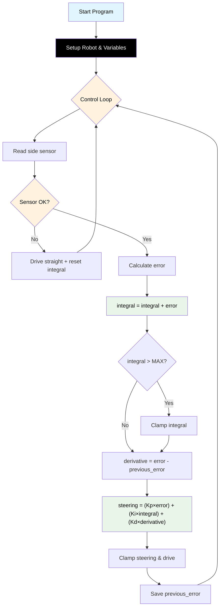

# Challenge 3: Wall Follow — Full PID

In this challenge you will add the **Integral (I)** term to complete the full **PID controller**. The maze now has an **L-shaped corner** — your PD controller from Challenge 2 will drift as it follows the wall around the turn because it cannot fix small persistent errors. The Integral term fixes this.

You will learn:

- What **steady-state error** is and why PD can't fix it.
- How the Integral term **accumulates** error over time.
- What **integral windup** is and how to prevent it.

---

## Success Criteria

My robot follows the wall around the **L-shaped corner** and reaches the **green exit zone**.

---

## Before You Begin

1. Complete [Challenge 2](docs.html?doc=Challenge_2) — you will build on your PD code.
2. Open the **Simulator** and select **Challenge 3**.
3. Notice the maze has a corner. Try running your Challenge 2 code here — the robot may drift after the turn.

---

## Flowchart Of The Algorithm



---

## Key Concepts

### What is Steady-State Error?

After the robot turns the L corner, the wall is now in a slightly different position relative to the sensor. The PD controller may settle at a distance that is close to — but not exactly at — the target. This small persistent gap is called **steady-state error**.

- P reacts proportionally, but if the remaining error is tiny, the P correction is also tiny and not enough to close the gap.
- D only reacts to changing error — if the error is small and constant, D produces zero.

### What is the Integral Term?

The Integral **adds up** (accumulates) the error over every loop iteration:

```
integral = integral + error
```

Even if the error is tiny, it keeps adding up. Eventually the integral becomes large enough to produce a meaningful correction:

```
steering = (Kp × error) + (Ki × integral) + (Kd × derivative)
```

Think of it like a bucket slowly filling with water — each drip is small, but eventually the bucket overflows and forces a change.

### What is Ki?

**Ki** (Integral gain) controls how strongly the accumulated error affects steering:

- **Bigger Ki** → faster correction of steady-state error, but risk of **windup** (see below).
- **Smaller Ki** → slower correction, but more stable.

> [!Important]
> Ki should always be **much smaller** than Kp. A good starting value is `Ki = 0.01`. If it's too large, the robot will become unstable.

### What is Integral Windup?

If the robot is far from the wall for a long time (e.g. during a turn when the sensor reads -1), the integral can accumulate to a huge value. When the robot finally sees the wall again, this massive integral causes a violent overcorrection. This is called **windup**.

The fix is to **clamp** the integral so it can never exceed a maximum value:

```python
if integral > INTEGRAL_MAX:
    integral = INTEGRAL_MAX
elif integral < -INTEGRAL_MAX:
    integral = -INTEGRAL_MAX
```

And **reset** the integral to 0 when the sensor returns -1 (wall not visible):

```python
if wall_distance == -1:
    integral = 0       # Reset when wall lost
```

---

## Step 1 — Start from Your Challenge 2 Code

Copy your working PD code. You will add:

1. Two new variables: `Ki` and `INTEGRAL_MAX`.
2. An `integral` variable before the loop.
3. The integral calculation inside the loop.
4. Anti-windup clamping.
5. Integral reset when the sensor returns -1.

---

## Step 2 — Add the New Variables

```python
BASE_SPEED = 160
TARGET_WALL_DISTANCE = 150
Kp = 0.5
Ki = 0.01                 # Integral gain — keep SMALL!
Kd = 0.3
MAX_STEERING = 40
INTEGRAL_MAX = 500         # Anti-windup clamp

previous_error = 0
integral = 0
```

---

## Step 3 — Reset Integral on Sensor Error

Update your sensor check to also reset the integral:

```python
    if wall_distance == -1:
        my_robot.drive(BASE_SPEED, BASE_SPEED)
        integral = 0       # Reset when wall lost
        hold_state(0.05)
        continue
```

---

## Step 4 — Calculate the Integral

After calculating the error, add the integral accumulation with clamping:

```python
    error = wall_distance - TARGET_WALL_DISTANCE

    # Integral: accumulated error
    integral = integral + error
    if integral > INTEGRAL_MAX:
        integral = INTEGRAL_MAX
    elif integral < -INTEGRAL_MAX:
        integral = -INTEGRAL_MAX
```

---

## Step 5 — Full PID Steering

Update the steering calculation to include all three terms:

```python
    # Derivative
    derivative = error - previous_error

    # Full PID
    steering = (Kp * error) + (Ki * integral) + (Kd * derivative)
```

The rest (clamping, differential drive, saving `previous_error`) stays the same as Challenge 2.

---

## Understanding How P, I, and D Work Together

| Term                 | What it does                                    | When it matters most                               |
| -------------------- | ----------------------------------------------- | -------------------------------------------------- |
| **P** (Proportional) | Steers proportional to current error            | When the robot is far from the target distance     |
| **I** (Integral)     | Fixes small persistent error over time          | After a turn, when the error is small but constant |
| **D** (Derivative)   | Dampens oscillations by resisting rapid changes | At the start, or when the error changes quickly    |

Together:

- **P** gets you close.
- **D** stops you from overshooting.
- **I** closes the last gap.

---

## Tuning Guide

| Symptom                               | Cause                 | Fix                                                       |
| ------------------------------------- | --------------------- | --------------------------------------------------------- |
| Robot drifts after the L corner       | Ki too low            | Increase Ki (try 0.02, 0.05)                              |
| Robot overcorrects violently          | Ki too high           | Decrease Ki or lower INTEGRAL_MAX                         |
| Robot goes unstable after losing wall | Integral windup       | Make sure you reset `integral = 0` when sensor returns -1 |
| Robot oscillates and drifts           | All gains need tuning | Tune in order: Kp first, then Kd, then Ki                 |

> [!Tip]
> The best tuning order is always: **P → D → I**. Get P working, add D to smooth it, then add I to close the gap.

---

## Complete Code

```python
# Challenge 3: Wall Follow — Full PID
from aidriver import AIDriver, hold_state
import aidriver

aidriver.DEBUG_AIDRIVER = True
my_robot = AIDriver()

BASE_SPEED = 160
TARGET_WALL_DISTANCE = 150
Kp = 0.5
Ki = 0.01
Kd = 0.3
MAX_STEERING = 40
INTEGRAL_MAX = 500

previous_error = 0
integral = 0

while True:
    wall_distance = my_robot.read_distance_2()

    if wall_distance == -1:
        my_robot.drive(BASE_SPEED, BASE_SPEED)
        integral = 0
        hold_state(0.05)
        continue

    error = wall_distance - TARGET_WALL_DISTANCE

    integral = integral + error
    if integral > INTEGRAL_MAX:
        integral = INTEGRAL_MAX
    elif integral < -INTEGRAL_MAX:
        integral = -INTEGRAL_MAX

    derivative = error - previous_error

    steering = (Kp * error) + (Ki * integral) + (Kd * derivative)

    if steering > MAX_STEERING:
        steering = MAX_STEERING
    elif steering < -MAX_STEERING:
        steering = -MAX_STEERING

    right_speed = BASE_SPEED - steering
    left_speed = BASE_SPEED + steering

    my_robot.drive(int(right_speed), int(left_speed))

    previous_error = error
    hold_state(0.05)
```

---

## Debugging Tips

- Add `print("I:", integral, "steer:", steering)` to watch the integral build up over time.
- If the integral hits `INTEGRAL_MAX` or `-INTEGRAL_MAX` every loop, it's growing too fast. Reduce Ki.
- After the L corner, the integral should slowly grow from zero to a small value that corrects the drift.
- If the robot suddenly jerks after losing and re-finding the wall, check that you are resetting `integral = 0` when the sensor returns -1.
