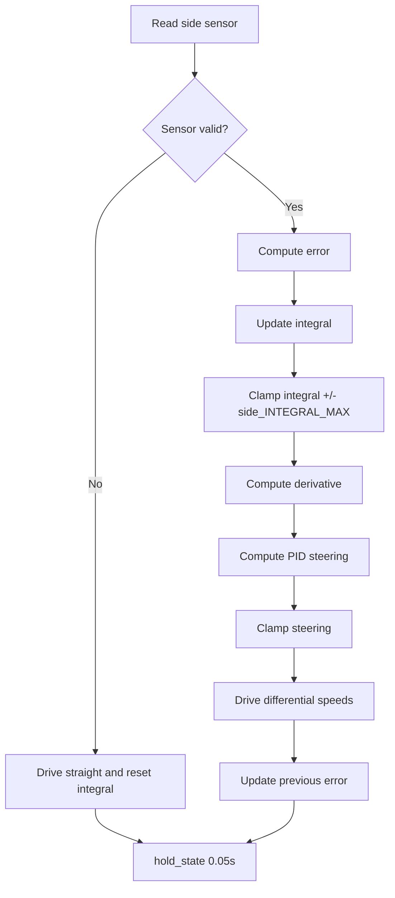

# Challenge 3: Wall Follow - Full PID

## Purpose

Complete the wall-follow controller by adding the integral term so small persistent errors are corrected, especially around corner geometry.

## Success Criteria

The robot follows the wall through the corridor and around the L corner, then reaches the green exit zone without sustained drift.

## Before You Begin

1. Complete Challenge 2 with stable PD gains.
2. Open simulator Challenge 3.
3. Carry forward all working values.

## Maze Situation

- Maze feature: straight section plus L corner.
- Trigger condition expected in code: side-wall availability and continuous PID control.
- New behavior introduced: integral accumulation with anti-windup.
- Why previous challenge fails: PD can leave a small persistent offset around corner geometry.

## What Is New In This Challenge

New: integral term and anti-windup clamp.

Unchanged: P and D terms, steering clamp, loop timing.

Delta equations:

```python
side_integral = side_integral + error
steering = (side_Kp * error) + (side_Ki * side_integral) + (side_Kd * side_derivative)
```

## Carry Forward From Previous Challenge

| Group   | Variable                                                                                          | Notes                      |
| ------- | ------------------------------------------------------------------------------------------------- | -------------------------- |
| Reused  | `BASE_SPEED`, `TARGET_WALL_DISTANCE`, `MAX_STEERING`, `side_Kp`, `side_Kd`, `side_previous_error` | Carried from Challenge 2.  |
| New     | `side_Ki`                                                                                         | Integral gain.             |
| New     | `side_integral`                                                                                   | Running accumulated error. |
| New     | `side_INTEGRAL_MAX`                                                                               | Anti-windup clamp.         |
| Removed | None                                                                                              | PD logic remains active.   |

## Algorithm Flow



## Starter Code Contract

Safe to edit:

1. All prior tunables from Challenge 2.
2. `side_Ki`.
3. `side_INTEGRAL_MAX`.

Do not edit unless instructed:

1. Integral reset when side wall is lost.
2. Integral clamp and steering clamp.
3. Loop order of integral, derivative, drive, history update.

Optional debug edits:

1. Print `error`, `side_integral`, `side_derivative`, and `steering`.

## Tunables

| Name                | Unit            | Purpose                   | Typical start value | Symptoms when too low | Symptoms when too high       |
| ------------------- | --------------- | ------------------------- | ------------------- | --------------------- | ---------------------------- |
| `side_Ki`           | gain            | Correct persistent offset | 0.001               | Corner drift remains  | Slow rolling oscillation     |
| `side_INTEGRAL_MAX` | error-sum units | Limit accumulated error   | 50                  | Little I effect       | Overshoot after wall returns |
| `side_Kp`           | gain            | Immediate correction      | 0.25                | Weak control          | Fast oscillation             |
| `side_Kd`           | gain            | Damping                   | 0.40                | Overshoot             | Sluggish response            |

## Tuning Guide

1. Verify PD is tuned first.
2. Adjust `side_Ki` in very small increments.
3. Adjust the integral clamp aggressively to prevent windup.
4. Verify integral resets when wall is lost.

## Debug Checklist

- [ ] Integral resets to zero when side sensor is invalid.
- [ ] Integral stays within `+/-side_INTEGRAL_MAX`.
- [ ] PID steering remains clamped.
- [ ] Robot no longer carries persistent offset around the L corner.

## Common Failure Modes

| Symptom                         | Root cause            | Verification step                        | Fix                                |
| ------------------------------- | --------------------- | ---------------------------------------- | ---------------------------------- |
| Drift remains on corner         | `side_Ki` too low     | Monitor integral growth                  | Increase `side_Ki` slightly        |
| Large overshoot after reacquire | Integral windup       | Print `side_integral` after wall returns | Reduce `side_Ki` and clamp tighter |
| Oscillation grows over time     | `side_Ki` too high    | Observe slow wave pattern                | Reduce `side_Ki`                   |
| No integral effect              | Integral not updating | Print integral each loop                 | Confirm update and clamp logic     |

## Exit Check

Pass when the Success Criteria are met in at least 3 consecutive simulator runs.

## What Is Next

Challenge 4 introduces the first explicit state machine and front-triggered gyro turn.
