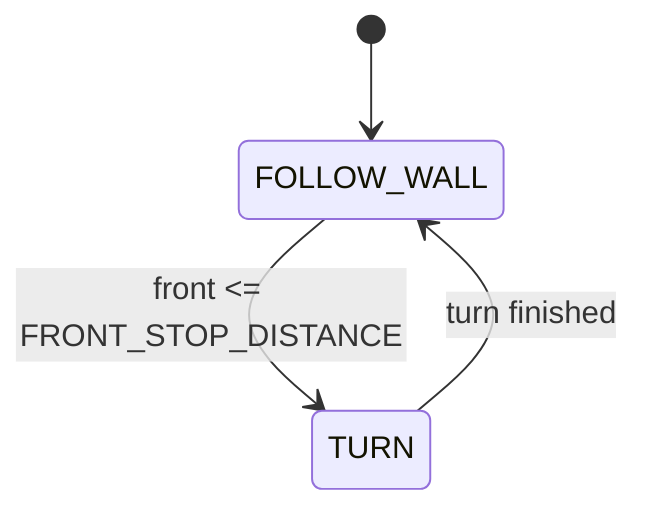

# Challenge 4: Corner Detection — Your First State Machine

Until now your robot did **one thing**: hug the side wall with a PID. A real maze needs the robot to
**switch behaviours** — follow the wall, then stop and turn at a corner, then follow again. The clean
way to manage "which behaviour am I doing right now?" is a **state machine**.

In this challenge you build a two-state machine and write the **gyro turn** that every later
challenge reuses.

You will learn:

- What a **finite state machine (FSM)** is and why robots use them.
- How a **trigger** moves the robot from one state to another.
- How to turn an exact 90° with a **closed-loop gyro PID** you write yourself.

---

## Success Criteria

My robot follows the wall, **detects the wall ahead**, **turns 90° away from it**, and reaches the
**green exit zone**.

---

## Before You Begin

1. Complete [Challenge 3](docs.html?doc=Challenge_3) — you need a working side-wall PID.
2. Open the **Simulator** and select **Challenge 4**.
3. Run your Challenge 3 code here first — it drives straight into the corner wall, because it only
   looks sideways. That is the problem this challenge solves.

---

## Concept 1 — What is a state machine?

A **state machine** says: _the robot is always in exactly one named **state**, and a **trigger**
moves it to another state._ Each state is a small, simple behaviour. You never mix them up, because
only one runs at a time.

Challenge 4 has **two states**:

| State         | What the robot does                                 |
| ------------- | --------------------------------------------------- |
| `FOLLOW_WALL` | hold the side wall at a fixed distance with the PID |
| `TURN`        | a wall is close ahead → spin 90° away from the wall |



In code, each state is a **function that returns the name of the next state**, and the main loop
just runs whichever state is current:

```python
while True:
    if state == "FOLLOW_WALL":
        state = follow_wall()
    elif state == "TURN":
        state = turn()
```

That is the whole pattern. Every challenge from here adds **states** and **triggers** to this same
loop — nothing else changes.

---

## Concept 2 — Triggers: how a state decides to switch

A trigger is just a condition a state checks. `FOLLOW_WALL` reads the **front** sensor every loop. If
a wall is close enough ahead, it returns `"TURN"` instead of steering:

```python
front = my_robot.read_distance()
if front != -1 and front <= FRONT_STOP_DISTANCE:
    return "TURN"          # trigger fired — switch state
```

| Tunable               | Meaning                                               |
| --------------------- | ----------------------------------------------------- |
| `FRONT_STOP_DISTANCE` | how close (mm) the wall ahead must be to start a turn |
| `FRONT_SLOW_DISTANCE` | start slowing down once the wall is within this range |
| `FRONT_Kp`            | how hard to brake as the wall approaches              |

> **Why slow down first?** Slamming from full speed into a turn overshoots. `FOLLOW_WALL` ramps the
> speed down as `front` shrinks (`speed = FRONT_Kp × (front − FRONT_STOP_DISTANCE)`) so the robot
> arrives at the corner already slow.

---

## Concept 3 — The gyro turn you write once and reuse forever

The `TURN` state spins the robot using the **gyroscope**, not a guessed time. The gyro reports how
fast the robot is rotating (deg/s); add that up each loop and you know the **angle turned so far**.
Keep spinning until you reach 90°:

```python
heading = 0.0
while (TURN_ANGLE - heading) > turn_tolerance:
    gz = my_robot.read_gyro_z_dps()      # current spin rate, deg/s
    heading += abs(gz) * TURN_DT         # add the angle covered this step
    error = TURN_ANGLE - heading         # how far left to go
    speed = turn_Kp * error + turn_Kd * (error - prev_error)
    # ...drive the two wheels in opposite directions to spin on the spot...
```

This is a **PID on the turn itself**. You tune three gains here and **carry them forward to every
later challenge**:

| Tunable          | Meaning                                           |
| ---------------- | ------------------------------------------------- |
| `turn_Kp`        | how aggressively it spins toward the target angle |
| `turn_Kd`        | damps the overshoot so it doesn't spin past 90°   |
| `turn_tolerance` | how close (degrees) to 90° counts as "done"       |

The angle (90°) is fixed; the gains decide _how briskly and precisely_ it gets there. See the
[PID Turn Tuning Quickstart](docs.html?doc=PID_Turn_Tuning_Quickstart).

> **Which way does it spin?** Away from the wall you follow. `gyro_turn_pid()` takes a `turn_right`
> flag, and `my_robot.wall_sign` (−1 for a left wall) picks the direction automatically — so the
> same code works for a left- or right-hand robot.

---

## What you tune in this challenge

Everything is already wired up in the editor; the numbers start at `0`. Fill them in:

| Group          | Tunables                                                       |
| -------------- | -------------------------------------------------------------- |
| Wall follow    | `BASE_SPEED`, `TARGET_WALL_DISTANCE`, `MAX_STEERING`           |
| Side PID       | `side_Kp`, `side_Ki`, `side_Kd`, `side_INTEGRAL_MAX` (from C3) |
| Front approach | `FRONT_SLOW_DISTANCE`, `FRONT_STOP_DISTANCE`, `FRONT_Kp`       |
| Gyro turn      | `turn_Kp`, `turn_Kd`, `turn_tolerance`                         |

> The turn **mechanics** (`TURN_ANGLE = 90`, step time, speed limits, a safety step-cap) are filled
> in for you — they are physics, not tuning.

---

## Tuning guide

| Observation                           | Fix                                                                            |
| ------------------------------------- | ------------------------------------------------------------------------------ |
| Doesn't slow before the wall          | Raise `FRONT_SLOW_DISTANCE` (try 500)                                          |
| Stops too far from the wall           | Lower `FRONT_STOP_DISTANCE` (try 120)                                          |
| Crashes before stopping               | Raise `FRONT_STOP_DISTANCE` or `FRONT_Kp`                                      |
| Doesn't complete a full 90°           | Raise `turn_Kp` or lower `turn_tolerance`                                      |
| Overshoots / wobbles on the turn      | Raise `turn_Kd`                                                                |
| Lurches sideways right after the turn | The side PID state is reset for you on entering `TURN` — check your side gains |

---

## Try it

1. Open **Challenge 4** in the editor — the two-state machine and the gyro turn are already written.
2. Fill in the tunables above and run.
3. Stuck? The tuned answer lives in `app/answers/challenge-4.py`, but try your own numbers first.

---

## What's Next

[Challenge 5](docs.html?doc=Challenge_5) adds a **third state** for outside corners, where the side
wall suddenly _ends_ and the robot has to wrap around it.
