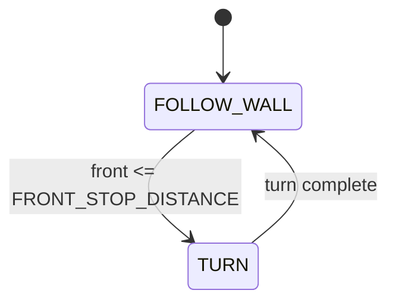

# Challenge 4: Corner Detection - First State Machine

## Purpose

Move from a single control loop to a two-state machine so the robot can switch between wall following and turning when the front wall blocks the path.

## Success Criteria

The robot follows the wall, detects a front wall, performs a 90 deg gyro turn away from the wall, and reaches the green exit zone.

## Before You Begin

1. Complete Challenge 3 with stable side PID.
2. Open simulator Challenge 4.
3. Confirm your wall side selection in `AIDriver("left")` or `AIDriver("right")`.

## Maze Situation

- Maze feature: inside corner with wall directly ahead.
- Trigger condition expected in code: `front <= FRONT_STOP_DISTANCE`.
- New behavior introduced: explicit state transition from Follow wall state to Turn state.
- Why previous challenge fails: side-only control cannot respond to a front blockage.

## What Is New In This Challenge

New: finite state machine with two states.

Unchanged: side PID logic from Challenge 3 in Follow wall state.

State delta:

1. `FOLLOW_WALL` handles normal corridor control.
2. `TURN` performs gyro-closed-loop 90 deg turn.

## Carry Forward From Previous Challenge

| Group   | Variable                                                 | Notes                                            |
| ------- | -------------------------------------------------------- | ------------------------------------------------ |
| Reused  | `BASE_SPEED`, side PID tunables                          | Follow wall behavior stays the same.             |
| New     | `FRONT_SLOW_DISTANCE`, `FRONT_STOP_DISTANCE`, `FRONT_Kp` | Front approach slowdown and stop trigger.        |
| New     | `turn_Kp`, `turn_Kd`, `turn_tolerance`                   | Gyro turn tuning.                                |
| New     | `state`                                                  | Current FSM state label.                         |
| Removed | None                                                     | Previous PID block is embedded in `FOLLOW_WALL`. |

## Algorithm Flow

### State Table

| State name    | Responsibilities                                            | Exit conditions                           |
| ------------- | ----------------------------------------------------------- | ----------------------------------------- |
| `FOLLOW_WALL` | Run side PID, check front distance, apply approach slowdown | Exit to `TURN` when front trigger fires   |
| `TURN`        | Brake, rotate 90 deg using gyro PID, reset side PID history | Exit to `FOLLOW_WALL` when turn completes |

### Trigger Table

| Trigger condition                              | From state    | To state      | Priority |
| ---------------------------------------------- | ------------- | ------------- | -------- |
| `front != -1 and front <= FRONT_STOP_DISTANCE` | `FOLLOW_WALL` | `TURN`        | High     |
| Turn error <= tolerance                        | `TURN`        | `FOLLOW_WALL` | High     |

## Starter Code Contract

Safe to edit:

1. Front approach tunables.
2. Turn tunables.
3. Carry-forward side PID tunables.

Do not edit unless instructed:

1. State loop dispatch.
2. Trigger ordering.
3. Gyro integration structure.
4. Safety timeouts and clamps.

Optional debug edits:

1. Print current `state`, `front`, and turn error.

## Tunables

| Name                  | Unit | Purpose                        | Typical start value | Symptoms when too low     | Symptoms when too high   |
| --------------------- | ---- | ------------------------------ | ------------------- | ------------------------- | ------------------------ |
| `FRONT_STOP_DISTANCE` | mm   | Turn trigger distance          | 120                 | Late turn, collision risk | Early turn, awkward path |
| `FRONT_SLOW_DISTANCE` | mm   | Begin deceleration zone        | 500                 | Harsh corner entry        | Over-slow approach       |
| `FRONT_Kp`            | gain | Approach deceleration strength | 0.8                 | Weak slowdown             | Over-braking             |
| `turn_Kp`             | gain | Turn speed toward target angle | 4.5                 | Under-rotation            | Overshoot risk           |
| `turn_Kd`             | gain | Turn damping                   | 0.6                 | Wobble/overshoot          | Sluggish turn            |
| `turn_tolerance`      | deg  | Completion threshold           | 2.0                 | Never settles             | Stops too early          |

## Tuning Guide

1. Verify front approach behavior so corner entry is controlled.
2. Adjust turn gains for reliable 90 deg behavior.
3. Verify side PID after turn because corner exit speed affects reacquisition.

## Debug Checklist

- [ ] State changes from `FOLLOW_WALL` to `TURN` at expected front distance.
- [ ] Turn completes near 90 deg without repeated oscillation.
- [ ] Side PID re-locks after turn.
- [ ] Robot reaches exit zone in repeated runs.

## Common Failure Modes

| Symptom                 | Root cause                               | Verification step                    | Fix                                          |
| ----------------------- | ---------------------------------------- | ------------------------------------ | -------------------------------------------- |
| Crashes into front wall | `FRONT_STOP_DISTANCE` too low            | Log front distance at state switch   | Increase stop distance                       |
| Turns less than 90 deg  | `turn_Kp` too low or tolerance too large | Print final turn error               | Increase `turn_Kp` or tighten tolerance      |
| Overshoots turn         | `turn_Kd` too low                        | Observe oscillation at end of turn   | Increase `turn_Kd`                           |
| Jerky corner entry      | Poor front slowdown tuning               | Log approach speed vs front distance | Increase `FRONT_SLOW_DISTANCE` or `FRONT_Kp` |

## Exit Check

Pass when the Success Criteria are met in at least 3 consecutive simulator runs.

## What Is Next

Challenge 5 adds Outside corner or nib handling with a new NIB_WALL state and wall-lost debounce logic.
