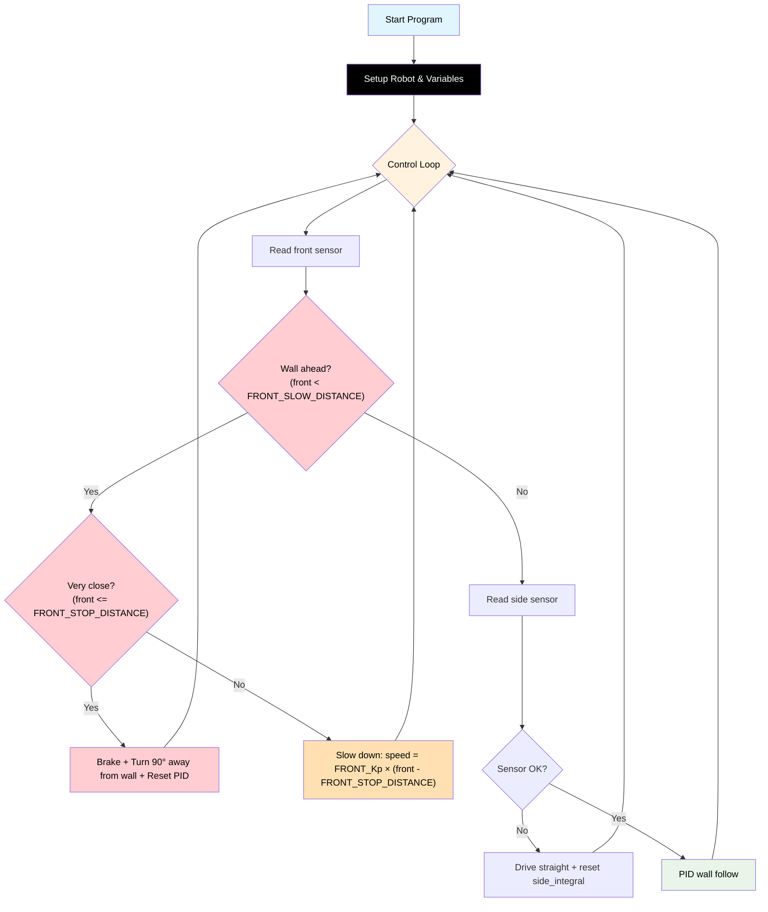

# Challenge 4: Corner Detection

In this challenge you will combine the **front sensor** with your **side PID wall following** to navigate a corridor that has a **single 90° corner**. The robot must detect the wall ahead, turn in the correct direction, and continue following the wall to the exit.

You will learn:

- How to use **two sensors at once** (sensor fusion).
- How to use `wall_sign` to automatically pick the correct turn direction.
- How to reset PID state after a manoeuvre.

---

## Success Criteria

My robot follows the wall, **detects the corner**, **turns 90°**, and reaches the **green exit zone** on the other side.

---

## Before You Begin

1. Complete [Challenge 3](docs.html?doc=Challenge_3) — you need a working full PID controller.
2. Open the **Simulator** and select **Challenge 4**.
3. Run your Challenge 3 code here — the robot will crash into the corner wall because it only looks sideways, not forward!

---

## Flowchart Of The Algorithm



---

## Key Concepts

### Sensor Fusion

**Sensor fusion** means using data from multiple sensors to make better decisions. In this challenge:

| Sensor              | Purpose                              | Code                         |
| ------------------- | ------------------------------------ | ---------------------------- |
| **Front** (`front`) | Detect walls ahead — triggers a turn | `my_robot.read_distance()`   |
| **Side** (`side`)   | Follow the wall — PID steering       | `my_robot.read_distance_2()` |

### Priority-Based Decisions

When you have two sensors, you need **rules about which one takes priority**:

1. **Priority 1a: Very close to wall ahead** (`front <= FRONT_STOP_DISTANCE`) → Stop and turn 90°. Most urgent.
2. **Priority 1b: Approaching wall ahead** (`front < FRONT_SLOW_DISTANCE`) → Slow down proportionally.
3. **Priority 2: No wall ahead** → Use PID to follow the side wall as normal.

### Using `wall_sign` for Automatic Turn Direction

Instead of hardcoding `rotate_left` or `rotate_right`, use `my_robot.wall_sign`:

| `AIDriver(...)` | `wall_sign` | Turn direction at a corner         |
| --------------- | ----------- | ---------------------------------- |
| `"left"`        | `-1`        | Turn **right** away from left wall |
| `"right"`       | `+1`        | Turn **left** away from right wall |

```python
# Turn away from the wall you are following
if my_robot.wall_sign == -1:   # following left wall → turn right
    my_robot.rotate_right(TURN_SPEED)
else:                          # following right wall → turn left
    my_robot.rotate_left(TURN_SPEED)
hold_state(TURN_TIME_90)
```

This means the same code works whether the robot is set to `"left"` or `"right"` — no hardcoded direction needed.

### P Control on the Front Sensor — Smooth Deceleration

Instead of slamming on the brakes, use P control on the front sensor to control **speed**:

```
approach_speed = FRONT_Kp × (front - FRONT_STOP_DISTANCE)
```

| Front distance | Kp=1.0, stop=150mm                      | Result speed    |
| -------------- | --------------------------------------- | --------------- |
| 400mm          | 1.0 × (400 − 150) = 250 → clamped to 200 | 200             |
| 300mm          | 1.0 × (300 − 150) = 150                 | 150             |
| 200mm          | 1.0 × (200 − 150) = 50 → clamped to 120  | 120             |
| 150mm          | 1.0 × (150 − 150) = 0                   | **Stop → turn** |

### Resetting PID After a Turn

After turning, the side sensor sees a completely different wall. Reset both variables or the PID will make a large incorrect correction:

```python
side_integral = 0
side_previous_error = 0
```

### Tuning `TURN_TIME_90`

`TURN_TIME_90` controls how long the robot rotates. Start at `0.35` and adjust in `0.05s` steps until the turn is approximately 90°.

---

## Step 1 — Start from Your Challenge 3 Code

Copy your working PID code. You will add:

1. Front sensor variables: `FRONT_SLOW_DISTANCE`, `FRONT_STOP_DISTANCE`, `FRONT_Kp`.
2. `TURN_SPEED` and `TURN_TIME_90` variables.
3. A front-sensor check at the **top** of the loop (before the PID code).

---

## Step 2 — Add New Configuration Variables

```python
# Front sensor P-controlled approach
FRONT_SLOW_DISTANCE = 400  # Start decelerating (mm)
FRONT_STOP_DISTANCE = 150  # Stop and turn (mm)
FRONT_Kp = 1.0
TURN_SPEED = 180
TURN_TIME_90 = 0           # TODO: tune for ~90 degree turn (try 0.35)
```

> [!Note]
> `TURN_TIME_90 = 0` is intentionally zero — you **must** tune this yourself.

---

## Step 3 — Add the Front Sensor Check

At the **top** of your `while True:` loop, before the PID code, add:

```python
while True:
    front = my_robot.read_distance()

    # Priority 1: Wall ahead — P-controlled deceleration then 90° turn
    if front != -1 and front < FRONT_SLOW_DISTANCE:
        if front <= FRONT_STOP_DISTANCE:
            # Close enough — stop and turn 90° away from your wall
            my_robot.brake()
            hold_state(0.3)
            if my_robot.wall_sign == -1:   # following left wall → turn right
                my_robot.rotate_right(TURN_SPEED)
            else:                          # following right wall → turn left
                my_robot.rotate_left(TURN_SPEED)
            hold_state(TURN_TIME_90)
            my_robot.brake()
            hold_state(0.3)
            side_integral = 0
            side_previous_error = 0
            continue
        else:
            # Approaching — slow down proportionally
            approach_speed = int(FRONT_Kp * (front - FRONT_STOP_DISTANCE))
            if approach_speed < 120:
                approach_speed = 120
            if approach_speed > BASE_SPEED:
                approach_speed = BASE_SPEED
            my_robot.drive(approach_speed, approach_speed)
            hold_state(0.05)
            continue
```

> [!Important]
> The `front != -1` check prevents decelerating when the sensor is in error state.

---

## Step 4 — Keep Your PID Code

The rest of the loop is your existing Challenge 3 PID wall-following code. It only runs when there is **no wall ahead**:

```python
    # Priority 2: Side wall following with PID
    side = my_robot.read_distance_2()

    if side == -1:
        my_robot.drive(BASE_SPEED, BASE_SPEED)
        side_integral = 0
        hold_state(0.05)
        continue

    error = side - TARGET_WALL_DISTANCE
    # ... rest of PID code ...
```

---

## Step 5 — Tune

| Observation                          | Fix                                                       |
| ------------------------------------ | --------------------------------------------------------- |
| Robot doesn't slow down before wall  | Increase `FRONT_SLOW_DISTANCE` (try 500)                  |
| Robot stops too far from wall        | Decrease `FRONT_STOP_DISTANCE` (try 120)                  |
| Robot crashes before stopping        | Increase `FRONT_STOP_DISTANCE` or `FRONT_Kp`              |
| Robot doesn't turn enough            | Increase `TURN_TIME_90`                                   |
| Robot turns too far (overshoots 90°) | Decrease `TURN_TIME_90`                                   |
| Robot jerks badly after turning      | Check `side_integral` and `side_previous_error` are reset |

---

## Starter Scaffold

This is exactly what you'll see in the editor when you open the challenge. The full algorithm is already written for you — every numeric setting starts at `0`. Your job is to tune the values.

```python
# Challenge 4: Corner Detection (90° turn)
# --------------------------------------------------------------------
# Adds a front-sensor priority block that brakes, rotates 90° away
# from the wall, and resumes wall-following. The full algorithm is
# already written for you. Every numeric setting starts at 0.
#
# Tuning guides:
#     docs.html?doc=PID_Front_Distance_Tuning_Quickstart   (FRONT_*, FRONT_Kp)
#     docs.html?doc=PID_Turn_Tuning_Quickstart             (TURN_SPEED, TURN_TIME_90)
#
# Values to set:
#     all carried-forward C3 PID + base values
#     FRONT_SLOW_DISTANCE, FRONT_STOP_DISTANCE     when to slow / brake (mm)
#     FRONT_Kp                                      front-approach gain
#     TURN_SPEED                                    rotation wheel speed
#     TURN_TIME_90                                  seconds for ~90° rotation
#
# Goal: turn the L-corner at speed without clipping either wall.
# --------------------------------------------------------------------

from aidriver import AIDriver, hold_state
import aidriver

aidriver.DEBUG_AIDRIVER = False
my_robot = AIDriver("left")

BASE_SPEED = 0
TARGET_WALL_DISTANCE = 0
MAX_STEERING = 0

side_Kp = 0.0
side_Kd = 0.0
side_Ki = 0.0
side_INTEGRAL_MAX = 0

FRONT_SLOW_DISTANCE = 0
FRONT_STOP_DISTANCE = 0
FRONT_Kp = 0.0
TURN_SPEED = 0
TURN_TIME_90 = 0.0

side_previous_error = 0
side_integral = 0


while True:
    # --- Front-sensor priority: detect & turn 90° at corners ---
    front = my_robot.read_distance()

    if front != -1 and front < FRONT_SLOW_DISTANCE:
        if front <= FRONT_STOP_DISTANCE:
            my_robot.brake()
            hold_state(0.3)

            # Rotate AWAY from the wall (wall_sign tells us which side).
            if my_robot.wall_sign == -1:
                my_robot.rotate_right(TURN_SPEED)
            else:
                my_robot.rotate_left(TURN_SPEED)
            hold_state(TURN_TIME_90)

            my_robot.brake()
            hold_state(0.3)

            side_integral = 0
            side_previous_error = 0
            continue
        else:
            # Approach the wall on a P-controlled deceleration ramp.
            approach_speed = int(FRONT_Kp * (front - FRONT_STOP_DISTANCE))
            if approach_speed < 120:
                approach_speed = 120
            if approach_speed > BASE_SPEED:
                approach_speed = BASE_SPEED
            my_robot.drive(approach_speed, approach_speed)
            hold_state(0.05)
            continue

    # --- Side wall-follow PID (carried forward from Challenge 3) ---
    wall_distance = my_robot.read_distance_2()

    if wall_distance == -1:
        my_robot.drive(BASE_SPEED, BASE_SPEED)
        side_integral = 0
        hold_state(0.05)
        continue

    error = wall_distance - TARGET_WALL_DISTANCE

    side_integral = side_integral + error
    if side_integral > side_INTEGRAL_MAX:
        side_integral = side_INTEGRAL_MAX
    elif side_integral < -side_INTEGRAL_MAX:
        side_integral = -side_INTEGRAL_MAX

    side_derivative = error - side_previous_error

    steering = (
        (side_Kp * error) + (side_Ki * side_integral) + (side_Kd * side_derivative)
    )

    if steering > MAX_STEERING:
        steering = MAX_STEERING
    elif steering < -MAX_STEERING:
        steering = -MAX_STEERING

    right_speed = BASE_SPEED - (my_robot.wall_sign * steering)
    left_speed = BASE_SPEED + (my_robot.wall_sign * steering)

    my_robot.drive(int(right_speed), int(left_speed))

    side_previous_error = error
    hold_state(0.05)
```

<details>
<summary><strong>Reference Solution</strong> — click to expand <em>(only after you've genuinely tried)</em></summary>

The simulator-tuned answer key fills in every value. These are the same numbers used by the automated integration tests.

```python
from aidriver import AIDriver, hold_state
import aidriver

aidriver.DEBUG_AIDRIVER = False
my_robot = AIDriver("left")

BASE_SPEED = 200
TARGET_WALL_DISTANCE = 200
MAX_STEERING = 60

side_Kp = 0.25
side_Kd = 0.40
side_Ki = 0.001
side_INTEGRAL_MAX = 50

FRONT_SLOW_DISTANCE = 400
FRONT_STOP_DISTANCE = 150
FRONT_Kp = 1.0
TURN_SPEED = 180
TURN_TIME_90 = 0.35

side_previous_error = 0
side_integral = 0


while True:
    # --- Front-sensor priority: detect & turn 90° at corners ---
    front = my_robot.read_distance()

    if front != -1 and front < FRONT_SLOW_DISTANCE:
        if front <= FRONT_STOP_DISTANCE:
            my_robot.brake()
            hold_state(0.3)

            if my_robot.wall_sign == -1:
                my_robot.rotate_right(TURN_SPEED)
            else:
                my_robot.rotate_left(TURN_SPEED)
            hold_state(TURN_TIME_90)

            my_robot.brake()
            hold_state(0.3)

            side_integral = 0
            side_previous_error = 0
            continue
        else:
            approach_speed = int(FRONT_Kp * (front - FRONT_STOP_DISTANCE))
            if approach_speed < 120:
                approach_speed = 120
            if approach_speed > BASE_SPEED:
                approach_speed = BASE_SPEED
            my_robot.drive(approach_speed, approach_speed)
            hold_state(0.05)
            continue

    # --- Side wall-follow PID (carried forward from Challenge 3) ---
    wall_distance = my_robot.read_distance_2()

    if wall_distance == -1:
        my_robot.drive(BASE_SPEED, BASE_SPEED)
        side_integral = 0
        hold_state(0.05)
        continue

    error = wall_distance - TARGET_WALL_DISTANCE

    side_integral = side_integral + error
    if side_integral > side_INTEGRAL_MAX:
        side_integral = side_INTEGRAL_MAX
    elif side_integral < -side_INTEGRAL_MAX:
        side_integral = -side_INTEGRAL_MAX

    side_derivative = error - side_previous_error

    steering = (
        (side_Kp * error) + (side_Ki * side_integral) + (side_Kd * side_derivative)
    )

    if steering > MAX_STEERING:
        steering = MAX_STEERING
    elif steering < -MAX_STEERING:
        steering = -MAX_STEERING

    right_speed = BASE_SPEED - (my_robot.wall_sign * steering)
    left_speed = BASE_SPEED + (my_robot.wall_sign * steering)

    my_robot.drive(int(right_speed), int(left_speed))

    side_previous_error = error
    hold_state(0.05)
```

</details>

---
## Debugging Tips

- Add `print("front:", front)` at the top of the loop to confirm the sensor is reading correctly.
- If the robot never slows down, check that `FRONT_SLOW_DISTANCE` is large enough to detect the wall in time.
- If the robot turns the wrong way, check that `AIDriver("left")` or `AIDriver("right")` matches your physical setup.
- If the PID oscillates badly after a turn, confirm `side_integral = 0` and `side_previous_error = 0` are being reset.

---

## What's Next

In [Challenge 5](docs.html?doc=Challenge_5) you will extend this code to also handle a **180° dead end** by checking the side sensor after stopping to decide which turn angle to use.
