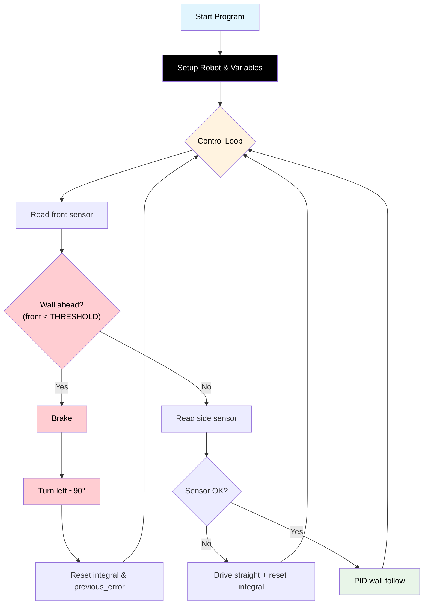

# Challenge 4: Dead End Detection

In this challenge you will combine the **front sensor** with your **side PID wall following** to navigate a corridor that has a **dead end**. The robot must detect the wall ahead, stop, turn, and continue following the wall to the exit.

You will learn:

- How to use **two sensors at once** (sensor fusion).
- How to structure code with **priorities** (front wall takes priority over side following).
- How to reset PID state after a manoeuvre.

---

## Success Criteria

My robot follows the wall, **detects the dead end**, **turns**, and reaches the **green exit zone** on the other side.

---

## Before You Begin

1. Complete [Challenge 3](docs.html?doc=Challenge_3) — you need a working full PID controller.
2. Open the **Simulator** and select **Challenge 4**.
3. Run your Challenge 3 code here — the robot will crash into the dead-end wall because it only looks sideways, not forward!

---

## Flowchart Of The Algorithm



---

## Key Concepts

### Sensor Fusion

**Sensor fusion** means using data from multiple sensors to make better decisions. In this challenge:

| Sensor                         | Purpose                              | Code                         |
| ------------------------------ | ------------------------------------ | ---------------------------- |
| **Front** (`read_distance()`)  | Detect walls ahead — triggers a turn | `my_robot.read_distance()`   |
| **Side** (`read_distance_2()`) | Follow the wall — PID steering       | `my_robot.read_distance_2()` |

### Priority-Based Decisions

When you have two sensors, you need **rules about which one takes priority**:

1. **Priority 1: Wall ahead** → Stop everything and turn. This is the most urgent action — if you don't turn, you crash.
2. **Priority 2: Side wall following** → Use PID to follow the wall smoothly. This happens only when there's no wall ahead.

This is coded as an `if` / `else` structure:

```python
if wall_ahead:
    # Priority 1: turn!
else:
    # Priority 2: PID wall follow
```

### Resetting PID After a Turn

After the robot turns, the side sensor now sees a completely different wall at a completely different distance. The integral and previous_error from before the turn are **no longer valid**. If you don't reset them, the PID will make a huge incorrect correction.

```python
integral = 0
previous_error = 0
```

Always reset these after any major manoeuvre (turn, stop, reverse).

### Tuning the Turn

The `TURN_TIME` variable controls how long the robot rotates. You need to tune this so the robot turns approximately 90 degrees:

- Too short → robot doesn't turn enough, drives into the wall.
- Too long → robot turns too far and goes backwards.

> [!Tip]
> Start with `TURN_TIME = 0.5` and adjust up or down in small increments (0.1s) until the turn looks like a right angle.

---

## Step 1 — Start from Your Challenge 3 Code

Copy your working PID code. You will add:

1. A `FRONT_THRESHOLD` variable — how close the front wall must be to trigger a turn.
2. `TURN_SPEED` and `TURN_TIME` variables.
3. A front-sensor check at the **top** of the loop (before the PID code).

---

## Step 2 — Add New Configuration Variables

```python
FRONT_THRESHOLD = 250      # Distance to trigger a turn (mm)
TURN_SPEED = 180
TURN_TIME = 0              # TODO: tune for ~90 degree turn
```

> [!Note]
> `TURN_TIME = 0` is intentionally set to zero — you **must** tune this yourself. This forces you to experiment.

---

## Step 3 — Add the Front Sensor Check

At the **top** of your `while True:` loop, before the side-sensor PID code, add:

```python
while True:
    front = my_robot.read_distance()

    # Priority 1: Wall ahead — stop and turn
    if front != -1 and front < FRONT_THRESHOLD:
        my_robot.brake()
        hold_state(0.3)
        my_robot.rotate_left(TURN_SPEED)
        hold_state(TURN_TIME)
        my_robot.brake()
        hold_state(0.3)
        integral = 0
        previous_error = 0
        continue
```

The `continue` skips the PID code and goes back to the top of the loop — after turning, the robot will re-read both sensors before deciding what to do next.

> [!Important]
> The `front != -1` check ensures you don't turn when the front sensor is in error state (returning -1).

---

## Step 4 — Keep Your PID Code

The rest of the loop is your existing Challenge 3 PID wall-following code. It only runs when there is **no wall ahead**:

```python
    # Priority 2: Side wall following with PID
    wall_distance = my_robot.read_distance_2()

    if wall_distance == -1:
        my_robot.drive(BASE_SPEED, BASE_SPEED)
        integral = 0
        hold_state(0.05)
        continue

    error = wall_distance - TARGET_WALL_DISTANCE
    # ... rest of PID code ...
```

---

## Step 5 — Tune the Turn

Run the code in the simulator and adjust `TURN_TIME`:

| Observation                         | Fix                                             |
| ----------------------------------- | ----------------------------------------------- |
| Robot doesn't turn enough           | Increase TURN_TIME                              |
| Robot turns too far                 | Decrease TURN_TIME                              |
| Robot starts turning too late       | Increase FRONT_THRESHOLD                        |
| Robot turns when no wall is ahead   | Decrease FRONT_THRESHOLD                        |
| Robot jerks violently after turning | Make sure you reset integral and previous_error |

---

## Complete Code

```python
# Challenge 4: Dead End Detection
from aidriver import AIDriver, hold_state
import aidriver

aidriver.DEBUG_AIDRIVER = True
my_robot = AIDriver()

BASE_SPEED = 160
TARGET_WALL_DISTANCE = 150
FRONT_THRESHOLD = 250
TURN_SPEED = 180
TURN_TIME = 0              # TODO: tune for ~90 degree turn

Kp = 0.5
Ki = 0.01
Kd = 0.3
MAX_STEERING = 40
INTEGRAL_MAX = 500

previous_error = 0
integral = 0

while True:
    front = my_robot.read_distance()

    # Priority 1: Wall ahead — stop and turn
    if front != -1 and front < FRONT_THRESHOLD:
        my_robot.brake()
        hold_state(0.3)
        my_robot.rotate_left(TURN_SPEED)
        hold_state(TURN_TIME)
        my_robot.brake()
        hold_state(0.3)
        integral = 0
        previous_error = 0
        continue

    # Priority 2: Side wall following with PID
    wall_distance = my_robot.read_distance_2()

    if wall_distance == -1:
        my_robot.drive(BASE_SPEED, BASE_SPEED)
        integral = 0
        hold_state(0.05)
        continue

    error = wall_distance - TARGET_WALL_DISTANCE
    integral = integral + error
    if integral > INTEGRAL_MAX:
        integral = INTEGRAL_MAX
    elif integral < -INTEGRAL_MAX:
        integral = -INTEGRAL_MAX
    derivative = error - previous_error

    steering = (Kp * error) + (Ki * integral) + (Kd * derivative)
    if steering > MAX_STEERING:
        steering = MAX_STEERING
    elif steering < -MAX_STEERING:
        steering = -MAX_STEERING

    right_speed = BASE_SPEED - steering
    left_speed = BASE_SPEED + steering
    my_robot.drive(int(right_speed), int(left_speed))

    previous_error = error
    hold_state(0.05)
```

---

## Debugging Tips

- Add `print("front:", front)` to watch the front sensor reading as the robot approaches the dead end.
- If the robot never turns, check that `FRONT_THRESHOLD` is large enough and that the front sensor is returning valid values (not -1).
- If the robot turns but then immediately turns again, `TURN_TIME` may be too short (it's still facing the wall after turning).
- If the PID oscillates badly after a turn, make sure you are resetting both `integral = 0` and `previous_error = 0`.
