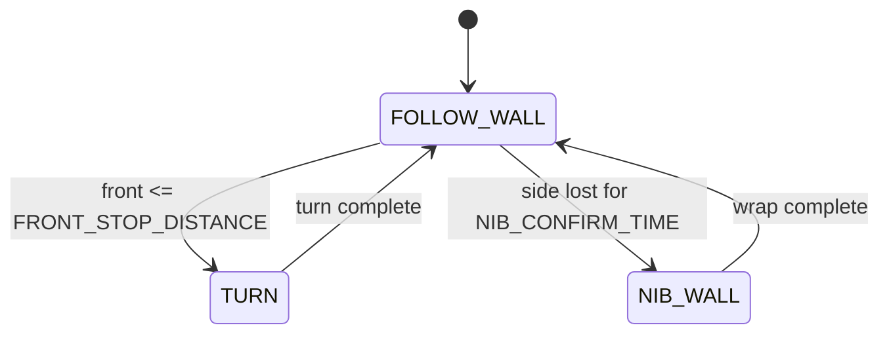

# Challenge 5: Outside Corners - Add NIB_WALL State

## Purpose

Extend the state machine to handle outside corners where the side wall disappears.

## Success Criteria

The robot detects side-wall loss at a nib, runs the wrap maneuver, reacquires the wall, and reaches the goal pocket.

## Before You Begin

1. Complete Challenge 4 with working turn behavior.
2. Open simulator Challenge 5.
3. Carry forward all tuned side and turn parameters.

## Maze Situation

- Maze feature: outside corner (nib) where side wall ends.
- Trigger condition expected in code: side wall lost for confirmation time.
- New behavior introduced: NIB_WALL state for wrap-around maneuver.
- Why previous challenge fails: with no side wall, follow logic drives into open space.

## What Is New In This Challenge

New: wall-lost debounce and nib wrap state.

Unchanged: front-triggered TURN state and side PID follow state.

## Carry Forward From Previous Challenge

| Group   | Variable                                  | Notes                          |
| ------- | ----------------------------------------- | ------------------------------ |
| Reused  | Side PID and front-turn tunables          | Same as Challenge 4.           |
| New     | `NIB_LOST_DISTANCE`, `NIB_CONFIRM_TIME`   | Side-wall loss detection.      |
| New     | `NIB_FORWARD_BEFORE`, `NIB_FORWARD_AFTER` | Wrap maneuver distances/times. |
| New     | `nib_lost_time`                           | Debounce timer.                |
| Removed | None                                      | Existing states remain.        |

## Algorithm Flow

### State Table

| State name    | Responsibilities                                                 | Exit conditions              |
| ------------- | ---------------------------------------------------------------- | ---------------------------- |
| `FOLLOW_WALL` | Run side PID, check front trigger, track side loss timer         | Exit to `TURN` or `NIB_WALL` |
| `TURN`        | Execute inside-corner 90 deg turn away from wall                 | Exit to `FOLLOW_WALL`        |
| `NIB_WALL`    | Drive forward, turn toward wall side, drive forward to reacquire | Exit to `FOLLOW_WALL`        |

### Trigger Table

| Trigger condition                             | From state    | To state      | Priority |
| --------------------------------------------- | ------------- | ------------- | -------- |
| `front <= FRONT_STOP_DISTANCE`                | `FOLLOW_WALL` | `TURN`        | Highest  |
| side lost continuously for `NIB_CONFIRM_TIME` | `FOLLOW_WALL` | `NIB_WALL`    | High     |
| Wrap sequence complete                        | `NIB_WALL`    | `FOLLOW_WALL` | High     |

## Starter Code Contract

Safe to edit:

1. Nib wrap timing values.
2. Nib loss thresholds if challenge explicitly allows.
3. Existing front and side gains.

Do not edit unless instructed:

1. Trigger priority order.
2. Debounce logic structure.
3. Turn direction mapping using wall side.

Optional debug edits:

1. Print `state`, `side`, and `nib_lost_time`.

## Tunables

| Name                 | Unit | Purpose                            | Typical start value | Symptoms when too low | Symptoms when too high |
| -------------------- | ---- | ---------------------------------- | ------------------- | --------------------- | ---------------------- |
| `NIB_LOST_DISTANCE`  | mm   | Side distance considered wall-lost | 400                 | False nib triggers    | Slow nib detection     |
| `NIB_CONFIRM_TIME`   | s    | Debounce before nib state          | 0.5                 | Noise-triggered turns | Delayed response       |
| `NIB_FORWARD_BEFORE` | s    | Clear corner before turning        | 0.25                | Clips corner          | Wrap too wide          |
| `NIB_FORWARD_AFTER`  | s    | Move alongside new wall after turn | 0.30                | Missed reacquire      | Overshoot past wall    |

## Tuning Guide

1. Verify debounce behavior is stable first.
2. Adjust `NIB_FORWARD_BEFORE` to avoid clipping.
3. Adjust `NIB_FORWARD_AFTER` for reliable wall reacquisition.

## Debug Checklist

- [ ] Nib trigger occurs only when wall is truly gone.
- [ ] No random nib turns on normal wall-follow oscillation.
- [ ] Wrap turn direction is toward the previous wall side.
- [ ] Robot reacquires wall and continues follow state.

## Common Failure Modes

| Symptom                  | Root cause                                            | Verification step                | Fix                                    |
| ------------------------ | ----------------------------------------------------- | -------------------------------- | -------------------------------------- |
| Random nib turns         | `NIB_LOST_DISTANCE` too low or confirm time too short | Plot side reading around trigger | Increase threshold and/or confirm time |
| Clips outside corner     | `NIB_FORWARD_BEFORE` too low                          | Observe position at turn start   | Increase `NIB_FORWARD_BEFORE`          |
| Fails to reacquire wall  | `NIB_FORWARD_AFTER` not tuned                         | Observe side reading after wrap  | Adjust `NIB_FORWARD_AFTER`             |
| Wraps in wrong direction | Wall-side mapping issue                               | Print wall sign and turn command | Fix mapping toward wall side           |

## Exit Check

Pass when the Success Criteria are met in at least 3 consecutive simulator runs.

## What Is Next

Challenge 6 combines dead ends and nibs in one maze and validates trigger precedence in the same three-state machine.
