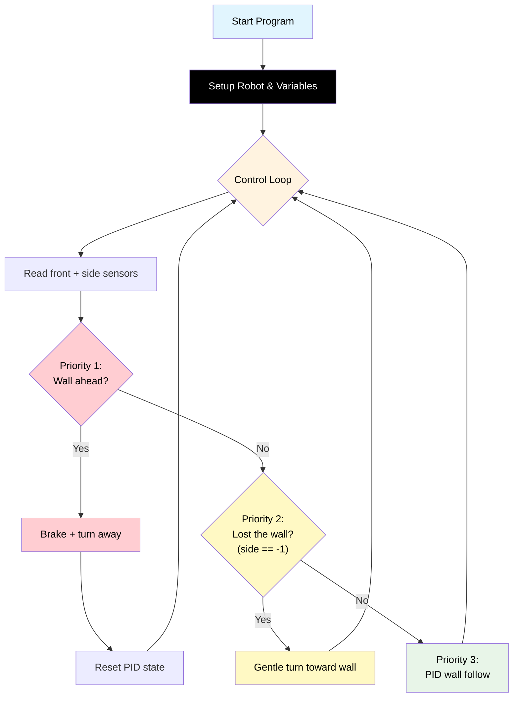

# Challenge 5: Maze Solver — Hand on Wall

In this challenge you will put everything together to navigate a **full maze**. Your robot will use the **hand-on-wall algorithm** combined with PID wall following and front sensor detection to find its way from the start to the exit.

You will learn:

- What the **hand-on-wall algorithm** is and why it works.
- How to handle **three different situations** (wall ahead, wall lost, wall visible).
- How to choose between **right-hand rule** and **left-hand rule**.

---

## Success Criteria

My robot navigates the maze from start to the **green exit zone** without hitting walls. Time limit: **60 seconds**.

---

## Before You Begin

1. Complete [Challenge 4](docs.html?doc=Challenge_4) — you need sensor fusion and PID working.
2. Open the **Simulator** and select **Challenge 5**.
3. Try running your Challenge 4 code — it may get partway through, but will likely get stuck at open junctions or turns in the wrong direction.

---

## Flowchart Of The Algorithm



---

## Key Concepts

### What is the Hand-on-Wall Algorithm?

Imagine you are in a dark maze and you put your **right hand on the wall**. If you never take your hand off the wall — always touching it, always turning to keep contact — you will eventually find the exit.

This works because:

- A maze is a connected set of walls.
- If you always follow the same wall, you are guaranteed to trace the entire boundary.
- The exit is part of that boundary.

### Right-Hand Rule vs Left-Hand Rule

You can follow either the **right wall** or the **left wall**, but you must be **consistent**:

| Rule                | Which sensor side | When wall lost, turn... | When wall ahead, turn... |
| ------------------- | ----------------- | ----------------------- | ------------------------ |
| **Right-hand rule** | Right side        | Right (toward the wall) | Left (away from wall)    |
| **Left-hand rule**  | Left side         | Left (toward the wall)  | Right (away from wall)   |

> [!Important]
> Pick one rule and stick with it for the entire maze. Switching mid-run will confuse the algorithm.

### Three Priority Levels

Your robot needs to handle three situations, checked in order of urgency:

**Priority 1 — Wall ahead (front sensor):** Stop and turn. This is the most urgent — if you don't react, you crash. Turn **away** from the wall you're following (if following the right wall, turn left).

**Priority 2 — Lost the wall (side sensor returns -1):** The wall has ended — there's a gap or a junction. Turn **gently toward** the wall to reconnect with it. Don't spin on the spot — just slow down the wall-side wheel so the robot curves toward where the wall should be.

**Priority 3 — Wall visible (side sensor returns a distance):** Use PID to follow the wall smoothly. This is the same code from Challenge 3.

### Why "Gentle Turn" for Lost Wall?

When the side sensor returns -1, the wall has disappeared — probably because the robot reached a junction or turn. A hard spin would overshoot. Instead, the robot curves gently by slowing one wheel:

```python
# Following right wall, wall lost — curve right
my_robot.drive(BASE_SPEED, int(BASE_SPEED * 0.6))
```

This makes the robot arc to the right, searching for the wall. Once the sensor picks up the wall again, PID takes over.

---

## Step 1 — Start from Your Challenge 4 Code

Copy your working Challenge 4 code. You will modify the "wall lost" handling (when `side == -1`) and add the `WALL_SIDE` variable.

---

## Step 2 — Add the Wall Side Variable

```python
WALL_SIDE = "right"        # Follow the right wall
```

> [!Tip]
> If the default maze doesn't work with `"right"`, try `"left"`. Some mazes are easier to solve with one rule than the other.

---

## Step 3 — Read Both Sensors

At the top of the loop, read both sensors:

```python
while True:
    front = my_robot.read_distance()
    side = my_robot.read_distance_2()
```

---

## Step 4 — Priority 1: Wall Ahead

This is the same as Challenge 4:

```python
    # Priority 1: Wall ahead — must turn
    if front != -1 and front < FRONT_THRESHOLD:
        my_robot.brake()
        hold_state(0.3)
        my_robot.rotate_left(TURN_SPEED)
        hold_state(TURN_TIME)
        my_robot.brake()
        hold_state(0.3)
        integral = 0
        previous_error = 0
```

---

## Step 5 — Priority 2: Lost the Wall

This is **new**. When the side sensor returns -1, curve gently toward where the wall should be:

```python
    # Priority 2: Lost the wall — gentle turn toward it
    elif side == -1:
        if WALL_SIDE == "right":
            my_robot.drive(BASE_SPEED, int(BASE_SPEED * 0.6))
        else:
            my_robot.drive(int(BASE_SPEED * 0.6), BASE_SPEED)
```

> [!Note]
> The `0.6` factor means the wall-side wheel runs at 60% speed. This creates a gentle curve. You can adjust this value — lower = tighter curve, higher = gentler curve.

---

## Step 6 — Priority 3: PID Wall Follow

This is your existing PID code, now inside an `else` block:

```python
    # Priority 3: Wall visible — PID follow
    else:
        error = side - TARGET_WALL_DISTANCE
        integral = integral + error
        if integral > INTEGRAL_MAX:
            integral = INTEGRAL_MAX
        elif integral < -INTEGRAL_MAX:
            integral = -INTEGRAL_MAX
        derivative = error - previous_error

        steering = (Kp * error) + (Ki * integral) + (Kd * derivative)
        if steering > MAX_STEERING:
            steering = MAX_STEERING
        elif steering < -MAX_STEERING:
            steering = -MAX_STEERING

        if WALL_SIDE == "right":
            right_speed = BASE_SPEED - steering
            left_speed = BASE_SPEED + steering
        else:
            right_speed = BASE_SPEED + steering
            left_speed = BASE_SPEED - steering

        my_robot.drive(int(right_speed), int(left_speed))
        previous_error = error

    hold_state(0.05)
```

> [!Important]
> Notice the steering direction flips depending on `WALL_SIDE`. When following the left wall, the correction signs are reversed.

---

## Step 7 — Tune and Test

Use the **maze selector** in the simulator to try different mazes:

| Maze    | Difficulty | Good for testing                |
| ------- | ---------- | ------------------------------- |
| Zigzag  | Default    | Sharp corners, narrow corridors |
| Simple  | Easy       | Basic L-shape                   |
| Spiral  | Medium     | Long winding path               |
| Classic | Hard       | Multiple junctions              |

### Tuning Guide

| Symptom                                 | Cause                        | Fix                                      |
| --------------------------------------- | ---------------------------- | ---------------------------------------- |
| Robot gets stuck at a junction          | Not turning toward lost wall | Check Priority 2 logic                   |
| Robot keeps spinning at junctions       | Turning too aggressively     | Increase the 0.6 factor (try 0.7, 0.8)   |
| Robot crashes into walls on tight turns | FRONT_THRESHOLD too small    | Increase FRONT_THRESHOLD                 |
| Robot takes too long (> 60 seconds)     | BASE_SPEED too slow          | Increase BASE_SPEED (but test carefully) |
| Robot follows wrong wall after turn     | Steering signs wrong         | Check WALL_SIDE and steering direction   |

---

## Complete Code

```python
# Challenge 5: Maze Solver — Hand on Wall
from aidriver import AIDriver, hold_state
import aidriver

aidriver.DEBUG_AIDRIVER = True
my_robot = AIDriver()

BASE_SPEED = 160
TARGET_WALL_DISTANCE = 150
FRONT_THRESHOLD = 250
TURN_SPEED = 180
TURN_TIME = 0              # TODO: tune for ~90 degree turn

Kp = 0.5
Ki = 0.01
Kd = 0.3
MAX_STEERING = 40
INTEGRAL_MAX = 500

WALL_SIDE = "right"

previous_error = 0
integral = 0

while True:
    front = my_robot.read_distance()
    side = my_robot.read_distance_2()

    # Priority 1: Wall ahead — must turn
    if front != -1 and front < FRONT_THRESHOLD:
        my_robot.brake()
        hold_state(0.3)
        my_robot.rotate_left(TURN_SPEED)
        hold_state(TURN_TIME)
        my_robot.brake()
        hold_state(0.3)
        integral = 0
        previous_error = 0

    # Priority 2: Lost the wall — gentle turn toward it
    elif side == -1:
        if WALL_SIDE == "right":
            my_robot.drive(BASE_SPEED, int(BASE_SPEED * 0.6))
        else:
            my_robot.drive(int(BASE_SPEED * 0.6), BASE_SPEED)

    # Priority 3: Wall visible — PID follow
    else:
        error = side - TARGET_WALL_DISTANCE
        integral = integral + error
        if integral > INTEGRAL_MAX:
            integral = INTEGRAL_MAX
        elif integral < -INTEGRAL_MAX:
            integral = -INTEGRAL_MAX
        derivative = error - previous_error

        steering = (Kp * error) + (Ki * integral) + (Kd * derivative)
        if steering > MAX_STEERING:
            steering = MAX_STEERING
        elif steering < -MAX_STEERING:
            steering = -MAX_STEERING

        if WALL_SIDE == "right":
            right_speed = BASE_SPEED - steering
            left_speed = BASE_SPEED + steering
        else:
            right_speed = BASE_SPEED + steering
            left_speed = BASE_SPEED - steering

        my_robot.drive(int(right_speed), int(left_speed))
        previous_error = error

    hold_state(0.05)
```

---

## Debugging Tips

- Add `print("P1" if front... "P2" if side... "P3")` to see which priority is active each loop.
- Watch the simulator trace to see where the robot is getting stuck.
- If the robot circles forever at a junction, the gentle turn may not be strong enough. Try reducing the 0.6 factor.
- If the robot works in the simulator but not on the real robot, remember that real motors and sensors behave slightly differently. You may need to re-tune TURN_TIME and the PID gains.
- Use `WALL_SIDE = "left"` if the maze is easier to solve from the other side.

---

## What You've Learned

Congratulations! Over these 5 challenges you have built:

| Challenge | What you added            | Concept                   |
| --------- | ------------------------- | ------------------------- |
| 1         | Side sensor + P control   | Proportional correction   |
| 2         | Derivative term           | Dampening oscillations    |
| 3         | Integral term             | Fixing steady-state error |
| 4         | Front sensor + turn logic | Sensor fusion, priorities |
| 5         | Hand-on-wall algorithm    | Complete maze solving     |

You now have a **fully autonomous maze-solving robot** using a PID controller — the same type of controller used in industrial robots, drones, self-driving cars, and spacecraft.
