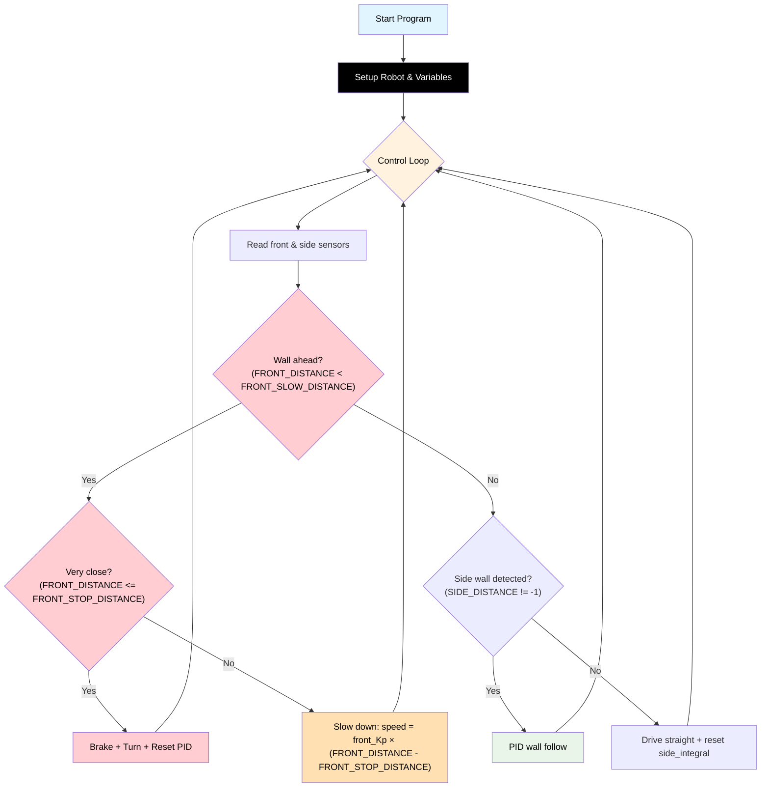

# Challenge 5: Full Maze Navigation

In this final challenge, your robot must use **all your skills** to navigate a maze with multiple turns, dead ends, and open spaces. You will combine **side PID wall following**, **front wall detection**, and **decision logic** to reach the exit.

You will learn:

- How to combine all previous algorithms into a robust maze solver.
- How to handle open spaces (no wall detected).
- How to tune all PID and threshold variables for best performance.

---

## Success Criteria

My robot navigates the maze, avoids dead ends, makes correct turns, and reaches the **green exit zone**.

---

## Before You Begin

1. Complete [Challenge 4](docs.html?doc=Challenge_4) — you need working PID and dead-end logic.
2. Open the **Simulator** and select **Challenge 5**.
3. Run your Challenge 4 code here — the robot will need to handle more complex situations!

---

## Flowchart Of The Algorithm



---

## Key Concepts

### Combining All Logic

You now need to combine **side PID wall following** and **front wall detection** with logic for open spaces:

- **Wall ahead (FRONT_DISTANCE < FRONT_SLOW_DISTANCE):** Slow down or stop and turn.
- **No wall ahead, side wall detected (SIDE_DISTANCE != -1):** Use PID to follow the wall.
- **No wall ahead, no side wall (SIDE_DISTANCE == -1):** Drive straight and reset side_integral.

### Example Variable Names

```python
BASE_SPEED = 165
TARGET_WALL_DISTANCE = 150
MAX_STEERING = 40
side_Kp = 0.55
side_Ki = 0.0
side_Kd = 0.0
front_Kp = 0.7
FRONT_SLOW_DISTANCE = 220
FRONT_STOP_DISTANCE = 120
```

- Use **all-caps** for constants and thresholds.
- Use **side\_** and **front\_** prefixes for PID gains and variables.
- Use **SIDE_DISTANCE** and **FRONT_DISTANCE** for sensor readings.

---

## Example Code Structure

```python
BASE_SPEED = 165
TARGET_WALL_DISTANCE = 150
MAX_STEERING = 40
side_Kp = 0.55
side_Ki = 0.0
side_Kd = 0.0
front_Kp = 0.7
FRONT_SLOW_DISTANCE = 220
FRONT_STOP_DISTANCE = 120

while True:
    FRONT_DISTANCE = my_robot.read_distance()
    SIDE_DISTANCE = my_robot.read_distance_2()

    if FRONT_DISTANCE <= FRONT_STOP_DISTANCE:
        # Stop and turn
        ...
    elif FRONT_DISTANCE < FRONT_SLOW_DISTANCE:
        # Slow down
        speed = front_Kp * (FRONT_DISTANCE - FRONT_STOP_DISTANCE)
        ...
    elif SIDE_DISTANCE != -1:
        # PID wall follow
        error = SIDE_DISTANCE - TARGET_WALL_DISTANCE
        ...
    else:
        # No wall detected, drive straight
        ...
```

---

## Step 1 — Start from Your Challenge 4 Code

Copy your working Challenge 4 code. You will modify the "wall lost" handling (when `side == -1`) to use `my_robot.wall_sign` for automatic direction.

---

## Step 2 — Set the Wall Side

The wall side is set when you create the robot:

```python
my_robot = AIDriver("left")  # ← "left" or "right" — must match your physical setup!
```

`AIDriver("left")` sets `my_robot.wall_sign = -1`. All steering formulas use `wall_sign` automatically, so no other code needs to change if you switch sides.

> [!Tip]
> If the default maze doesn't work with `"left"`, try `"right"`. Some mazes are easier to solve from one side.

---

## Step 3 — Read Both Sensors

At the top of the loop, read both sensors:

```python
while True:
    front = my_robot.read_distance()
    side = my_robot.read_distance_2()
```

---

## Step 4 — Priority 1: Wall Ahead (P-Controlled Approach)

This uses the same P-controlled deceleration from Challenge 4:

```python
    # Priority 1: Wall ahead — P-controlled deceleration then turn
    if front != -1 and front < FRONT_SLOW_DISTANCE:
        if front <= FRONT_STOP_DISTANCE:
            my_robot.brake()
            hold_state(0.3)
            my_robot.rotate_left(TURN_SPEED)
            hold_state(TURN_TIME)
            my_robot.brake()
            hold_state(0.3)
            side_integral = 0
            side_previous_error = 0
        else:
            approach_speed = int(FRONT_Kp * (front - FRONT_STOP_DISTANCE))
            if approach_speed < 120:
                approach_speed = 120
            if approach_speed > BASE_SPEED:
                approach_speed = BASE_SPEED
            my_robot.drive(approach_speed, approach_speed)
```

---

## Step 5 — Priority 2: Lost the Wall

This is **new**. When the side sensor returns -1, curve gently toward where the wall should be:

```python
    # Priority 2: Lost the wall — drift toward it to reacquire
    elif side == -1:
        r = BASE_SPEED - int(my_robot.wall_sign * BASE_SPEED * 0.4)
        l = BASE_SPEED + int(my_robot.wall_sign * BASE_SPEED * 0.4)
        my_robot.drive(r, l)
```

> [!Note]
> `wall_sign` automatically curves toward the correct wall side. Adjust the `0.4` factor — lower = tighter curve, higher = gentler.

---

## Step 6 — Priority 3: PID Wall Follow

This is your existing PID code, now inside an `else` block:

```python
    # Priority 3: Wall visible — PID follow
    else:
        error = side - TARGET_WALL_DISTANCE
        side_integral = side_integral + error
        if side_integral > side_INTEGRAL_MAX:
            side_integral = side_INTEGRAL_MAX
        elif side_integral < -side_INTEGRAL_MAX:
            side_integral = -side_INTEGRAL_MAX
        side_derivative = error - side_previous_error

        steering = (side_Kp * error) + (side_Ki * side_integral) + (side_Kd * side_derivative)
        if steering > MAX_STEERING:
            steering = MAX_STEERING
        elif steering < -MAX_STEERING:
            steering = -MAX_STEERING

        right_speed = BASE_SPEED - (my_robot.wall_sign * steering)
        left_speed  = BASE_SPEED + (my_robot.wall_sign * steering)

        my_robot.drive(int(right_speed), int(left_speed))
        side_previous_error = error

    hold_state(0.05)
```

---

## Step 7 — Tune and Test

Use the **maze selector** in the simulator to try different mazes:

| Maze    | Difficulty | Good for testing                |
| ------- | ---------- | ------------------------------- |
| Zigzag  | Default    | Sharp corners, narrow corridors |
| Simple  | Easy       | Basic L-shape                   |
| Spiral  | Medium     | Long winding path               |
| Classic | Hard       | Multiple junctions              |

### Tuning Guide

| Symptom                                 | Cause                         | Fix                                      |
| --------------------------------------- | ----------------------------- | ---------------------------------------- |
| Robot gets stuck at a junction          | Not turning toward lost wall  | Check Priority 2 logic                   |
| Robot keeps spinning at junctions       | Turning too aggressively      | Increase the 0.6 factor (try 0.7, 0.8)   |
| Robot crashes into walls on tight turns | FRONT_SLOW_DISTANCE too small | Increase FRONT_SLOW_DISTANCE             |
| Robot takes too long (> 60 seconds)     | BASE_SPEED too slow           | Increase BASE_SPEED (but test carefully) |
| Robot follows wrong wall after turn     | Wrong wall side set           | Check `AIDriver("left"/"right")` setting |

---

## Complete Code

```python
# Challenge 5: Full Maze Navigation
from aidriver import AIDriver, hold_state
import aidriver

aidriver.DEBUG_AIDRIVER = False
my_robot = AIDriver("left")  # ← "left" or "right" — must match your physical setup!

BASE_SPEED = 160
TARGET_WALL_DISTANCE = 150
MAX_STEERING = 40
side_Kp = 0.40
side_Ki = 0.003
side_Kd = 0.15
side_INTEGRAL_MAX = 1200
FRONT_Kp = 0.5
FRONT_SLOW_DISTANCE = 400
FRONT_STOP_DISTANCE = 120
TURN_SPEED = 180
TURN_TIME = 0              # TODO: tune for ~90 degree turn

side_previous_error = 0
side_integral = 0

while True:
    front = my_robot.read_distance()
    side = my_robot.read_distance_2()

    # Priority 1: Wall ahead — P-controlled deceleration then turn
    if front != -1 and front < FRONT_SLOW_DISTANCE:
        if front <= FRONT_STOP_DISTANCE:
            my_robot.brake()
            hold_state(0.3)
            my_robot.rotate_left(TURN_SPEED)
            hold_state(TURN_TIME)
            my_robot.brake()
            hold_state(0.3)
            side_integral = 0
            side_previous_error = 0
        else:
            approach_speed = int(FRONT_Kp * (front - FRONT_STOP_DISTANCE))
            if approach_speed < 120:
                approach_speed = 120
            if approach_speed > BASE_SPEED:
                approach_speed = BASE_SPEED
            my_robot.drive(approach_speed, approach_speed)

    # Priority 2: Lost the wall — drift toward it to reacquire
    elif side == -1:
        r = BASE_SPEED - int(my_robot.wall_sign * BASE_SPEED * 0.4)
        l = BASE_SPEED + int(my_robot.wall_sign * BASE_SPEED * 0.4)
        my_robot.drive(r, l)

    # Priority 3: Wall visible — PID follow
    else:
        error = side - TARGET_WALL_DISTANCE
        side_integral = side_integral + error
        if side_integral > side_INTEGRAL_MAX:
            side_integral = side_INTEGRAL_MAX
        elif side_integral < -side_INTEGRAL_MAX:
            side_integral = -side_INTEGRAL_MAX
        side_derivative = error - side_previous_error

        steering = (side_Kp * error) + (side_Ki * side_integral) + (side_Kd * side_derivative)
        if steering > MAX_STEERING:
            steering = MAX_STEERING
        elif steering < -MAX_STEERING:
            steering = -MAX_STEERING

        right_speed = BASE_SPEED - (my_robot.wall_sign * steering)
        left_speed  = BASE_SPEED + (my_robot.wall_sign * steering)

        my_robot.drive(int(right_speed), int(left_speed))
        side_previous_error = error

    hold_state(0.05)
```

---

## Debugging Tips

- Add `print("P1" if front... "P2" if side... "P3")` to see which priority is active each loop.
- Watch the simulator trace to see where the robot is getting stuck.
- If the robot circles forever at a junction, the gentle turn may not be strong enough. Try reducing the 0.6 factor.
- If the robot works in the simulator but not on the real robot, remember that real motors and sensors behave slightly differently. You may need to re-tune TURN_TIME and the PID gains.
- Use `AIDriver("left")` or `AIDriver("right")` if the maze is easier to solve from the other side.

---

## What You've Learned

Congratulations! Over these 5 challenges you have built:

| Challenge | What you added                     | Concept                        |
| --------- | ---------------------------------- | ------------------------------ |
| 1         | Side sensor + P control            | Proportional correction        |
| 2         | Derivative term                    | Dampening oscillations         |
| 3         | Integral term                      | Fixing steady-state error      |
| 4         | Front sensor P deceleration + turn | Sensor fusion, smooth stopping |
| 5         | Hand-on-wall algorithm             | Complete maze solving          |

You now have a **fully autonomous maze-solving robot** using a PID controller — the same type of controller used in industrial robots, drones, self-driving cars, and spacecraft.
