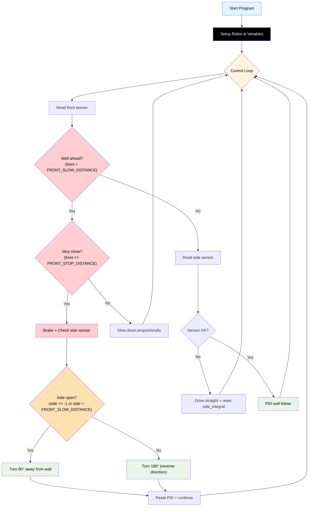

# Challenge 5: Dead End Detection

In this challenge you will extend your corner-detection code to also handle a **180° dead end**. After stopping at a front wall, the robot checks the **side sensor** to decide whether it is at a corner (turn 90°) or a dead end (turn 180°).

You will learn:

- How to use sensor data to **choose between two behaviours** at runtime.
- Why the same code must handle **multiple manoeuvre types** in a real maze.
- How to tune separate turn times for 90° and 180° turns.

---

## Success Criteria

My robot follows the wall, **correctly identifies the dead end**, **turns 180°**, and reaches the **green exit zone**.

---

## Before You Begin

1. Complete [Challenge 4](docs.html?doc=Challenge_4) — you need working corner detection.
2. Open the **Simulator** and select **Challenge 5**.
3. Run your Challenge 4 code here — the robot will attempt a 90° turn instead of 180° and fail to reach the exit.

---

## Flowchart Of The Algorithm



---

## Key Concepts

### Distinguishing Corner from Dead End

After stopping at a front wall, read the **side sensor** to identify the situation:

| Side sensor reading             | Situation                               | Turn needed        |
| ------------------------------- | --------------------------------------- | ------------------ |
| `-1` or `> FRONT_SLOW_DISTANCE` | **Corner** — corridor opens to the side | 90° away from wall |
| Small value (wall nearby)       | **Dead end** — walls on front AND side  | 180° reversal      |

```python
my_robot.brake()
hold_state(0.3)
side_check = my_robot.read_distance_2()

if side_check == -1 or side_check > FRONT_SLOW_DISTANCE:
    turn_duration = TURN_TIME_90   # corner
else:
    turn_duration = TURN_TIME_180  # dead end

if my_robot.wall_sign == -1:
    my_robot.rotate_right(TURN_SPEED)
else:
    my_robot.rotate_left(TURN_SPEED)
hold_state(turn_duration)
```

### TURN_TIME_180

A 180° turn takes **twice as long** as a 90° turn on the same `TURN_SPEED`. Start with:

```python
TURN_TIME_180 = TURN_TIME_90 * 2
```

Then fine-tune `TURN_TIME_180` separately if the robot over- or under-rotates.

> [!Tip]
> Tune `TURN_TIME_90` first in Challenge 4, then derive `TURN_TIME_180` from it here.

---

## Step 1 — Start from Your Challenge 4 Code

Copy your working Challenge 4 code. The only change is inside the `if front <= FRONT_STOP_DISTANCE:` block — replace the fixed 90° turn with a side-sensor check.

---

## Step 2 — Add `TURN_TIME_180`

```python
TURN_TIME_90  = 0.5   # ← use your tuned value from Challenge 4
TURN_TIME_180 = TURN_TIME_90 * 2
```

---

## Step 3 — Replace the Turn Block

Find this block from Challenge 4:

```python
        if front <= FRONT_STOP_DISTANCE:
            my_robot.brake()
            hold_state(0.3)
            if my_robot.wall_sign == -1:
                my_robot.rotate_right(TURN_SPEED)
            else:
                my_robot.rotate_left(TURN_SPEED)
            hold_state(TURN_TIME_90)
            my_robot.brake()
            hold_state(0.3)
            side_integral = 0
            side_previous_error = 0
            continue
```

Replace it with:

```python
        if front <= FRONT_STOP_DISTANCE:
            my_robot.brake()
            hold_state(0.3)
            # Check side sensor to decide corner (90°) vs dead end (180°)
            side_check = my_robot.read_distance_2()
            if side_check == -1 or side_check > FRONT_SLOW_DISTANCE:
                turn_duration = TURN_TIME_90   # corridor is open to the side
            else:
                turn_duration = TURN_TIME_180  # walls on front and side = dead end
            if my_robot.wall_sign == -1:
                my_robot.rotate_right(TURN_SPEED)
            else:
                my_robot.rotate_left(TURN_SPEED)
            hold_state(turn_duration)
            my_robot.brake()
            hold_state(0.3)
            side_integral = 0
            side_previous_error = 0
            continue
```

---

## Step 4 — Tune

| Observation                        | Fix                                                                                                          |
| ---------------------------------- | ------------------------------------------------------------------------------------------------------------ |
| Robot turns 90° at the dead end    | Increase `TURN_TIME_180`, or lower the threshold — `FRONT_SLOW_DISTANCE` may be too small for the side check |
| Robot turns 180° at a corner       | Increase `FRONT_SLOW_DISTANCE` used as threshold, or check that side sensor reads -1 at corners              |
| Robot doesn't turn enough (< 180°) | Increase `TURN_TIME_180`                                                                                     |
| Robot turns too far (> 180°)       | Decrease `TURN_TIME_180`                                                                                     |

---

## Starter Scaffold

This is what you'll see in the editor when you open the challenge. Comments mark the `TODO` blocks you must complete.

```python
# Challenge 5: Dead-End Detection (90° vs 180°)
# ====================================================================
# GOAL: After braking at a wall ahead, use the SIDE sensor to decide
#       whether you are at a corner (turn 90°) or a dead end (turn 180°).
#
# WHAT'S ALREADY DONE FOR YOU:
#   - Your full PID side-follow controller (from C3).
#   - The front-detect / approach / brake / turn / reset block from C4
#     is laid out below — but the turn duration is hard-coded to
#     TURN_TIME_90. You will REPLACE that with a runtime decision.
#
# WHAT YOU NEED TO ADD (inside the `if front <= FRONT_STOP_DISTANCE:` block):
#   1. After braking, read the side sensor:
#         side_check = my_robot.read_distance_2()
#   2. Decide the turn:
#         - If side_check == -1  OR  side_check > FRONT_SLOW_DISTANCE
#               → corridor is OPEN → use TURN_TIME_90
#         - Else (wall on the side AND wall in front)
#               → DEAD END → use TURN_TIME_180
#      Store the chosen value in a variable called `turn_duration`.
#   3. Use `turn_duration` in the hold_state call after rotating.
#
# READ THIS FIRST: docs/Challenge_5.md
# ====================================================================

from aidriver import AIDriver, hold_state
import aidriver

aidriver.DEBUG_AIDRIVER = False
my_robot = AIDriver("left")

# === BLOCK: CONFIG_BASE START ===
BASE_SPEED = 160
TARGET_WALL_DISTANCE = 150
MAX_STEERING = 40
# === BLOCK: CONFIG_BASE END ===

# === BLOCK: SIDE_KP START ===
side_Kp = 0.40
# === BLOCK: SIDE_KP END ===

# === BLOCK: SIDE_KD START ===
side_Kd = 0.15
# === BLOCK: SIDE_KD END ===

# === BLOCK: SIDE_KI START ===
side_Ki = 0.003
side_INTEGRAL_MAX = 1200
# === BLOCK: SIDE_KI END ===

# === BLOCK: FRONT_CONFIG START ===
FRONT_SLOW_DISTANCE = 400
FRONT_STOP_DISTANCE = 120
FRONT_Kp = 0.5
TURN_SPEED = 180
TURN_TIME_90 = 0.5  # ← use your tuned value from Challenge 4
# === BLOCK: FRONT_CONFIG END ===

# === BLOCK: TURN_TIME_180 START ===
TURN_TIME_180 = 0.0  # TODO: start with TURN_TIME_90 * 2, then fine-tune
# === BLOCK: TURN_TIME_180 END ===

side_previous_error = 0
side_integral = 0

# === MAIN LOOP ===
while True:
    # === BLOCK: FRONT_DETECT_DEADEND START ===
    front = my_robot.read_distance()

    if front != -1 and front < FRONT_SLOW_DISTANCE:
        if front <= FRONT_STOP_DISTANCE:
            my_robot.brake()
            hold_state(0.3)

            # TODO: read side sensor into  side_check
            # TODO: choose  turn_duration  based on side_check
            turn_duration = TURN_TIME_90  # placeholder — replace with your decision

            if my_robot.wall_sign == -1:
                my_robot.rotate_right(TURN_SPEED)
            else:
                my_robot.rotate_left(TURN_SPEED)
            hold_state(turn_duration)

            my_robot.brake()
            hold_state(0.3)
            side_integral = 0
            side_previous_error = 0
            continue
        else:
            approach_speed = int(FRONT_Kp * (front - FRONT_STOP_DISTANCE))
            if approach_speed < 120:
                approach_speed = 120
            if approach_speed > BASE_SPEED:
                approach_speed = BASE_SPEED
            my_robot.drive(approach_speed, approach_speed)
            hold_state(0.05)
            continue
    # === BLOCK: FRONT_DETECT_DEADEND END ===

    # === BLOCK: SIDE_FOLLOW_PID START ===
    wall_distance = my_robot.read_distance_2()

    if wall_distance == -1:
        my_robot.drive(BASE_SPEED, BASE_SPEED)
        side_integral = 0
        hold_state(0.05)
        continue

    error = wall_distance - TARGET_WALL_DISTANCE

    side_integral = side_integral + error
    if side_integral > side_INTEGRAL_MAX:
        side_integral = side_INTEGRAL_MAX
    elif side_integral < -side_INTEGRAL_MAX:
        side_integral = -side_INTEGRAL_MAX

    side_derivative = error - side_previous_error

    steering = (
        (side_Kp * error) + (side_Ki * side_integral) + (side_Kd * side_derivative)
    )

    if steering > MAX_STEERING:
        steering = MAX_STEERING
    elif steering < -MAX_STEERING:
        steering = -MAX_STEERING

    right_speed = BASE_SPEED - (my_robot.wall_sign * steering)
    left_speed = BASE_SPEED + (my_robot.wall_sign * steering)

    my_robot.drive(int(right_speed), int(left_speed))

    side_previous_error = error
    # === BLOCK: SIDE_FOLLOW_PID END ===

    hold_state(0.05)
```

<details>
<summary><strong>Reference Solution</strong> — click to expand <em>(only after you've genuinely tried)</em></summary>

```python
# Challenge 5: Dead End Detection
# Extend the corner-detection block: after braking, check the side sensor to
# decide between a 90 degree corner turn and a 180 degree dead-end reversal.
# This file defines the FROZEN front-detect block reused in C6.

from aidriver import AIDriver, hold_state
import aidriver

aidriver.DEBUG_AIDRIVER = False
my_robot = AIDriver("left")  # ← "left" or "right" — must match your physical setup!

# === BLOCK: CONFIG_BASE START ===
BASE_SPEED = 160  # Forward speed (must be > 120)
TARGET_WALL_DISTANCE = 150  # Distance to maintain from wall (mm)
MAX_STEERING = 40  # Max wheel speed difference
# Rule: BASE_SPEED - MAX_STEERING must be >= 120 (motor dead zone)
# === BLOCK: CONFIG_BASE END ===

# === BLOCK: SIDE_KP START ===
side_Kp = 0.40  # Proportional gain — raise in 0.05 steps until zig-zag starts
# === BLOCK: SIDE_KP END ===

# === BLOCK: SIDE_KD START ===
side_Kd = 0.15  # Derivative gain — dampens oscillations
# === BLOCK: SIDE_KD END ===

# === BLOCK: SIDE_KI START ===
side_Ki = 0.003  # Integral gain — start very small, raise in 0.002 steps
side_INTEGRAL_MAX = 1200  # Anti-windup clamp
# === BLOCK: SIDE_KI END ===

# === BLOCK: FRONT_CONFIG START ===
FRONT_SLOW_DISTANCE = 400  # Start decelerating (mm)
FRONT_STOP_DISTANCE = 120  # Stop and turn (mm)
FRONT_Kp = 0.5  # Front deceleration gain
TURN_SPEED = 180
TURN_TIME_90 = 0.5  # Tune for ~90 degree turn
# === BLOCK: FRONT_CONFIG END ===

# === BLOCK: TURN_TIME_180 START ===
TURN_TIME_180 = TURN_TIME_90 * 2  # Twice the 90 degree time, then fine-tune
# === BLOCK: TURN_TIME_180 END ===

side_previous_error = 0
side_integral = 0

# === MAIN LOOP ===
while True:
    # === BLOCK: FRONT_DETECT_DEADEND START ===
    # Priority 1: Wall ahead — decelerate, then choose 90 degree corner or 180 degree dead-end
    front = my_robot.read_distance()

    if front != -1 and front < FRONT_SLOW_DISTANCE:
        if front <= FRONT_STOP_DISTANCE:
            my_robot.brake()
            hold_state(0.3)
            # Check side sensor to decide corner (90 degree) vs dead end (180 degree)
            side_check = my_robot.read_distance_2()
            if side_check == -1 or side_check > FRONT_SLOW_DISTANCE:
                turn_duration = TURN_TIME_90  # corridor open to the side
            else:
                turn_duration = TURN_TIME_180  # walls on front AND side
            # Turn away from the wall you are following (wall_sign-aware)
            if my_robot.wall_sign == -1:
                my_robot.rotate_right(TURN_SPEED)
            else:
                my_robot.rotate_left(TURN_SPEED)
            hold_state(turn_duration)
            my_robot.brake()
            hold_state(0.3)
            side_integral = 0
            side_previous_error = 0
            continue
        else:
            # Approaching — slow down proportionally
            approach_speed = int(FRONT_Kp * (front - FRONT_STOP_DISTANCE))
            if approach_speed < 120:
                approach_speed = 120
            if approach_speed > BASE_SPEED:
                approach_speed = BASE_SPEED
            my_robot.drive(approach_speed, approach_speed)
            hold_state(0.05)
            continue
    # === BLOCK: FRONT_DETECT_DEADEND END ===

    # === BLOCK: SIDE_FOLLOW_PID START ===
    wall_distance = my_robot.read_distance_2()

    if wall_distance == -1:
        my_robot.drive(BASE_SPEED, BASE_SPEED)
        side_integral = 0  # Reset when wall lost — prevents windup
        hold_state(0.05)
        continue

    error = wall_distance - TARGET_WALL_DISTANCE

    # Integral: accumulated error (clamped against windup)
    side_integral = side_integral + error
    if side_integral > side_INTEGRAL_MAX:
        side_integral = side_INTEGRAL_MAX
    elif side_integral < -side_INTEGRAL_MAX:
        side_integral = -side_INTEGRAL_MAX

    # Derivative
    side_derivative = error - side_previous_error

    # Full PID
    steering = (
        (side_Kp * error) + (side_Ki * side_integral) + (side_Kd * side_derivative)
    )

    if steering > MAX_STEERING:
        steering = MAX_STEERING
    elif steering < -MAX_STEERING:
        steering = -MAX_STEERING

    right_speed = BASE_SPEED - (my_robot.wall_sign * steering)
    left_speed = BASE_SPEED + (my_robot.wall_sign * steering)

    my_robot.drive(int(right_speed), int(left_speed))

    side_previous_error = error
    # === BLOCK: SIDE_FOLLOW_PID END ===

    hold_state(0.05)
```

</details>

---
## Debugging Tips

- Add `print("side_check:", side_check, "turn:", turn_duration)` inside the stop block to verify the correct turn is chosen.
- If the robot always picks 90°, the side sensor may be reading -1 even at the dead end — check the sensor range and `FRONT_SLOW_DISTANCE` threshold value.
- If the robot always picks 180°, the side sensor may not be returning -1 at the corner — the wall may still be partially visible. Try using a larger threshold (e.g. `side_check > 600`).

---

## What's Next

In [Challenge 6](docs.html?doc=Challenge_6) you will combine everything into a **full maze solver** that handles open junctions, multiple turns, and lost-wall recovery.

You will learn:

- How to combine all previous algorithms into a robust maze solver.
- How to handle open spaces (no wall detected).
- How to tune all PID and threshold variables for best performance.

---
