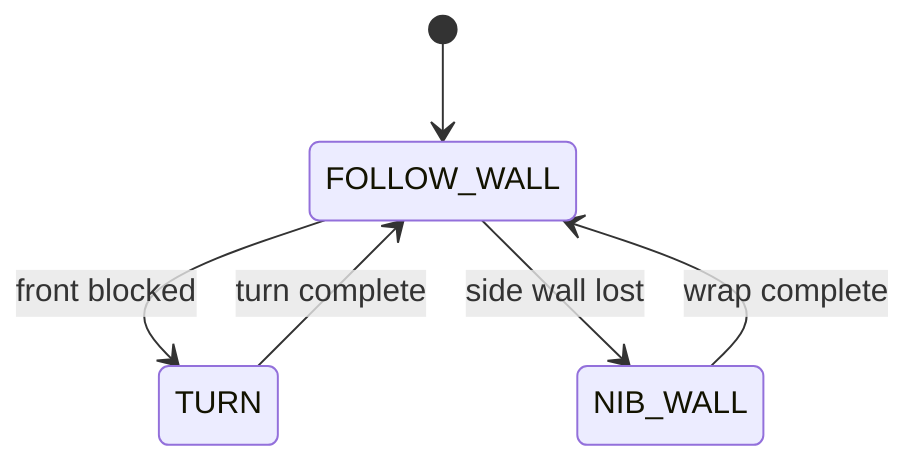

# Challenge 6: Dead Ends and Nibs - One Machine, Both Turns

## Purpose

Demonstrate that the same three-state machine handles mixed inside and outside corners without adding new states.

## Success Criteria

The robot navigates the mixed-corner maze, selecting the correct turn behavior at each corner type, and reaches the green exit zone.

## Before You Begin

1. Complete Challenge 5 with reliable nib behavior.
2. Open simulator Challenge 6.
3. Carry forward all tuned values.

## Maze Situation

- Maze feature: both front-blocking dead ends and outside-corner nibs.
- Trigger condition expected in code: front trigger and side-loss trigger in defined priority.
- New behavior introduced: none, this is integration and robustness tuning.
- Why previous challenge may fail: challenge-specific tuning may not generalize to mixed geometry.

## What Is New In This Challenge

New: robustness validation and trigger priority discipline.

Unchanged: same three states (`FOLLOW_WALL`, `TURN`, `NIB_WALL`).

## Carry Forward From Previous Challenge

| Group   | Variable                                | Notes                            |
| ------- | --------------------------------------- | -------------------------------- |
| Reused  | All side, front, turn, and nib tunables | Same machine, new maze geometry. |
| New     | None                                    | No new algorithm blocks.         |
| Removed | None                                    | All three states remain.         |

## Algorithm Flow

### State Table

| State name    | Responsibilities                            | Exit conditions              |
| ------------- | ------------------------------------------- | ---------------------------- |
| `FOLLOW_WALL` | Control side distance and evaluate triggers | Exit to `TURN` or `NIB_WALL` |
| `TURN`        | Handle inside corners and dead ends         | Return to `FOLLOW_WALL`      |
| `NIB_WALL`    | Handle outside corners                      | Return to `FOLLOW_WALL`      |

### Trigger Table

| Trigger condition              | From state           | To state      | Priority |
| ------------------------------ | -------------------- | ------------- | -------- |
| `front <= FRONT_STOP_DISTANCE` | `FOLLOW_WALL`        | `TURN`        | Highest  |
| side lost for confirm window   | `FOLLOW_WALL`        | `NIB_WALL`    | High     |
| Completion of turn/wrap        | `TURN` or `NIB_WALL` | `FOLLOW_WALL` | High     |

## Starter Code Contract

Safe to edit:

1. Tunables only.
2. Speed and distance thresholds for this maze.

Do not edit unless instructed:

1. State list.
2. Trigger priority.
3. Shared control-loop skeleton.

Optional debug edits:

1. Print current state and active trigger.

## Tunables

| Name                  | Unit | Purpose                  | Typical start value | Symptoms when too low | Symptoms when too high |
| --------------------- | ---- | ------------------------ | ------------------- | --------------------- | ---------------------- |
| `BASE_SPEED`          | PWM  | Global traversal speed   | 190 to 210          | Slow run              | Unstable corners       |
| `FRONT_STOP_DISTANCE` | mm   | Dead-end trigger         | 120                 | Late turns            | Early turns            |
| `NIB_FORWARD_BEFORE`  | s    | Outside-corner clearance | 0.25                | Corner clip           | Too wide wrap          |
| `NIB_FORWARD_AFTER`   | s    | Reacquire alignment      | 0.30                | Missed wall           | Overrun                |

## Tuning Guide

1. Verify dead-end turns first.
2. Verify nib wraps second.
3. Adjust speed downward if transitions become unstable.

## Debug Checklist

- [ ] Dead ends trigger `TURN` consistently.
- [ ] Nibs trigger `NIB_WALL` consistently.
- [ ] Trigger precedence does not conflict.
- [ ] Robot reaches exit across repeated runs.

## Common Failure Modes

| Symptom                           | Root cause                    | Verification step                | Fix                                |
| --------------------------------- | ----------------------------- | -------------------------------- | ---------------------------------- |
| Wrong turn type selected          | Trigger precedence issue      | Log trigger checks per loop      | Enforce front trigger first        |
| Works on dead ends, fails on nibs | Wrap timing not robust        | Isolate nib sections in run logs | Retune nib timings                 |
| Works on nibs, fails on dead ends | Front approach too aggressive | Observe pre-turn speed           | Increase slowdown or stop distance |
| Random instability                | Speed too high                | Compare behavior at lower speed  | Reduce `BASE_SPEED`                |

## Exit Check

Pass when the Success Criteria are met in at least 3 consecutive simulator runs.

## What Is Next

Challenge 7 uses the same machine on the full maze and focuses on long-run reliability.
