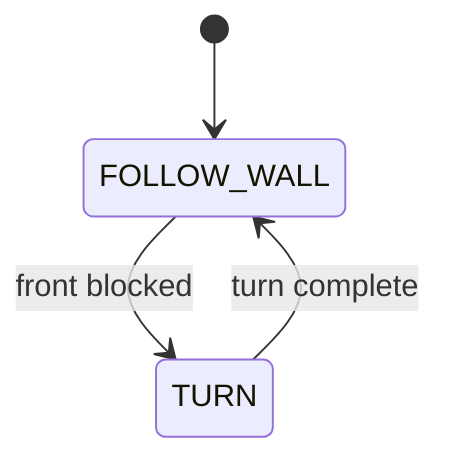

# Challenge 6: Dead-End Turns - Front Trigger Priority

## Purpose

Validate robust front-trigger dead-end handling using the existing state-machine structure and your held gyro turn PID.

## Success Criteria

The robot detects dead ends reliably, turns away cleanly, and reaches the green exit zone.

## Before You Begin

1. Complete Challenge 5 with reliable turn behavior.
2. Open simulator Challenge 6.
3. Carry forward all tuned values.

## Maze Situation

- Maze feature: front-blocking dead-end channel.
- Trigger condition expected in code: `front <= FRONT_STOP_DISTANCE`.
- New behavior introduced: none, this is front-trigger reliability tuning.
- Why previous challenge may fail: turn timing and front threshold may be marginal across repeated dead-end entries.

## What Is New In This Challenge

New: robustness validation of front-trigger turn behavior.

Unchanged: same core control-loop structure and turn PID from earlier challenges.

## Carry Forward From Previous Challenge

| Group   | Variable                                   | Notes                         |
| ------- | ------------------------------------------ | ----------------------------- |
| Reused  | Side PID, front trigger, and turn tunables | Same machine, dead-end focus. |
| New     | None                                       | No new algorithm blocks.      |
| Removed | None                                       | Existing structure is reused. |

## Algorithm Flow

### State Table

| State name    | Responsibilities                                 | Exit conditions                      |
| ------------- | ------------------------------------------------ | ------------------------------------ |
| `FOLLOW_WALL` | Control side distance and evaluate front trigger | Exit to `TURN` when front is blocked |
| `TURN`        | Handle dead-end turns                            | Return to `FOLLOW_WALL`              |

### Trigger Table

| Trigger condition              | From state    | To state      | Priority |
| ------------------------------ | ------------- | ------------- | -------- |
| `front <= FRONT_STOP_DISTANCE` | `FOLLOW_WALL` | `TURN`        | Highest  |
| Completion of turn             | `TURN`        | `FOLLOW_WALL` | High     |

## Starter Code Contract

Safe to edit:

1. Tunables only.
2. Speed and distance thresholds for this maze.

Do not edit unless instructed:

1. State list.
2. Trigger priority.
3. Shared control-loop skeleton.

Optional debug edits:

1. Print current state and active trigger.

## Tunables

| Name                  | Unit | Purpose                | Typical start value | Symptoms when too low | Symptoms when too high |
| --------------------- | ---- | ---------------------- | ------------------- | --------------------- | ---------------------- |
| `BASE_SPEED`          | PWM  | Global traversal speed | 190 to 210          | Slow run              | Unstable corners       |
| `FRONT_STOP_DISTANCE` | mm   | Dead-end trigger       | 120                 | Late turns            | Early turns            |
| `turn_Kp`             | gain | Turn response strength | 4.5                 | Under-rotation        | Overshoot risk         |
| `turn_Kd`             | gain | Turn damping           | 0.6                 | Wobble                | Sluggish turn          |

## Tuning Guide

1. Verify dead-end turns first.
2. Adjust front threshold and turn gains for repeatable corner exits.
3. Adjust speed downward if transitions become unstable.

## Debug Checklist

- [ ] Dead ends trigger `TURN` consistently.
- [ ] Trigger precedence does not conflict.
- [ ] Robot reaches exit across repeated runs.

## Common Failure Modes

| Symptom                  | Root cause               | Verification step                 | Fix                            |
| ------------------------ | ------------------------ | --------------------------------- | ------------------------------ |
| Wrong turn type selected | Trigger precedence issue | Log trigger checks per loop       | Enforce front trigger first    |
| Misses dead-end trigger  | Front threshold too low  | Log front distance at turn point  | Increase `FRONT_STOP_DISTANCE` |
| Over-rotates at dead end | Turn damping too low     | Log heading error near completion | Increase `turn_Kd`             |
| Random instability       | Speed too high           | Compare behavior at lower speed   | Reduce `BASE_SPEED`            |

## Exit Check

Pass when the Success Criteria are met in at least 3 consecutive simulator runs.

## What Is Next

Challenge 7 uses the same machine on the full maze and focuses on long-run reliability.
