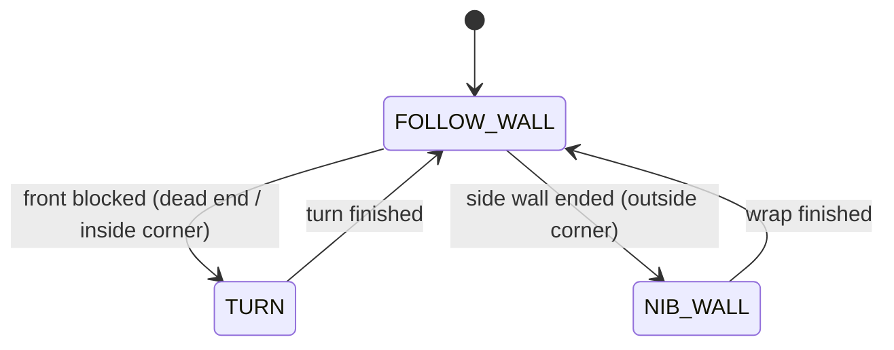

# Challenge 6: Dead Ends and Nibs — One Machine, Both Turns

Challenge 6 introduces **no new state**. Instead you take the exact three-state machine from
Challenge 5 and run it on a maze that has **both** kinds of corner: walls that block you from the
**front** (dead ends / inside corners) and walls that **end** beside you (outside corners / nibs).

The lesson is that a well-designed state machine **scales**: the same `FOLLOW_WALL` / `TURN` /
`NIB_WALL` states that solved one corner type also solve a maze full of mixed corners, with only
tuning to adjust.

You will learn:

- How a single state machine handles **multiple corner types** with no new logic.
- The **left-hand rule** and why it guarantees a wall is always nearby to follow.
- How the same `gyro_turn_pid` serves both turn directions.

---

## Success Criteria

My robot follows the wall through a maze of **dead ends and outside corners**, turning the correct
way at each, and reaches the **green exit zone**.

---

## Before You Begin

1. Complete [Challenge 5](docs.html?doc=Challenge_5) — carry forward every tuned value.
2. Open the **Simulator** and select **Challenge 6**.
3. Your Challenge 5 code already has all three states — this challenge is about **trusting the same
   machine** on a harder maze and tuning it.

---

## Concept 1 — The left-hand rule

Keep one hand (say the **left**) always on the wall and you will eventually walk every corridor of a
simply-connected maze and find the exit. The robot does the same with its **side sensor** as that
hand. The two states that turn map directly onto the two things the "hand" meets:

| Situation             | Sensor evidence                  | State      | Turn direction         |
| --------------------- | -------------------------------- | ---------- | ---------------------- |
| Wall blocks the front | `front <= FRONT_STOP_DISTANCE`   | `TURN`     | **away** from the wall |
| Side wall ends        | side lost for `NIB_CONFIRM_TIME` | `NIB_WALL` | **toward** the wall    |

For a **left**-hand robot that reads as "turn **right** at a dead end, **left** at a nib." The
`my_robot.wall_sign` value flips both automatically for a right-hand robot — your code never
hard-codes a direction.



---

## Concept 2 — Why no new code is needed

Each loop, `FOLLOW_WALL` checks the **front** trigger first, then the **side-lost** trigger, then
otherwise steers with the PID. That ordering already covers every case in this maze:

```python
def follow_wall():
    front = my_robot.read_distance()
    if front != -1 and front <= FRONT_STOP_DISTANCE:
        return "TURN"            # dead end / inside corner

    side = my_robot.read_distance_2()
    if side is lost for long enough:
        return "NIB_WALL"        # outside corner

    ...run the side PID...        # normal wall following
    return "FOLLOW_WALL"
```

A dead end and an outside corner can never both be true at the same instant, so a single pass of the
machine always picks the right one. This is the payoff of the state-machine design: **new corner
types are new states, not tangled `if`/`else` branches.**

---

## What you tune in this challenge

There are **no new parameters**. You re-use everything from Challenges 4 and 5 and adjust for this
maze's geometry:

| Group    | What to revisit for this maze                                                |
| -------- | ---------------------------------------------------------------------------- |
| Front    | `FRONT_STOP_DISTANCE` / `FRONT_SLOW_DISTANCE` — corridors may be tighter     |
| Nib wrap | `NIB_FORWARD_BEFORE` / `NIB_FORWARD_AFTER` — corners may be a different size |
| Speed    | `BASE_SPEED` — slower is steadier through mixed corners                      |

---

## Tuning guide

| Observation                             | Fix                                                                  |
| --------------------------------------- | -------------------------------------------------------------------- |
| Turns the wrong way at a corner         | Check `AIDriver("left"/"right")` matches your wall side              |
| Clips an inside corner on the way round | Raise `FRONT_STOP_DISTANCE` so it turns a little earlier             |
| Misses the wrap at an outside corner    | Re-tune `NIB_FORWARD_BEFORE` / `NIB_FORWARD_AFTER`                   |
| Spins randomly mid-corridor             | Leave `NIB_LOST_DISTANCE` / `NIB_CONFIRM_TIME` at the pre-set values |
| Generally twitchy                       | Lower `BASE_SPEED` and re-check the side PID gains                   |

---

## Try it

1. Open **Challenge 6** — same three states as Challenge 5.
2. Carry your numbers forward and adjust for the new maze.
3. The tuned answer is in `app/answers/challenge-6.py`.

---

## What's Next

[Challenge 7](docs.html?doc=Challenge_7) is the capstone: the full maze, solved end-to-end by the
same unchanged state machine.
