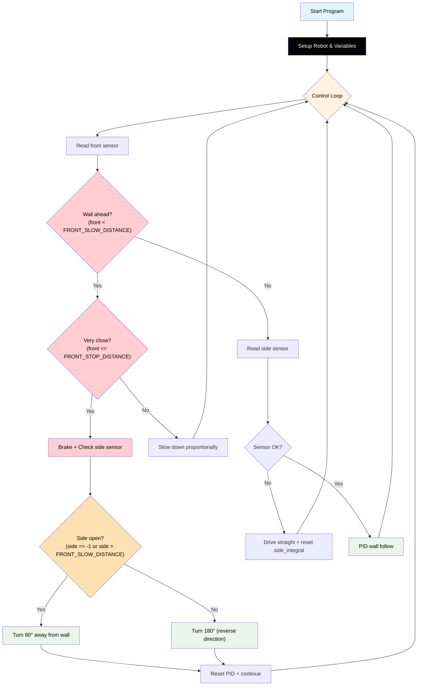

# Challenge 6: Dead End Detection

In this challenge you will extend your corner-detection code to also handle a **180° dead end**. After stopping at a front wall, the robot checks the **side sensor** to decide whether it is at a corner (turn 90°) or a dead end (turn 180°).

You will learn:

- How to use sensor data to **choose between two behaviours** at runtime.
- Why the same code must handle **multiple manoeuvre types** in a real maze.
- How to tune separate turn times for 90° and 180° turns.

---

## Success Criteria

My robot follows the wall, **correctly identifies the dead end**, **turns 180°**, and reaches the **green exit zone**.

---

## Before You Begin

1. Complete [Challenge 4](docs.html?doc=Challenge_4) — you need working corner detection.
2. Open the **Simulator** and select **Challenge 6**.
3. Run your Challenge 4 code here — the robot will attempt a 90° turn instead of 180° and fail to reach the exit.

---

## Flowchart Of The Algorithm



---

## Key Concepts

### Distinguishing Corner from Dead End

After stopping at a front wall, read the **side sensor** to identify the situation:

| Side sensor reading             | Situation                               | Turn needed        |
| ------------------------------- | --------------------------------------- | ------------------ |
| `-1` or `> FRONT_SLOW_DISTANCE` | **Corner** — corridor opens to the side | 90° away from wall |
| Small value (wall nearby)       | **Dead end** — walls on front AND side  | 180° reversal      |

```python
my_robot.brake()
hold_state(0.3)
side_check = my_robot.read_distance_2()
dead_end = not (side_check == -1 or side_check > FRONT_SLOW_DISTANCE)

turn_dir = "right" if my_robot.wall_sign == -1 else "left"
if dead_end:
    my_robot.turn_180(turn_dir)   # walls front AND side
else:
    my_robot.turn_90(turn_dir)    # corner
```

### `turn_180` — a Gyro 180° Reversal

Just like `turn_90`, `my_robot.turn_180("left"/"right")` uses the **gyroscope** to rotate the robot exactly 180° and stop. There is no timing to guess and no `1.7×` rule to derive — the same closed-loop controller simply targets a larger angle. Because the robot measures its own rotation, a 180° reversal is just as accurate as a 90° corner.

> [!Tip]
> The turn accuracy is set once by the gyro PID gains (`turn_Kp`, `turn_Kd`) — see the [PID Turn Tuning Quickstart](docs.html?doc=PID_Turn_Tuning_Quickstart). You do not tune anything per-challenge.

---

## Step 1 — Start from Your Challenge 4 Code

Copy your working Challenge 4 code. The only change is inside the `if front <= FRONT_STOP_DISTANCE:` block — replace the fixed `turn_90` with a side-sensor check that chooses between `turn_90` and `turn_180`.

---

## Step 2 — Replace the Turn Block

Find this block from Challenge 4:

```python
        if front <= FRONT_STOP_DISTANCE:
            my_robot.brake()
            hold_state(0.3)
            if my_robot.wall_sign == -1:
                my_robot.turn_90("right")
            else:
                my_robot.turn_90("left")
            my_robot.brake()
            hold_state(0.3)
            side_integral = 0
            side_previous_error = 0
            continue
```

Replace it with:

```python
        if front <= FRONT_STOP_DISTANCE:
            my_robot.brake()
            hold_state(0.3)
            # Check side sensor to decide corner (90°) vs dead end (180°)
            side_check = my_robot.read_distance_2()
            dead_end = not (side_check == -1 or side_check > FRONT_SLOW_DISTANCE)
            turn_dir = "right" if my_robot.wall_sign == -1 else "left"
            if dead_end:
                my_robot.turn_180(turn_dir)  # walls on front and side
            else:
                my_robot.turn_90(turn_dir)   # corridor is open to the side
            my_robot.brake()
            hold_state(0.3)
            side_integral = 0
            side_previous_error = 0
            continue
```

---

## Step 3 — Tune

| Observation                     | Fix                                                                                                                       |
| ------------------------------- | ------------------------------------------------------------------------------------------------------------------------- |
| Robot turns 90° at the dead end | Side check too strict — the side reading is being treated as "open"; lower the threshold it compares against              |
| Robot turns 180° at a corner    | Side check too loose — raise `FRONT_SLOW_DISTANCE`, or verify the side sensor reads -1 at corners                         |
| Turn under- or over-rotates     | Adjust the gyro PID gains (`turn_Kp`, `turn_Kd`) in the [PID Turn Tuning guide](docs.html?doc=PID_Turn_Tuning_Quickstart) |

---

## Starter Scaffold

This is exactly what you'll see in the editor when you open the challenge. The full algorithm — including the side-sensor decision — is already written for you. Every numeric setting starts at `0`. Your job is to tune the values.

```python
# Challenge 6: Dead-End Detection (90° vs 180°)
# --------------------------------------------------------------------
# After braking at a wall ahead, the robot reads its side sensor to
# decide between a gyro 90° turn (corner) or a gyro 180° turn (dead
# end). The full algorithm is already written for you. Every numeric
# setting starts at 0.
#
# Tuning guide: docs.html?doc=PID_Turn_Tuning_Quickstart
#
# Values to set:
#     all carried-forward C4 values
#
# Both turn sizes are handled by the gyroscope (my_robot.turn_90 /
# my_robot.turn_180).
#
# Goal: navigate the corner AND the dead-end maze without help.
# --------------------------------------------------------------------

from aidriver import AIDriver, hold_state
import aidriver

aidriver.DEBUG_AIDRIVER = False
my_robot = AIDriver("left")

BASE_SPEED = 0
TARGET_WALL_DISTANCE = 0
MAX_STEERING = 0

side_Kp = 0.0
side_Kd = 0.0
side_Ki = 0.0
side_INTEGRAL_MAX = 0

FRONT_SLOW_DISTANCE = 0
FRONT_STOP_DISTANCE = 0
FRONT_Kp = 0.0

side_previous_error = 0
side_integral = 0


while True:
    front = my_robot.read_distance()

    if front != -1 and front < FRONT_SLOW_DISTANCE:
        if front <= FRONT_STOP_DISTANCE:
            my_robot.brake()
            hold_state(0.3)

            # Decide turn size from the side sensor:
            #   wall on side as well as in front  → dead end  → 180°
            #   side is open / out of range        → corner    → 90°
            side_check = my_robot.read_distance_2()
            dead_end = not (side_check == -1 or side_check > FRONT_SLOW_DISTANCE)

            turn_dir = "right" if my_robot.wall_sign == -1 else "left"
            if dead_end:
                my_robot.turn_180(turn_dir)
            else:
                my_robot.turn_90(turn_dir)

            my_robot.brake()
            hold_state(0.3)

            side_integral = 0
            side_previous_error = 0
            continue
        else:
            approach_speed = int(FRONT_Kp * (front - FRONT_STOP_DISTANCE))
            if approach_speed < 120:
                approach_speed = 120
            if approach_speed > BASE_SPEED:
                approach_speed = BASE_SPEED
            my_robot.drive(approach_speed, approach_speed)
            hold_state(0.05)
            continue

    # --- Side wall-follow PID ---
    wall_distance = my_robot.read_distance_2()

    if wall_distance == -1:
        my_robot.drive(BASE_SPEED, BASE_SPEED)
        side_integral = 0
        hold_state(0.05)
        continue

    error = wall_distance - TARGET_WALL_DISTANCE

    side_integral = side_integral + error
    if side_integral > side_INTEGRAL_MAX:
        side_integral = side_INTEGRAL_MAX
    elif side_integral < -side_INTEGRAL_MAX:
        side_integral = -side_INTEGRAL_MAX

    side_derivative = error - side_previous_error

    steering = (
        (side_Kp * error) + (side_Ki * side_integral) + (side_Kd * side_derivative)
    )

    if steering > MAX_STEERING:
        steering = MAX_STEERING
    elif steering < -MAX_STEERING:
        steering = -MAX_STEERING

    right_speed = BASE_SPEED - (my_robot.wall_sign * steering)
    left_speed = BASE_SPEED + (my_robot.wall_sign * steering)

    my_robot.drive(int(right_speed), int(left_speed))

    side_previous_error = error
    hold_state(0.05)
```

<details>
<summary><strong>Reference Solution</strong> — click to expand <em>(only after you've genuinely tried)</em></summary>

The simulator-tuned answer key fills in every value. These are the same numbers used by the automated integration tests.

```python
from aidriver import AIDriver, hold_state
import aidriver

aidriver.DEBUG_AIDRIVER = False
my_robot = AIDriver("left")

BASE_SPEED = 200
TARGET_WALL_DISTANCE = 200
MAX_STEERING = 60

side_Kp = 0.25
side_Kd = 0.40
side_Ki = 0.001
side_INTEGRAL_MAX = 50

FRONT_SLOW_DISTANCE = 400
FRONT_STOP_DISTANCE = 150
FRONT_Kp = 1.0

side_previous_error = 0
side_integral = 0


while True:
    front = my_robot.read_distance()

    if front != -1 and front < FRONT_SLOW_DISTANCE:
        if front <= FRONT_STOP_DISTANCE:
            my_robot.brake()
            hold_state(0.3)

            side_check = my_robot.read_distance_2()
            dead_end = not (side_check == -1 or side_check > FRONT_SLOW_DISTANCE)

            turn_dir = "right" if my_robot.wall_sign == -1 else "left"
            if dead_end:
                my_robot.turn_180(turn_dir)
            else:
                my_robot.turn_90(turn_dir)

            my_robot.brake()
            hold_state(0.3)

            side_integral = 0
            side_previous_error = 0
            continue
        else:
            approach_speed = int(FRONT_Kp * (front - FRONT_STOP_DISTANCE))
            if approach_speed < 120:
                approach_speed = 120
            if approach_speed > BASE_SPEED:
                approach_speed = BASE_SPEED
            my_robot.drive(approach_speed, approach_speed)
            hold_state(0.05)
            continue

    # --- Side wall-follow PID ---
    wall_distance = my_robot.read_distance_2()

    if wall_distance == -1:
        my_robot.drive(BASE_SPEED, BASE_SPEED)
        side_integral = 0
        hold_state(0.05)
        continue

    error = wall_distance - TARGET_WALL_DISTANCE

    side_integral = side_integral + error
    if side_integral > side_INTEGRAL_MAX:
        side_integral = side_INTEGRAL_MAX
    elif side_integral < -side_INTEGRAL_MAX:
        side_integral = -side_INTEGRAL_MAX

    side_derivative = error - side_previous_error

    steering = (
        (side_Kp * error) + (side_Ki * side_integral) + (side_Kd * side_derivative)
    )

    if steering > MAX_STEERING:
        steering = MAX_STEERING
    elif steering < -MAX_STEERING:
        steering = -MAX_STEERING

    right_speed = BASE_SPEED - (my_robot.wall_sign * steering)
    left_speed = BASE_SPEED + (my_robot.wall_sign * steering)

    my_robot.drive(int(right_speed), int(left_speed))

    side_previous_error = error
    hold_state(0.05)
```

</details>

---

## Debugging Tips

- Add `print("side_check:", side_check, "dead_end:", dead_end)` inside the stop block to verify the correct turn is chosen.
- If the robot always picks 90°, the side sensor may be reading -1 even at the dead end — check the sensor range and `FRONT_SLOW_DISTANCE` threshold value.
- If the robot always picks 180°, the side sensor may not be returning -1 at the corner — the wall may still be partially visible. Try using a larger threshold (e.g. `side_check > 600`).

---

## What's Next

In [Challenge 7](docs.html?doc=Challenge_7) you will combine everything into a **full maze solver** that handles open junctions, multiple turns, and lost-wall recovery.

You will learn:

- How to combine all previous algorithms into a robust maze solver.
- How to handle open spaces (no wall detected).
- How to tune all PID and threshold variables for best performance.

---
