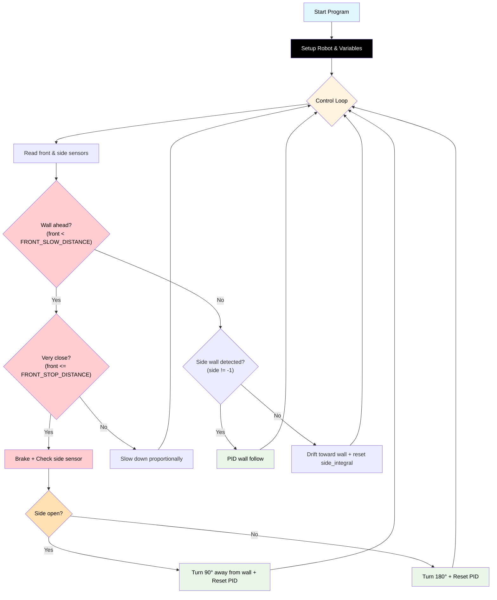

# Challenge 7: Full Maze Navigation

In this final challenge, your robot must use **all your skills** to navigate a maze with multiple turns, dead ends, and open spaces. You will combine **side PID wall following**, **front wall detection**, **corner/dead-end logic**, and **lost-wall recovery** to reach the exit.

You will learn:

- How to combine all previous algorithms into a robust maze solver.
- How to handle open spaces where no side wall is detected.
- How to tune all PID and threshold variables for best performance.

---

## Success Criteria

My robot navigates the maze, handles corners and dead ends, recovers from open spaces, and reaches the **green exit zone** within 60 seconds.

---

## Before You Begin

1. Complete [Challenge 6](docs.html?doc=Challenge_6) — you need working corner and dead-end detection.
2. Open the **Simulator** and select **Challenge 7**.
3. Run your Challenge 6 code here — the robot will get stuck at open junctions where the side wall disappears.

---

## Flowchart Of The Algorithm



---

## Key Concepts

### The New Priority: Lost Wall Recovery

Challenges 4 and 5 assume the side wall is always present. In a full maze, the robot passes **open junctions** where the side wall disappears. Without recovery logic the robot drives straight until it crashes.

**Priority structure:**

| Priority | Condition                     | Action                              |
| -------- | ----------------------------- | ----------------------------------- |
| 1        | `front < FRONT_SLOW_DISTANCE` | Decelerate or stop + turn           |
| 2        | `side == -1`                  | Drift toward the expected wall side |
| 3        | Wall visible                  | PID wall follow                     |

### Drifting Toward the Wall

When `side == -1`, gently curve toward the wall using `wall_sign`:

```python
elif side == -1:
    r = BASE_SPEED - int(my_robot.wall_sign * BASE_SPEED * 0.20)
    l = BASE_SPEED + int(my_robot.wall_sign * BASE_SPEED * 0.20)
    my_robot.drive(r, l)
```

`wall_sign` automatically curves toward the correct side. Adjust `0.20`:

- Higher value → tighter curve (re-acquires wall faster, may overshoot or stall the inside wheel)
- Lower value → gentler curve (smoother, may drift too far before re-acquiring)

> [!Important]
> Keep `LOST_WALL_DRIFT` small enough that the inside wheel stays ≥ `120` (motor dead zone). With `BASE_SPEED = 200`, the absolute maximum is `(200 - 120) / 200 = 0.40`. The simulator-tuned answer key uses `0.20`.

---

## Step 1 — Start from Your Challenge 6 Code

Copy your working Challenge 6 code. The only addition is a new `elif side == -1:` block between the front-sensor check and the PID block.

---

## Step 2 — Add the Lost-Wall Recovery Block

Find the `# Priority 2: Side wall following with PID` section and split it:

```python
    # Priority 2: Lost the wall — drift toward it to reacquire
    side = my_robot.read_distance_2()
    if side == -1:
        r = BASE_SPEED - int(my_robot.wall_sign * BASE_SPEED * 0.20)
        l = BASE_SPEED + int(my_robot.wall_sign * BASE_SPEED * 0.20)
        my_robot.drive(r, l)
        side_integral = 0
        hold_state(0.05)
        continue

    # Priority 3: Wall visible — PID follow
    error = side - TARGET_WALL_DISTANCE
    # ... rest of PID code (unchanged from Challenge 6) ...
```

---

## Step 3 — Tune and Test

Use the **maze selector** in the simulator to try different mazes:

| Maze    | Difficulty | Good for testing                |
| ------- | ---------- | ------------------------------- |
| Zigzag  | Default    | Sharp corners, narrow corridors |
| Simple  | Easy       | Basic L-shape                   |
| Spiral  | Medium     | Long winding path               |
| Classic | Hard       | Multiple junctions              |

### Tuning Guide

| Symptom                                 | Fix                                                     |
| --------------------------------------- | ------------------------------------------------------- |
| Robot gets stuck at a junction          | Check Priority 2 lost-wall drift logic                  |
| Robot spins at junctions                | Reduce `LOST_WALL_DRIFT` (try `0.15`)                   |
| Robot crashes into walls on tight turns | Increase `FRONT_SLOW_DISTANCE`                          |
| Robot takes too long (> 60 seconds)     | Increase `BASE_SPEED` (test carefully)                  |
| Robot follows wrong wall after a turn   | Check `AIDriver("left"/"right")` matches physical setup |

---

## Starter Scaffold

This is exactly what you'll see in the editor when you open the challenge. The full algorithm — including lost-wall recovery — is already written for you. Every numeric setting starts at `0`. Your job is to tune the values.

```python
# Challenge 7: Full Maze Navigation
# --------------------------------------------------------------------
# Adds lost-wall recovery so the robot can cross open junctions
# (where the side sensor briefly returns -1) without driving straight
# into the opposite wall. The full algorithm is already written for
# you. Every numeric setting starts at 0.
#
# Tuning guide: docs.html?doc=PID_Real_World_Tuning_Quickstart
#
# Values to set:
#     all carried-forward C5 values
#     LOST_WALL_DRIFT   new — fraction of BASE_SPEED used to curve back
#                              toward the wall (range 0.0–0.25)
#
# IMPORTANT: keep LOST_WALL_DRIFT small enough that the inside wheel
# stays > 120 (the MIN_MOTOR_SPEED). With BASE_SPEED=200, 0.15 puts
# the inside wheel at 170; higher values still move but crawl.
#
# Goal: complete the full maze without external help.
# --------------------------------------------------------------------

from aidriver import AIDriver, hold_state
import aidriver

aidriver.DEBUG_AIDRIVER = False
my_robot = AIDriver("left")

BASE_SPEED = 0
TARGET_WALL_DISTANCE = 0
MAX_STEERING = 0

side_Kp = 0.0
side_Kd = 0.0
side_Ki = 0.0
side_INTEGRAL_MAX = 0

FRONT_SLOW_DISTANCE = 0
FRONT_STOP_DISTANCE = 0
FRONT_Kp = 0.0

LOST_WALL_DRIFT = 0.0

side_previous_error = 0
side_integral = 0


while True:
    front = my_robot.read_distance()

    if front != -1 and front < FRONT_SLOW_DISTANCE:
        if front <= FRONT_STOP_DISTANCE:
            my_robot.brake()
            hold_state(0.3)
            side_check = my_robot.read_distance_2()
            dead_end = not (side_check == -1 or side_check > FRONT_SLOW_DISTANCE)
            turn_dir = "right" if my_robot.wall_sign == -1 else "left"
            if dead_end:
                my_robot.turn_180(turn_dir)
            else:
                my_robot.turn_90(turn_dir)
            my_robot.brake()
            hold_state(0.3)
            side_integral = 0
            side_previous_error = 0
            continue
        else:
            approach_speed = int(FRONT_Kp * (front - FRONT_STOP_DISTANCE))
            if approach_speed < 120:
                approach_speed = 120
            if approach_speed > BASE_SPEED:
                approach_speed = BASE_SPEED
            my_robot.drive(approach_speed, approach_speed)
            hold_state(0.05)
            continue

    # --- Lost-wall recovery: curve gently toward the wall when sensor blanks ---
    side = my_robot.read_distance_2()
    if side == -1:
        r = BASE_SPEED - int(my_robot.wall_sign * BASE_SPEED * LOST_WALL_DRIFT)
        l = BASE_SPEED + int(my_robot.wall_sign * BASE_SPEED * LOST_WALL_DRIFT)
        my_robot.drive(r, l)
        side_integral = 0
        hold_state(0.05)
        continue

    # --- Side wall-follow PID (uses the reading we already have) ---
    wall_distance = side

    error = wall_distance - TARGET_WALL_DISTANCE

    side_integral = side_integral + error
    if side_integral > side_INTEGRAL_MAX:
        side_integral = side_INTEGRAL_MAX
    elif side_integral < -side_INTEGRAL_MAX:
        side_integral = -side_INTEGRAL_MAX

    side_derivative = error - side_previous_error

    steering = (
        (side_Kp * error) + (side_Ki * side_integral) + (side_Kd * side_derivative)
    )

    if steering > MAX_STEERING:
        steering = MAX_STEERING
    elif steering < -MAX_STEERING:
        steering = -MAX_STEERING

    right_speed = BASE_SPEED - (my_robot.wall_sign * steering)
    left_speed = BASE_SPEED + (my_robot.wall_sign * steering)

    my_robot.drive(int(right_speed), int(left_speed))

    side_previous_error = error
    hold_state(0.05)
```

<details>
<summary><strong>Reference Solution</strong> — click to expand <em>(only after you've genuinely tried)</em></summary>

The simulator-tuned answer key fills in every value. These are the same numbers used by the automated integration tests.

```python
from aidriver import AIDriver, hold_state
import aidriver

aidriver.DEBUG_AIDRIVER = False
my_robot = AIDriver("left")

BASE_SPEED = 200
TARGET_WALL_DISTANCE = 200
MAX_STEERING = 60

side_Kp = 0.25
side_Kd = 0.40
side_Ki = 0.001
side_INTEGRAL_MAX = 50

FRONT_SLOW_DISTANCE = 400
FRONT_STOP_DISTANCE = 150
FRONT_Kp = 1.0

LOST_WALL_DRIFT = 0.20

side_previous_error = 0
side_integral = 0


while True:
    front = my_robot.read_distance()

    if front != -1 and front < FRONT_SLOW_DISTANCE:
        if front <= FRONT_STOP_DISTANCE:
            my_robot.brake()
            hold_state(0.3)
            side_check = my_robot.read_distance_2()
            dead_end = not (side_check == -1 or side_check > FRONT_SLOW_DISTANCE)
            turn_dir = "right" if my_robot.wall_sign == -1 else "left"
            if dead_end:
                my_robot.turn_180(turn_dir)
            else:
                my_robot.turn_90(turn_dir)
            my_robot.brake()
            hold_state(0.3)
            side_integral = 0
            side_previous_error = 0
            continue
        else:
            approach_speed = int(FRONT_Kp * (front - FRONT_STOP_DISTANCE))
            if approach_speed < 120:
                approach_speed = 120
            if approach_speed > BASE_SPEED:
                approach_speed = BASE_SPEED
            my_robot.drive(approach_speed, approach_speed)
            hold_state(0.05)
            continue

    # --- Lost-wall recovery ---
    side = my_robot.read_distance_2()
    if side == -1:
        r = BASE_SPEED - int(my_robot.wall_sign * BASE_SPEED * LOST_WALL_DRIFT)
        l = BASE_SPEED + int(my_robot.wall_sign * BASE_SPEED * LOST_WALL_DRIFT)
        my_robot.drive(r, l)
        side_integral = 0
        hold_state(0.05)
        continue

    # --- Side wall-follow PID (uses the reading we already have) ---
    wall_distance = side

    error = wall_distance - TARGET_WALL_DISTANCE

    side_integral = side_integral + error
    if side_integral > side_INTEGRAL_MAX:
        side_integral = side_INTEGRAL_MAX
    elif side_integral < -side_INTEGRAL_MAX:
        side_integral = -side_INTEGRAL_MAX

    side_derivative = error - side_previous_error

    steering = (
        (side_Kp * error) + (side_Ki * side_integral) + (side_Kd * side_derivative)
    )

    if steering > MAX_STEERING:
        steering = MAX_STEERING
    elif steering < -MAX_STEERING:
        steering = -MAX_STEERING

    right_speed = BASE_SPEED - (my_robot.wall_sign * steering)
    left_speed = BASE_SPEED + (my_robot.wall_sign * steering)

    my_robot.drive(int(right_speed), int(left_speed))

    side_previous_error = error
    hold_state(0.05)
```

</details>

---

## Debugging Tips

- Add `print("P1" if (front != -1 and front < FRONT_SLOW_DISTANCE) else "P2" if side == -1 else "P3")` to see which priority is active.
- Watch the simulator trace to see where the robot is getting stuck.
- If the robot circles forever at a junction, the drift curve may not be strong enough — try increasing `LOST_WALL_DRIFT`.
- If it works in the simulator but not on the real robot, re-tune the gyro turn gains (`turn_Kp`, `turn_Kd`) and the wall-following PID gains for physical conditions.

---

## What You've Learned

Congratulations! Over these 6 challenges you have built a complete autonomous navigation system:

| Challenge | Skill                                             |
| --------- | ------------------------------------------------- |
| 1         | P controller — proportional steering              |
| 2         | PD controller — damped steering                   |
| 3         | Full PID — steady-state correction                |
| 4         | Corner detection — 90° turn with front sensor     |
| 5         | Dead end detection — 90° vs 180° sensor fusion    |
| 6         | Full maze solver — priorities, lost-wall recovery |
