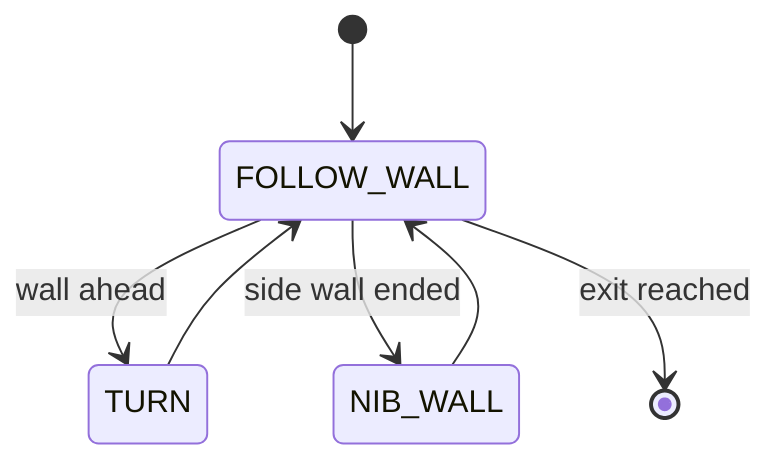

# Challenge 7: Full Maze - Capstone

## Purpose

Validate full-maze performance using the established three-state controller, focusing on reliability across long sequences of corners.

## Success Criteria

The robot completes the full maze from start to green exit zone with stable behavior across dead ends and outside corners.

## Before You Begin

1. Complete Challenge 6.
2. Open simulator Challenge 7.
3. Carry forward your best stable values.

## Maze Situation

- Maze feature: long run with repeated mixed-corner patterns.
- Trigger condition expected in code: same front and side-loss triggers.
- New behavior introduced: no new behavior, only robustness tuning.
- Why previous challenge may fail: values tuned for short sections may drift or fail over long sequences.

## What Is New In This Challenge

New: robustness target (repeatability over full run length).

Unchanged: same states, triggers, and core algorithms.

## Carry Forward From Previous Challenge

| Group   | Variable           | Notes                     |
| ------- | ------------------ | ------------------------- |
| Reused  | All prior tunables | Entire machine is reused. |
| New     | None               | Capstone tuning only.     |
| Removed | None               | No structural changes.    |

## Algorithm Flow

### State Table

| State name    | Responsibilities                           | Exit conditions         |
| ------------- | ------------------------------------------ | ----------------------- |
| `FOLLOW_WALL` | Stable side control and trigger monitoring | To `TURN` or `NIB_WALL` |
| `TURN`        | Controlled inside-corner turning           | Back to `FOLLOW_WALL`   |
| `NIB_WALL`    | Controlled outside-corner wrapping         | Back to `FOLLOW_WALL`   |

### Trigger Table

| Trigger condition              | From state          | To state      | Priority |
| ------------------------------ | ------------------- | ------------- | -------- |
| `front <= FRONT_STOP_DISTANCE` | `FOLLOW_WALL`       | `TURN`        | Highest  |
| side lost for confirm window   | `FOLLOW_WALL`       | `NIB_WALL`    | High     |
| Completion criteria met        | `TURN` / `NIB_WALL` | `FOLLOW_WALL` | High     |

## Starter Code Contract

Safe to edit:

1. Tunables only.

Do not edit unless instructed:

1. State machine topology.
2. Trigger order.
3. Safety clamp and timeout behavior.

Optional debug edits:

1. Add state-transition logging to identify where long-run failures start.

## Tunables

| Name                  | Unit | Purpose                          | Typical start value | Symptoms when too low | Symptoms when too high |
| --------------------- | ---- | -------------------------------- | ------------------- | --------------------- | ---------------------- |
| `BASE_SPEED`          | PWM  | Throughput vs stability tradeoff | 190 to 205          | Slow run              | Late reactions         |
| `turn_tolerance`      | deg  | Turn completion precision        | 2.0                 | Slow completion       | Incomplete turns       |
| `FRONT_STOP_DISTANCE` | mm   | Dead-end reaction margin         | 120                 | Wall contact risk     | Premature turn         |
| `NIB_FORWARD_BEFORE`  | s    | Nib wrap clearance               | 0.25                | Clip corner           | Wide path              |

## Tuning Guide

1. Verify behavior on the worst-case corner, not the average corner.
2. Adjust speed downward first if instability appears.
3. Verify failing states using transition logs.

## Debug Checklist

- [ ] Robot completes full maze in repeated runs.
- [ ] No state gets stuck.
- [ ] Turn outcomes remain consistent late in the run.
- [ ] Exit is reached without manual correction.

## Common Failure Modes

| Symptom                | Root cause                           | Verification step                   | Fix                             |
| ---------------------- | ------------------------------------ | ----------------------------------- | ------------------------------- |
| Fails only late in run | Marginal tuning accumulates error    | Compare early vs late corner logs   | Lower speed and retune margins  |
| Occasional missed turn | Trigger threshold too tight          | Log front distance at failed turn   | Increase stop distance margin   |
| Random nib failures    | Wrap timing not robust               | Log nib entry/exit durations        | Retune `NIB_FORWARD_*`          |
| General twitchiness    | Gains too aggressive for full course | Check steering saturation frequency | Slightly reduce gains and speed |

## Exit Check

Pass when the Success Criteria are met in at least 3 consecutive simulator runs.

## What Is Next

Challenge 8 adds marker sensing with the color sensor and introduces event-driven marker handling.
