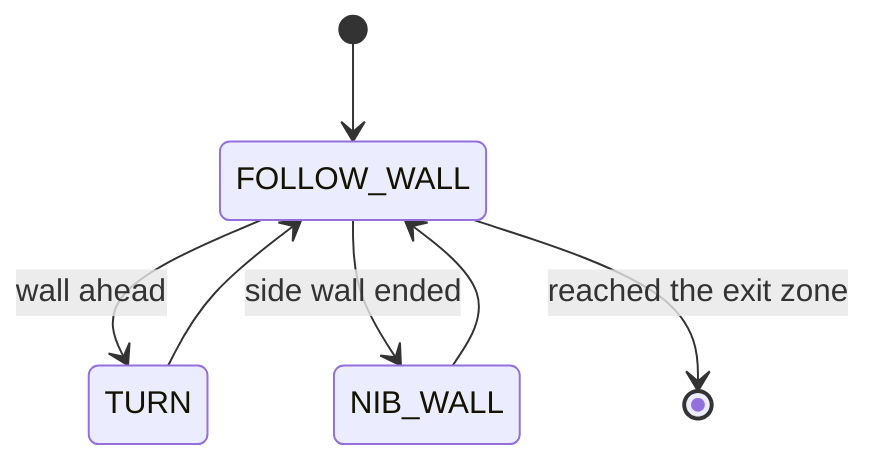

# Challenge 7: The Full Maze — Capstone

The final challenge. Your robot must solve a complete maze end-to-end using the **same three-state
machine** you have built up since Challenge 4. There is no new behaviour to add — this is about
**tuning the whole machine** until it runs the full course cleanly.

You will learn:

- How the `FOLLOW_WALL` / `TURN` / `NIB_WALL` machine composes into a complete maze solver.
- How to **tune for robustness** over a long run rather than a single corner.
- How to read the robot's behaviour to find which state needs attention.

---

## Success Criteria

My robot completes the **full maze** from start to the **green exit zone**, handling every dead end
and outside corner along the way, without external help.

---

## Before You Begin

1. Complete [Challenge 6](docs.html?doc=Challenge_6) — carry forward every tuned value.
2. Open the **Simulator** and select **Challenge 7**.
3. Run your Challenge 6 code — it already has every state it needs. The work here is **tuning** for
   the longer, more varied course.

---

## Concept — One machine, a whole maze

A complete maze is just a long sequence of the same three situations, in some order:

Because every state returns cleanly to `FOLLOW_WALL`, the machine can run forever, taking whichever
turn each corner calls for. Following one wall the whole way (the **left-hand rule** from Challenge 6) is guaranteed to reach the exit of a simply-connected maze. Your job is to make each state robust
enough to survive **dozens** of corners in a row.

---

## What you tune in this challenge

No new parameters — you are balancing the **whole** machine:

| Goal             | Levers                                                           |
| ---------------- | ---------------------------------------------------------------- |
| Smooth following | side PID gains (`side_Kp`, `side_Ki`, `side_Kd`), `MAX_STEERING` |
| Reliable turns   | `turn_Kp`, `turn_Kd`, `turn_tolerance`                           |
| Clean approaches | `FRONT_SLOW_DISTANCE`, `FRONT_STOP_DISTANCE`, `FRONT_Kp`         |
| Solid wraps      | `NIB_FORWARD_BEFORE`, `NIB_FORWARD_AFTER`                        |
| Speed vs. safety | `BASE_SPEED`                                                     |

> **Tune for the worst corner, not the average one.** A value that _just_ works on an easy corner
> will fail on the tightest one. Find the hardest corner in the maze and tune until it is reliable;
> the easy ones then take care of themselves.

---

## A debugging method

When a run fails, identify **which state** was active when it went wrong, then tune only that state:

| Where it failed                         | Likely state  | Fix                                                 |
| --------------------------------------- | ------------- | --------------------------------------------------- |
| Drifted into a wall mid-corridor        | `FOLLOW_WALL` | side PID gains / `BASE_SPEED`                       |
| Over/under-rotated at a corner          | `TURN`        | `turn_Kp` / `turn_Kd` / `turn_tolerance`            |
| Clipped or missed an outside corner     | `NIB_WALL`    | `NIB_FORWARD_BEFORE` / `NIB_FORWARD_AFTER`          |
| Started turning too late and hit a wall | trigger       | raise `FRONT_STOP_DISTANCE` / `FRONT_SLOW_DISTANCE` |

Print the current `state` each loop while debugging so you can see exactly where the machine is when
trouble starts.

---

## Try it

1. Open **Challenge 7** — the same three-state machine, no new code.
2. Carry all your numbers forward and tune for the full course.
3. A fully tuned reference is in `app/answers/challenge-7.py`.

> **Note on the bundled maze:** some maze layouts (such as a slalom of free-standing walls with no
> continuous surface) cannot be solved by a hand-on-wall rule at all — there is no single wall to
> follow from start to exit. If a maze seems impossible no matter how you tune, check whether it is
> actually wall-followable before assuming your code is wrong.

---

## What's Next

You have built a complete, layered robot controller: a side PID, a gyro turn, and a state machine
that composes them into a maze solver. To run it on the **real** robot, work through the
[Real-World Calibration](docs.html?doc=Real_World_Calibration_Data) so the simulator physics match
your hardware, then flash your tuned values to `main.py`.
