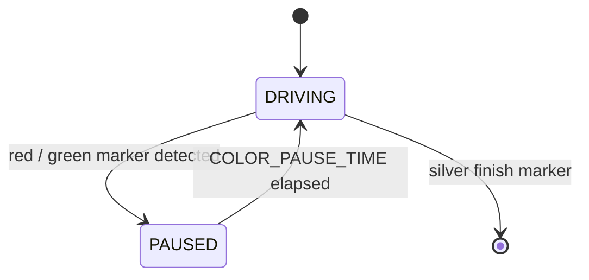

# Challenge 8: Ground Colour Detection — Pause on Markers

Challenge 8 adds a brand-new sensor: the **TCS34725 ground colour sensor** that looks _down_ at the
floor. Coloured tape markers are laid along the corridor and the robot must **pause** for a set time
whenever it rolls onto a **red** or **green** marker, then carry on. **Silver** (reflective) markers
mark the **start** and **finish** of the run.

The sensor has a hardware **interrupt** line: instead of polling colours constantly, the sensor
raises an interrupt the moment the floor gets bright enough to be a marker. Your code reacts to that
event with `color_detected()`.

You will learn:

- How a colour sensor reports light as four numbers — **red, green, blue, and clear** counts.
- How to turn raw counts into a decision by comparing **colour fractions** and **brightness**.
- How a **hardware interrupt** lets the robot ignore the plain floor and only react to markers.

---

## Success Criteria

My robot drives up the corridor, **pauses on every red and green marker** for `COLOR_PAUSE_TIME`
seconds, and reaches the **silver finish** marker without skipping any marker.

---

## Before You Begin

1. Open the **Simulator** and select **Challenge 8**.
2. The corridor floor shows four markers: a **silver** start, a **red**, a **green**, and a
   **silver** finish.
3. The robot drives straight — your job is to **tune the colour thresholds** so each marker is
   recognised correctly.

---

## Concept 1 — What the sensor reports

`my_robot.read_color()` returns four 16-bit counts:

```python
r, g, b, c = my_robot.read_color()
```

| Channel | Meaning                              |
| ------- | ------------------------------------ |
| `r`     | how much **red** light came back     |
| `g`     | how much **green** light came back   |
| `b`     | how much **blue** light came back    |
| `c`     | total **clear** (overall brightness) |

The plain floor is dim and roughly grey (small, balanced numbers). A coloured marker is brighter and
**lopsided** toward one channel. Silver is the brightest of all and stays **balanced**.

---

## Concept 2 — The interrupt gate

The sensor's interrupt fires whenever the **clear** channel crosses a brightness threshold, i.e. when
the robot is over _any_ marker. `color_detected()` reads that interrupt so you only classify a colour
when there is actually a marker underneath:

```python
if my_robot.color_detected():
    color = my_robot.classify_color()
else:
    color = "none"
```



---

## Concept 3 — Turning counts into a colour

`classify_color()` uses the thresholds you set on the robot. It works in **fractions** so it does not
matter how bright the marker is:

```python
total = r + g + b
red_fraction   = r / total
green_fraction = g / total
```

- If the clear value is below `color_min_clear`, it is just floor → **none**.
- If it is bright (`c >= color_silver_clear`) **and** balanced (neither colour dominates) → **silver**.
- Otherwise, the dominant fraction decides **red** or **green**.

---

## What you tune in this challenge

| Parameter            | What it does                                                         |
| -------------------- | -------------------------------------------------------------------- |
| `color_min_clear`    | Brightness below this is ignored as plain floor                      |
| `color_red_ratio`    | Red fraction `r/(r+g+b)` needed to call a marker **red**             |
| `color_green_ratio`  | Green fraction `g/(r+g+b)` needed to call a marker **green**         |
| `color_silver_clear` | Clear value above which a _balanced_ marker is treated as **silver** |
| `COLOR_PAUSE_TIME`   | How many seconds to pause on each red / green marker                 |
| `BASE_SPEED`         | Cruise speed up the corridor                                         |

Set these on the robot so `classify_color()` can read them:

```python
my_robot.color_min_clear = 180
my_robot.color_red_ratio = 0.55
my_robot.color_green_ratio = 0.55
my_robot.color_silver_clear = 500
```

---

## Tuning guide

| Observation                                    | Fix                                                               |
| ---------------------------------------------- | ----------------------------------------------------------------- |
| Robot pauses on the plain floor                | Raise `color_min_clear` until the floor reads `none`              |
| Robot never pauses on a marker                 | Lower `color_min_clear` / lower the colour ratio for that colour  |
| Red marker classified as green (or vice-versa) | Raise the ratio for the colour it should be                       |
| Silver marker read as red or green             | Raise `color_silver_clear` so only the brightest counts as silver |
| Finishes before the last marker                | The finish is **silver** — make sure silver is detected           |

> **Tip:** print `r, g, b, c` for each marker first, then pick thresholds that sit _between_ the
> floor values and the marker values.

---

## Try it

1. Open **Challenge 8** and run the starter code — at first it ignores every marker.
2. Read the raw counts on each marker, then raise the thresholds until each one classifies correctly.
3. The tuned answer is in `app/answers/challenge-8.py`.

---

## Hardware notes

On the real robot the TCS34725 shares the IMU's bit-banged I²C bus (GP16 = SDA, GP17 = SCL, address
`0x29`). Its active-low interrupt pin is wired to **GP7**. The driver lives in
`project/lib/tcs34725.py` and is wired into `AIDriver` automatically — if the sensor is missing,
`my_robot.has_color` is `False` and the colour methods return safe defaults.
