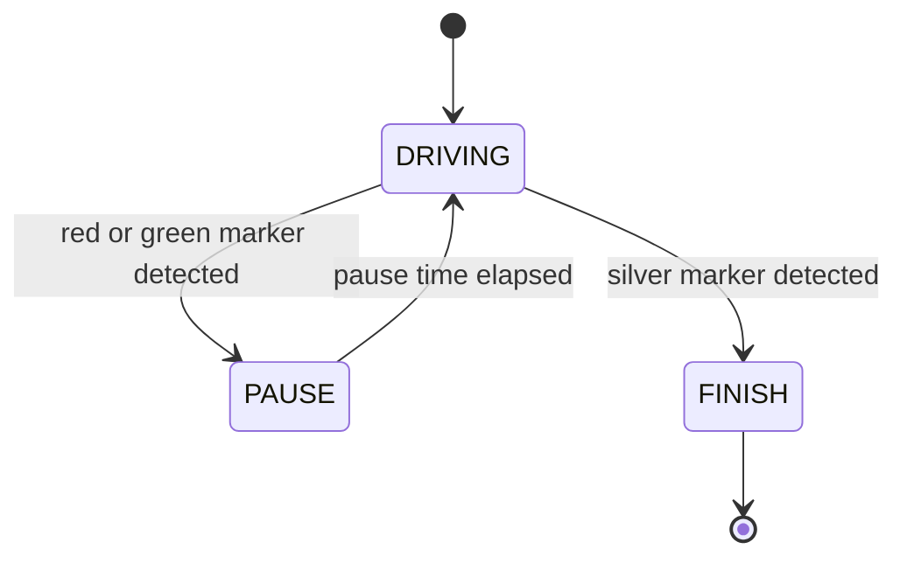

# Challenge 8: Ground Color Detection - Pause on Markers

## Purpose

Introduce color-marker handling so the robot reacts to red and green markers and recognizes silver start/finish markers.

## Success Criteria

The robot pauses on each red and green marker for the configured pause time and reaches the silver finish marker.

## Before You Begin

1. Open simulator Challenge 8.
2. Confirm marker order in the lane.
3. Start with conservative color thresholds and tune from measured values.

## Maze Situation

- Maze feature: bright floor markers (red, green, silver) on a corridor path.
- Trigger condition expected in code: marker event from brightness interrupt gate.
- New behavior introduced: color classification and pause behavior.
- Why previous challenge fails: maze solver has no marker interpretation or pause logic.

## What Is New In This Challenge

New: marker classification pipeline and marker-driven pause behavior.

Unchanged: base movement loop style and loop timing expectations.

## Carry Forward From Previous Challenge

| Group   | Variable                                                                        | Notes                                     |
| ------- | ------------------------------------------------------------------------------- | ----------------------------------------- |
| Reused  | `BASE_SPEED`                                                                    | Movement baseline remains.                |
| New     | `color_min_clear`, `color_red_ratio`, `color_green_ratio`, `color_silver_clear` | Color thresholds.                         |
| New     | `COLOR_PAUSE_TIME`                                                              | Pause duration for red and green markers. |
| New     | marker tracking variables                                                       | Prevent duplicate reactions per marker.   |
| Removed | NIB-specific tunables from core loop                                            | Not central to this challenge objective.  |

## Algorithm Flow

### State Table

| State name | Responsibilities                            | Exit conditions             |
| ---------- | ------------------------------------------- | --------------------------- |
| `DRIVING`  | Drive and check marker event/classification | Exit to `PAUSE` or `FINISH` |
| `PAUSE`    | Brake and wait `COLOR_PAUSE_TIME`           | Return to `DRIVING`         |
| `FINISH`   | Stop run and report completion              | End                         |

### Trigger Table

| Trigger condition           | From state | To state  | Priority |
| --------------------------- | ---------- | --------- | -------- |
| Classified red/green marker | `DRIVING`  | `PAUSE`   | High     |
| Classified silver finish    | `DRIVING`  | `FINISH`  | Highest  |
| Pause timer complete        | `PAUSE`    | `DRIVING` | High     |

## Starter Code Contract

Safe to edit:

1. Color thresholds.
2. Pause duration.
3. Speed.

Do not edit unless instructed:

1. Marker gate and classification order.
2. Duplicate-marker guard logic.
3. Safety brake before pause.

Optional debug edits:

1. Print `r, g, b, c` and classified color.

## Tunables

| Name                 | Unit         | Purpose                        | Typical start value | Symptoms when too low             | Symptoms when too high |
| -------------------- | ------------ | ------------------------------ | ------------------- | --------------------------------- | ---------------------- |
| `color_min_clear`    | clear counts | Separate floor from marker     | 180                 | False marker detection            | Missed markers         |
| `color_red_ratio`    | fraction     | Red classification threshold   | 0.55                | Red misread as none/green         | Red rarely detected    |
| `color_green_ratio`  | fraction     | Green classification threshold | 0.55                | Green misread as none/red         | Green rarely detected  |
| `color_silver_clear` | clear counts | Silver brightness threshold    | 500                 | Silver confused with color marker | Silver never detected  |
| `COLOR_PAUSE_TIME`   | s            | Pause duration at marker       | 1.0                 | Pause too short                   | Slow run               |

## Tuning Guide

1. Verify raw floor and marker counts first.
2. Adjust `color_min_clear` above floor.
3. Adjust color ratios to separate red and green confidently.
4. Adjust the silver threshold high enough to avoid false finish.

## Debug Checklist

- [ ] Floor reads as none.
- [ ] Red and green markers are detected once each pass.
- [ ] Silver finish is detected correctly.
- [ ] Pause timing is consistent.

## Common Failure Modes

| Symptom             | Root cause                  | Verification step                     | Fix                         |
| ------------------- | --------------------------- | ------------------------------------- | --------------------------- |
| Pauses on floor     | `color_min_clear` too low   | Print clear channel on floor          | Raise threshold             |
| Misses red/green    | Ratio thresholds too strict | Compare marker channel fractions      | Lower target ratio slightly |
| Finishes too early  | Silver threshold too low    | Log clear value where finish triggers | Raise `color_silver_clear`  |
| Double-count marker | No marker edge guard        | Log previous vs current marker        | Add new-marker check        |

## Exit Check

Pass when the Success Criteria are met in at least 3 consecutive simulator runs.

## What Is Next

Challenge 9 adds black-zone detection and recovery behavior.
