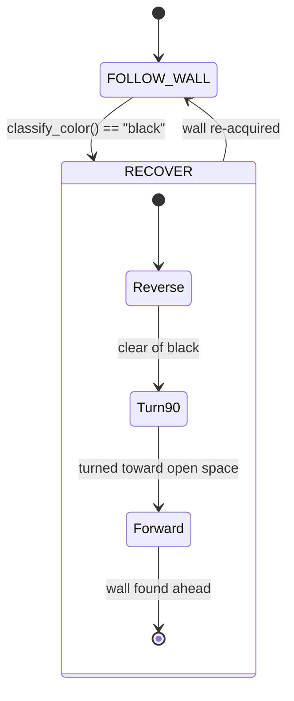

# Challenge 9: No-Go Zones — Detect BLACK and Recover

Challenge 9 introduces a brand-new **state**: a recovery manoeuvre that runs when the robot drives
onto a **BLACK no-go area**. Black floor patches are off-limits — the robot must notice it has
strayed onto one and get itself back to safety, then carry on.

This builds directly on the colour sensor from Challenge 8, but uses it in the opposite way. A bright
marker _raises_ the sensor's clear value; **black absorbs the LED**, so it reads _darker than the
plain floor_. That means the brightness interrupt never fires for black — you have to **poll** the
sensor every loop.

You will learn:

- How to detect a surface that is **darker** than the floor with a single threshold.
- How to build a **multi-step recovery state** that reverses, turns, and re-acquires a wall.
- How to drive straight **backwards and forwards on the gyro** using a heading PID.

---

## Success Criteria

My robot wall-follows up the left wall, detects the **black no-go patch**, runs the four-step
recovery, and reaches the **exit zone on the far side** of the arena.

---

## Before You Begin

1. Complete [Challenge 8](docs.html?doc=Challenge_8) — you already know how to read and classify
   colours.
2. Complete [Challenge 4](docs.html?doc=Challenge_4) — the recovery reuses the gyro turn.
3. Open the **Simulator** and select **Challenge 9**.

---

## Concept 1 — Black is _darker_ than the floor

`classify_color()` returns `"black"` when the clear channel falls below `color_black_clear`:

```python
r, g, b, c = my_robot.read_color()   # plain floor c ~120, black c ~30
```

Set the threshold **between** the floor and the black patch, and leave it at `0` to disable black
detection entirely:

```python
my_robot.color_black_clear = 60
```

> **Important:** `color_detected()` only fires on **bright** markers (it is driven by the hardware
> interrupt). Black is dark, so it never trips the interrupt — you must **poll** `classify_color()`
> on every loop to catch it.

---

## Concept 2 — The recovery state

The robot is always in one of two states. `FOLLOW_WALL` watches for black on every tick; the moment
it sees black it switches to `RECOVER`, which runs the four steps in order and then hands control
back.



---

## Concept 3 — The four-step manoeuvre

| Step | What it does                         | How                                                       |
| ---- | ------------------------------------ | --------------------------------------------------------- |
| 1    | **Reverse** straight off the black   | Drive backwards, holding heading with a gyro PID          |
| 2    | **Turn 90°** toward open space       | Read the side sensor, turn **away** from the nearest wall |
| 3    | **Drive forward** in a straight line | Drive forwards, holding the new heading with the gyro PID |
| 4    | **Look for a wall**                  | Stop once `read_distance()` finds a wall to follow again  |

### Driving straight on the gyro

Both the reverse and the forward phases hold a straight line the same way: integrate
`read_gyro_z_dps()` into a heading estimate and steer to drive it back to zero.

```python
gz = my_robot.read_gyro_z_dps()
heading = heading + gz * DT
correction = HEADING_Kp * heading
my_robot.drive(int(base_speed + correction), int(base_speed - correction))
```

`base_speed` is **negative** for the reverse phase and **positive** for the forward phase — the same
correction keeps both straight.

### Turning toward open space

The side sensor faces the wall you were following. If it still sees a near wall, the open space is on
the **other** side, so turn that way:

```python
side = my_robot.read_distance_2()
sensor_on_left = my_robot.wall_sign < 0
if side != -1 and side < OPEN_SPACE_DISTANCE:
    turn_dir = "right" if sensor_on_left else "left"   # away from the wall
else:
    turn_dir = "left" if sensor_on_left else "right"   # toward the open side
my_robot.turn_90(turn_dir)
```

---

## What you tune in this challenge

| Parameter             | What it does                                                         |
| --------------------- | -------------------------------------------------------------------- |
| `color_black_clear`   | Clear value below which the floor counts as a BLACK no-go area       |
| `HEADING_Kp`          | How hard to correct heading drift while reversing / driving straight |
| `REVERSE_SPEED`       | How fast to back out of the no-go area                               |
| `REVERSE_CLEAR_STEPS` | Extra straight-back steps after the sensor leaves the black          |
| `OPEN_SPACE_DISTANCE` | Side reading above which that side counts as "open"                  |
| `FORWARD_SPEED`       | Cruise speed while hunting for the next wall                         |
| `WALL_FOUND_DISTANCE` | Front distance that counts as "wall found"                           |

---

## Tuning guide

| Observation                       | Fix                                                                          |
| --------------------------------- | ---------------------------------------------------------------------------- |
| Never reacts to the black patch   | Lower `color_black_clear` is wrong — RAISE it toward the floor's clear value |
| Triggers black on the plain floor | Lower `color_black_clear` until the floor reads `none`                       |
| Reverses in a curve               | Raise `HEADING_Kp`; check the correction sign on `drive()`                   |
| Turns back into the no-go area    | Check `choose_open_direction()` and your `OPEN_SPACE_DISTANCE`               |
| Drives forever after turning      | Raise `WALL_FOUND_DISTANCE` or lower `FORWARD_MAX_STEPS`                     |

---

## Try it

1. Open **Challenge 9** and run the starter code — it ignores the black patch at first.
2. Tune `color_black_clear`, then the recovery parameters, until the robot backs out, turns toward
   open space, and reaches the exit.
3. The tuned answer is in `app/answers/challenge-9.py`.

---

## Hardware notes

Detection uses the same TCS34725 as Challenge 8 (shared bit-banged I²C on GP16/GP17, address `0x29`).
Because black never raises the brightness interrupt on GP7, the recovery loop **polls**
`classify_color()` rather than waiting on `color_detected()`. The reverse and forward phases rely on
the LSM6DS3 gyro (`read_gyro_z_dps()`) exactly like the Challenge 4 turn.

---

## What's Next

[Challenge 10](docs.html?doc=Challenge_10) is the **Rescue Maze capstone**: identify victims, keep a
running score, drop a rescue kit on the harmed ones, and report it all live on the **OLED** display.
