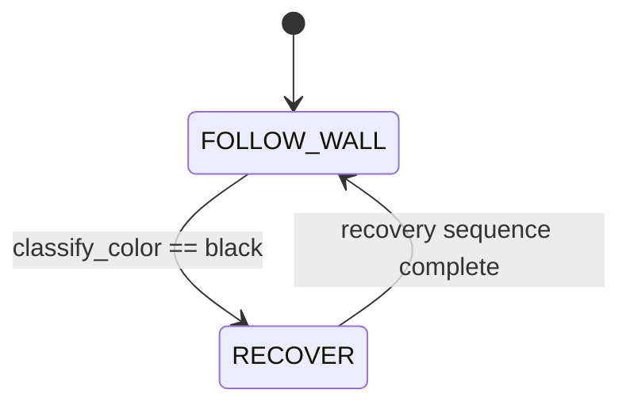

# Challenge 9: No-Go Zones - Detect Black and Recover

## Purpose

Add robust black-zone handling so the robot can detect black floor patches and recover using the implemented four-step maneuver.

## Success Criteria

When the robot enters a black zone, it runs the recovery sequence, reacquires a wall, and continues navigation.

## Before You Begin

1. Complete Challenge 8 color thresholding.
2. Confirm gyro turn behavior from Challenge 4 onward is stable.
3. Open simulator Challenge 9.

## Maze Situation

- Maze feature: one black no-go patch sized exactly 290 mm x 290 mm.
- Trigger condition expected in code: polled black classification in the control loop.
- New behavior introduced: RECOVER state using heading-stabilized reverse and forward motion.
- Why previous challenge fails: bright-marker interrupt logic does not detect dark black regions.

## What Is New In This Challenge

New: explicit RECOVER sequence with heading-hold motion and open-space turn selection.

Unchanged: follow wall logic remains the primary navigation mode outside recovery.

## Carry Forward From Previous Challenge

| Group   | Variable                                                                  | Notes                                          |
| ------- | ------------------------------------------------------------------------- | ---------------------------------------------- |
| Reused  | Wall-follow tunables                                                      | Navigation remains unchanged outside recovery. |
| New     | `color_black_clear`                                                       | Black classification threshold.                |
| New     | `HEADING_Kp`                                                              | Heading-hold gain during reverse and forward.  |
| New     | `REVERSE_SPEED`, `REVERSE_DT`, `REVERSE_CLEAR_STEPS`, `REVERSE_MAX_STEPS` | Reverse phase controls and safety cap.         |
| New     | `OPEN_SPACE_DISTANCE`                                                     | Open-space decision threshold.                 |
| New     | `FORWARD_SPEED`, `FORWARD_DT`, `WALL_FOUND_DISTANCE`, `FORWARD_MAX_STEPS` | Forward search controls and safety cap.        |
| New     | `GRID_CELL_MM`, `GRID_WALL_OFFSET_MM`, `GRID_ERROR_CLAMP_MM` | Section-based wall estimate compensation. |
| Removed | Interrupt-only marker assumption                                          | Black requires polling classification.         |

## Algorithm Flow

### State Table

| State name    | Responsibilities                             | Exit conditions                          |
| ------------- | -------------------------------------------- | ---------------------------------------- |
| `FOLLOW_WALL` | Normal navigation, poll black-zone condition | Exit to `RECOVER` on black detection     |
| `RECOVER`     | Execute the four-step recovery sequence      | Exit to `FOLLOW_WALL` when sequence ends |

### Trigger Table

| Trigger condition             | From state    | To state      | Priority |
| ----------------------------- | ------------- | ------------- | -------- |
| `classify_color() == "black"` | `FOLLOW_WALL` | `RECOVER`     | Highest  |
| Recovery sequence complete    | `RECOVER`     | `FOLLOW_WALL` | High     |

## Starter Code Contract

Safe to edit:

1. Recovery distances and thresholds.
2. Reverse and forward phase limits.
3. Black threshold.

Do not edit unless instructed:

1. Recovery step order.
2. Heading-hold correction sign.
3. Side-wall open-space turn decision logic.
4. Steering output clamps in recovery phases.

Optional debug edits:

1. Print recovery phase, heading error, and wall pickup readings.

## Tunables

| Name                  | Unit         | Purpose                               | Typical start value | Symptoms when too low  | Symptoms when too high       |
| --------------------- | ------------ | ------------------------------------- | ------------------- | ---------------------- | ---------------------------- |
| `color_black_clear`   | clear counts | Detect black zone                     | 60                  | Misses black           | False black on floor         |
| `HEADING_Kp`          | gain         | Heading-hold correction               | 0.8                 | Curved reverse/forward | Twitchy heading correction   |
| `REVERSE_SPEED`       | PWM          | Reverse speed off black               | 160                 | Slow escape            | Harsh reverse                |
| `REVERSE_CLEAR_STEPS` | loop count   | Extra clear loops after leaving black | 6                   | Re-entry risk          | Overlong reverse             |
| `OPEN_SPACE_DISTANCE` | mm           | Decide which side is open             | 400                 | Wrong turn choice      | Too conservative turn choice |
| `FORWARD_SPEED`       | PWM          | Forward search speed                  | 170                 | Slow reacquire         | Overshoot wall               |
| `WALL_FOUND_DISTANCE` | mm           | Wall reacquire threshold              | 300                 | Missed wall pickup     | Early stop                   |
| `GRID_WALL_OFFSET_MM` | mm           | Theoretical wall offset in section estimate | 6             | Persistent under-stop  | Persistent over-stop         |
| `GRID_ERROR_CLAMP_MM` | mm           | Clamp for section compensation        | 25                  | Too little correction  | Overreacts to noisy readings |

## Tuning Guide

1. Verify black detection first.
2. Adjust the reverse phase until black is cleared reliably.
3. Adjust open-space turn selection and forward wall pickup.
4. Verify section-based compensation improves wall reacquisition without oscillation.

## Debug Checklist

- [ ] Black detection is polled and reliable.
- [ ] Recovery phases execute in documented order.
- [ ] Reverse and forward heading remain stable (no strong curve).
- [ ] Recovery returns to follow-wall behavior after reacquiring wall.

## Common Failure Modes

| Symptom                       | Root cause                        | Verification step                       | Fix                            |
| ----------------------------- | --------------------------------- | --------------------------------------- | ------------------------------ |
| Ignores black patch           | `color_black_clear` too low       | Log clear channel at black entry        | Raise threshold                |
| Recovers but re-enters black  | Reverse clear window too short    | Track black->non-black transition count | Increase `REVERSE_CLEAR_STEPS` |
| Fails to find wall after turn | Forward stop threshold too strict | Log front distance during search        | Increase `WALL_FOUND_DISTANCE` |
| Recovery path curves badly    | Heading hold gain too low/high    | Log heading drift during recovery       | Retune `HEADING_Kp`            |
| Reacquire point jumps around  | Section compensation too aggressive | Log section estimate and stop target  | Lower `GRID_ERROR_CLAMP_MM`    |

## Exit Check

Pass when the Success Criteria are met in at least 3 consecutive simulator runs.

## What Is Next

Challenge 10 adds competition scoring, victim handling, OLED status updates, and rescue-kit actions on top of stable navigation.

---

## Challenge 9 Concrete Recovery Sequence

Use this exact sequence in RECOVER state:

1. Detect black-zone entry using polled `classify_color()`.
2. Latch RECOVER state.
3. Reverse straight with heading hold until black is cleared for `REVERSE_CLEAR_STEPS` loops.
4. Read side distance and choose turn direction toward open space.
5. Turn 90 deg using `my_robot.turn_90(turn_dir)`.
6. Drive forward with heading hold and section-based wall compensation until the front wall stop target is met.
7. Brake and return to FOLLOW_WALL.
